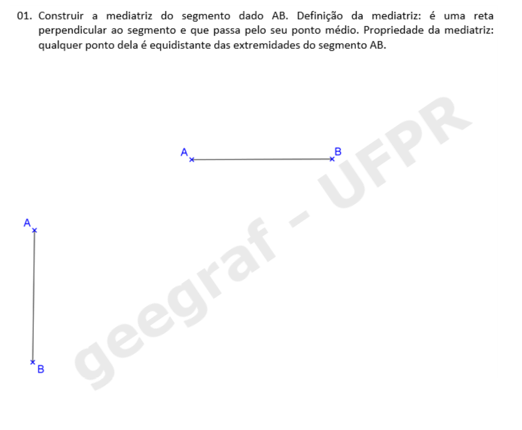
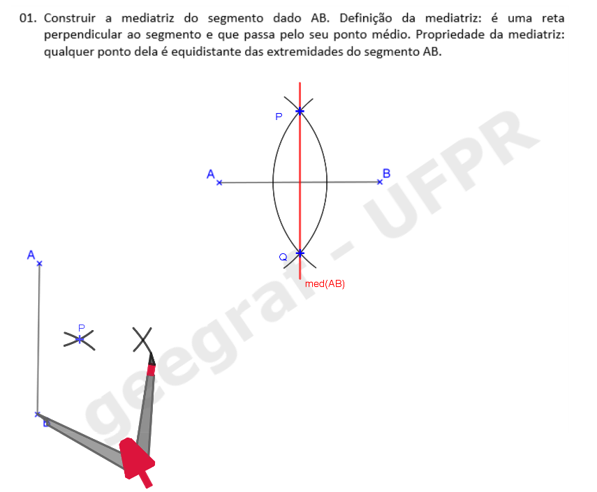
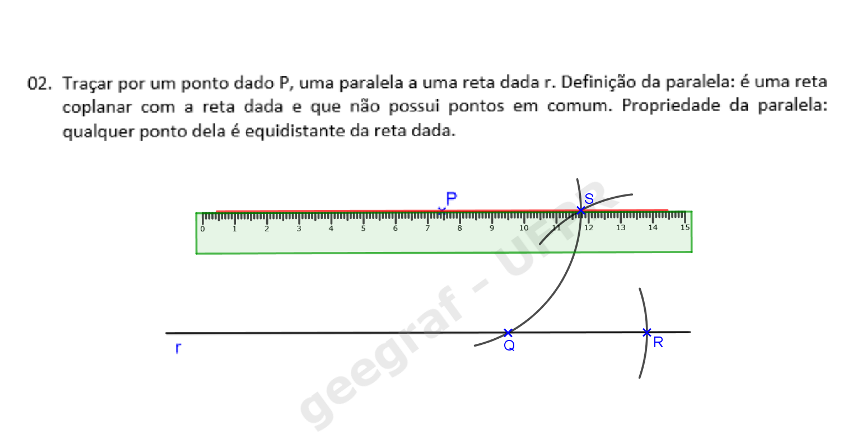
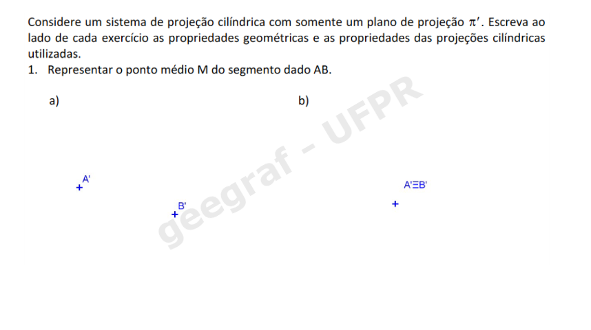
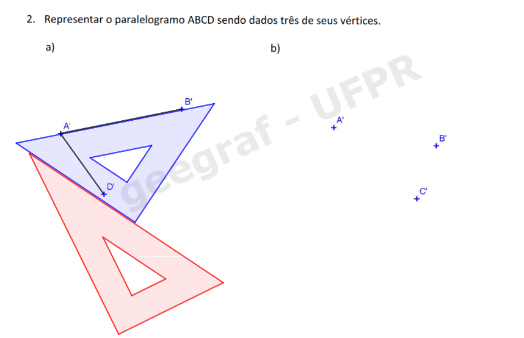
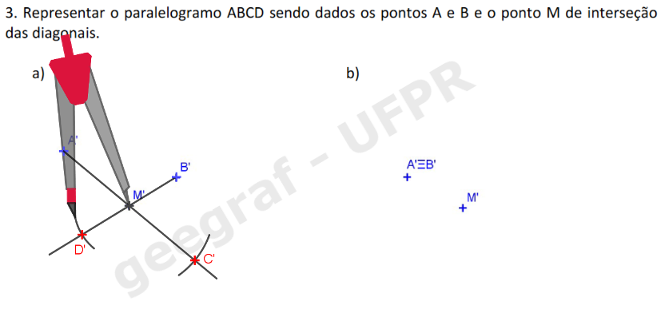

<head>
<link rel="stylesheet" href="scripts/style.css">
</head>

<h2 id="inicio">Visualização de propriedades de projeções, sólidos e aplicações</h2> 

  
Desenho Geométrico

  

Exercício 1 da pág. 1: mediatriz

  
 Vamos utilizar a régua e o compasso para resolver este exercício. Clique nos botões do passo a passo para fazer a construção na sua apostila.

  <ul class="slider">
      <li>
           <input type="radio" id="slide1" name="slide" checked>
           <label for="slide1">passos: 1</label>
           
           <figcaption>Com a ponta seca em A, desenhe um arco com raio maior do que a metade de AB.</figcaption>
       </li>
       <li>
           <input type="radio" id="slide2" name="slide">
           <label for="slide2">2</label>
           
           <figcaption>Com a ponta seca em B, desenhe um arco com o mesmo raio usado no passo anterior.</figcaption>
       </li>
       <li>
           <input type="radio" id="slide3" name="slide">
           <label for="slide3">3</label>
           
           <figcaption>Os pontos de interseção dos arcos são P e Q.</figcaption>
       </li>
       <li>
           <input type="radio" id="slide4" name="slide">
           <label for="slide4">4</label>
           
           <figcaption>Desenhe a reta que passa pelos pontos de interseção dos arcos.</figcaption>
       </li>
       <li>
           <input type="radio" id="slide5" name="slide">
           <label for="slide5">5</label>
           
           <figcaption>Pronto! A mediatriz do segmento AB está construída.</figcaption>
       </li>
    </ul>
    
  

  
Agora veja como fica a construção da mediatriz do segmento AB próximo da margem da folha.

  <ul class="slider">
       <li>
           <input type="radio" id="slide6" name="slide" checked>
           <label for="slide6">passos: 1</label>
           
           <figcaption>Podemos começar desenhando um arco com a ponta seca em A e um raio maior do que a metade de AB.</figcaption>
       </li>
       <li>
           <input type="radio" id="slide7" name="slide">
           <label for="slide7">2</label>
           
           <figcaption>Com a ponta seca em B, podemos desenhar um arco com a mesma medida usada no ponto A.</figcaption>
       </li>
       <li>
           <input type="radio" id="slide8" name="slide">
           <label for="slide8">3</label>
           
           <figcaption>Podemos desenhar um arco com medida diferente da que usamos nos passos anteriores para encontrar o segundo ponto da mediatriz.</figcaption>
       </li>
       <li>
           <input type="radio" id="slide9" name="slide">
           <label for="slide9">4</label>
           
           <figcaption>Desenhando os arcos com centros em A e B com mesma medida, encontramos os pontos P e Q da mediatriz.</figcaption>
       </li>
       <li>
           <input type="radio" id="slide10" name="slide">
           <label for="slide10">5</label>
           
           <figcaption>Desenhe a reta que passa pelos pontos P e Q.</figcaption>
       </li>
       <li>
           <input type="radio" id="slide11" name="slide">
           <label for="slide11">6</label>
           
           <figcaption>Pronto! A mediatriz do segmento AB está construída.</figcaption>
       </li>
  </ul>
  
  

  

  

Exercício 2 da pág. 2: reta paralela

  
 Podemos utilizar a régua e um dos esquadros ou a régua e o compasso para resolver este exercício. Primeiro, veja como é a construção com a régua e o esquadro de 45o.

  <ul class="slider">
      <li>
           <input type="radio" id="slide12" name="slide" checked>
           <label for="slide12">passos: 1</label>
           
           <figcaption>Alinhe um dos catetos do esquadro com a reta r.</figcaption>
       </li>
       <li>
           <input type="radio" id="slide13" name="slide">
           <label for="slide13">2</label>
           
           <figcaption>Coloque a régua como apoio na hipotenusa do esquadro. A régua ficará fixa.</figcaption>
       </li>
       <li>
           <input type="radio" id="slide14" name="slide">
           <label for="slide14">3</label>
           
           <figcaption>Deslize o esquadro até chegar na posição do ponto P. Lembre-se de não mover a régua.</figcaption>
       </li>
       <li>
           <input type="radio" id="slide15" name="slide">
           <label for="slide15">4</label>
           
           <figcaption>Desenhe a reta que passa pelo ponto P com o cateto do esquadro.</figcaption>
       </li>
       <li>
           <input type="radio" id="slide16" name="slide">
           <label for="slide16">5</label>
           
           <figcaption>Pronto! A reta paralela s está construída.</figcaption>
       </li>
    </ul>
    
  

  
 Agora veja os passos da construção feita com régua e compasso.

  <ul class="slider">
      <li>
           <input type="radio" id="slide17" name="slide" checked>
           <label for="slide17">passos: 1</label>
           
           <figcaption>Desenhe um arco com a ponta seca em P, que intercepte a reta r no ponto Q.</figcaption>
       </li>
       <li>
           <input type="radio" id="slide18" name="slide">
           <label for="slide18">2</label>
           
           <figcaption>Com a ponta seca em Q, use o mesmo raio PQ para marcar o ponto R na reta r.</figcaption>
       </li>
       <li>
           <input type="radio" id="slide19" name="slide">
           <label for="slide19">3</label>
           
           <figcaption>Desenhe o arco com a ponta seca em R, com a mesma medida PQ, interceptando o primeiro arco que você desenhou no ponto S.</figcaption>
       </li>
       <li>
           <input type="radio" id="slide20" name="slide">
           <label for="slide20">4</label>
           
           <figcaption>Desenhe a reta que passa pelos pontos P e S com a régua.</figcaption>
       </li>
       <li>
           <input type="radio" id="slide21" name="slide">
           <label for="slide21">5</label>
           
           <figcaption>Pronto! A reta paralela s está construída.</figcaption>
       </li>
    </ul>
    
  

  

   <a href="#desenho"> voltar ao topo</a>

  
Propriedades das projeções cilíndricas

  
Leia o conteúdo das páginas 12 e 13 da apostila. Agora vamos começar a trabalhar com as projeções de objetos e figuras em um plano &pi;'.
 
  

Conceito de Projeção Cônica, pág. 14

    
    <figcaption>Para projetar um ponto A qualquer do espaço usando a projeção cônica, basta definir a reta projetante <b>a</b>, que passa pelo centro de projeção O e pelo ponto A. A interseção desta reta com o plano &pi;' é a projeção A' do ponto A.</figcaption>
  

  

  

Conceito de Projeção Cilíndrica, pág. 14

    
    <figcaption>Para projetar um ponto A qualquer do espaço usando a projeção cilíndrica, basta definir a reta projetante <b>a</b>, paralela à direção <b>d</b> e pelo ponto A. A interseção desta reta com o plano &pi;' é a projeção A' do ponto A.</figcaption>
  

  

  

Uso de recursos de Realidade Aumentada e Realidade Virtual

    
Esta apostila tem recursos programados em Realidade Aumentada e Realidade Virtal. Você pode acessar estes recursos usando o seguinte endereço:

    
<a href="https://paulohscwb.github.io/cotadas/ra.html"> https://paulohscwb.github.io/cotadas/ra.html</a>

    Os ambientes podem ser acessados em qualquer navegador com um dispositivo de webcam (smartphone, tablet ou notebook).
     O acesso aos sites de Realidade Virtual é feito clicando no círculo azul que aparece em cima dos marcadores.
      

  
    Veja o vídeo de demonstração do uso destes recursos:
    

      <iframe src="https://drive.google.com/file/d/1Tg2c6pOoDNESEAvl9kvXgRGv81D-U0Kw/preview" width="100%"></iframe>
    

  

  

  

Visualização da Propriedade 1, pág. 15

    
      <figcaption>Visualização da Propriedade 1 com Realidade Virtual (RV) e Realidade Aumentada (RA). Neste caso, a reta r não é paralela à direção d.</figcaption>
      
    

      <figcaption>Visualização da Propriedade 1 com RV e RA. Neste caso, as retas r e d são paralelas.</figcaption>
      
  

  

  

Visualização da Propriedade 2, pág. 16

    
      <figcaption>Visualização da Propriedade 2 com RV e RA. Neste caso, r e s estão em planos projetantes distintos.</figcaption>
      
    

      <figcaption>Visualização da Propriedade 2 com RV e RA. Neste caso, r e s estão em um mesmo plano projetante.</figcaption>
      
  

  

  

Exercício 1 da pág. 19

  
 Vamos utilizar a régua e o compasso para resolver este exercício. De acordo com a propriedade 3, podemos encontrar a projeção do ponto médio de AB construindo a mediatriz da projeção deste segmento. Clique nos botões do passo a passo para fazer a construção na sua apostila.

  <ul class="slider">
      <li>
           <input type="radio" id="slide100" name="slide" checked>
           <label for="slide100">passos: 1</label>
           
           <figcaption>Com a ponta seca em A', desenhe um arco com raio maior do que a metade de A'B'.</figcaption>
       </li>
       <li>
           <input type="radio" id="slide101" name="slide">
           <label for="slide101">2</label>
           
           <figcaption>Com a ponta seca em B', desenhe um arco com o mesmo raio usado no passo anterior.</figcaption>
       </li>
       <li>
           <input type="radio" id="slide102" name="slide">
           <label for="slide102">3</label>
           
           <figcaption>Desenhe a reta que passa pelos pontos de interseção dos arcos usando a régua.</figcaption>
       </li>
       <li>
           <input type="radio" id="slide103" name="slide">
           <label for="slide103">4</label>
           
           <figcaption>A projeção do ponto médio M' está na interseção da mediatriz de A'B' com o segmento A'B'.</figcaption>
       </li>
       <li>
           <input type="radio" id="slide104" name="slide">
           <label for="slide104">5</label>
           
           <figcaption>Como os pontos A' e B' estão coincidentes, quer dizer que o segmento AB é paralelo à direção das projetantes. Logo, M' coincide com A' e B'.</figcaption>
       </li>
    </ul>
    
  

  

  

Exercício 2 da pág. 19 (item a)

  
 Vamos utilizar a régua, o compasso e o par de esquadros para resolver este exercício. De acordo com a propriedade 2, podemos encontrar a projeção dos lados de um paralelogramo utilizando a construção de retas paralelas.

  <ul class="slider">
      <li>
           <input type="radio" id="slide105" name="slide" checked>
           <label for="slide105">passos: 1</label>
           
           <figcaption>A projeção do lado C'D' será paralela ao segmento A'B'. Logo, podemos desenhar a reta C'D'//A'B' com o uso de esquadros.</figcaption>
       </li>
       <li>
           <input type="radio" id="slide106" name="slide">
           <label for="slide106">2</label>
           
           <figcaption>Alinhando o esquadro de 45o com A'B', coloque como apoio o outro esquadro ou a régua. Deslize o esquadro de 45o deixando o outro esquadro ou a régua fixo.</figcaption>
       </li>
       <li>
           <input type="radio" id="slide107" name="slide">
           <label for="slide107">3</label>
           
           <figcaption>Usando a mesma construção, você pode desenhar a reta paralela a A'D', ou usar o compasso. Pela propriedade 3, A'B' = C'D', logo, podemos "pegar" a medida A'B' com o compasso... </figcaption>
       </li>
       <li>
           <input type="radio" id="slide108" name="slide">
           <label for="slide108">4</label>
           
           <figcaption>... e desenhá-la com centro em D' e o raio A'B'. Logo, encontramos o ponto C'.</figcaption>
       </li>
       <li>
           <input type="radio" id="slide109" name="slide">
           <label for="slide109">5</label>
           
           <figcaption>Pronto! O paralelogramo está construído. Agora é sua vez de fazer o item b!</figcaption>
       </li>
    </ul>
    
  

  

  

Exercício 2 da pág. 19 (item c)

  
 Vamos utilizar a régua e o compasso para resolver este exercício. De acordo com a propriedade 5, o paralelogramo está em um plano paralelo à direção <b>d</b> das projetantes.

  <ul class="slider">
      <li>
           <input type="radio" id="slide110" name="slide" checked>
           <label for="slide110">passos: 1</label>
           
           <figcaption>O vértice C' do paralelogramo estará no prolongamento da reta A'B'.</figcaption>
       </li>
       <li>
           <input type="radio" id="slide111" name="slide">
           <label for="slide111">2</label>
           
           <figcaption>De acordo com a propriedade 3, os segmentos A'B' e C'D' são iguais. Logo, podemos "pegar" a medida A'B' com o compasso...</figcaption>
       </li>
       <li>
           <input type="radio" id="slide112" name="slide">
           <label for="slide112">3</label>
           
           <figcaption>... e desenhar o arco com medida A'B' no prolongamento deste segmento.</figcaption>
       </li>
       <li>
           <input type="radio" id="slide113" name="slide">
           <label for="slide113">4</label>
           
           <figcaption>Assim, encontramos o vértice C' do paralelogramo.</figcaption>
       </li>
    </ul>
    
  

  

  

Exercício 3 da pág. 20 (item a)

  
 Vamos utilizar a régua e o compasso para resolver este exercício.

  <ul class="slider">
      <li>
           <input type="radio" id="slide114" name="slide" checked>
           <label for="slide114">passos: 1</label>
           
           <figcaption>Relembrando uma propriedade do paralelogramo: as diagonais interceptam-se em seus respectivos pontos médios. Logo, pela propriedade 3, A'M' = M'C'.</figcaption>
       </li>
       <li>
           <input type="radio" id="slide115" name="slide">
           <label for="slide115">2</label>
           
           <figcaption>Logo, podemos "pegar" a medida A'B' com o compasso e prolongar o segmento A'M'.</figcaption>
       </li>
       <li>
           <input type="radio" id="slide116" name="slide">
           <label for="slide116">3</label>
           
           <figcaption>Para encontrar C', basta desenhar o arco com medida A'M' no prolongamento de A'M'.</figcaption>
       </li>
       <li>
           <input type="radio" id="slide117" name="slide">
           <label for="slide117">4</label>
           
           <figcaption>O mesmo acontece com os segmentos B'M' e M'D'. Logo, podemos "pegar" a medida B'M' com o compasso...</figcaption>
       </li>
       <li>
           <input type="radio" id="slide118" name="slide">
           <label for="slide118">5</label>
           
           <figcaption>... e podemos desenhar o arco com centro em M' e raio B'M'.</figcaption>
       </li>
       <li>
           <input type="radio" id="slide119" name="slide">
           <label for="slide119">6</label>
           
           <figcaption>Pronto! O paralelogramo está construído. Não esqueça de desenhar os lados desta figura.</figcaption>
       </li>
    </ul>
    
  

  

  

Exercícios 4 e 5, págs. 20 e 21

  
    <figcaption>Visualização do item c do Exercício 4 com RV e RA.</figcaption>
    
  

    <figcaption>Visualização do item a do Exercício 5 com RV e RA.</figcaption>
    
  

    <figcaption>Visualização do item c do Exercício 5 com RV e RA.</figcaption>
    
  

  

  

Visualização da Propriedade 7, pág. 22

  
    <figcaption>Visualização da propriedade 7 com RV e RA.</figcaption>
    
  

 <a href="#propriedades"> voltar ao topo</a>

  
Pontos e segmentos em épura

<h3>Exemplo de pontos em épura, pág. 27</h3>

  <figcaption>Visualização do exercício da página 27 com RV e RA.</figcaption>
  

<h3>Verdadeira grandeza de um segmento, pág. 28</h3>

  <figcaption>Visualização em RA e RV do rebatimento usado para encontrar a verdadeira grandeza de um segmento AB.</figcaption>
  
   <a href="#pontos"> voltar ao topo</a>

  
Sólidos em Projeções Cotadas

<h3>Pirâmide de base hexagonal, pág. 53</h3>
  
  <figcaption>Visualização em RA e RV do Exercício 2.</figcaption>
  

<h3>Pirâmide de base quadrada, pág. 56</h3>
  
  <figcaption>Visualização em RA e RV do Exercício 1.</figcaption>
  

<h3>Prisma de base hexagonal, pág. 56</h3>
  
  <figcaption>Visualização em RA e RV do Exercício 2.</figcaption>
  
 <a href="#solidos"> voltar ao topo</a>

  
Reta de declive e Rebatimento de um plano qualquer

<h3>Exemplo da pág. 63</h3>
  
  <figcaption>Visualização em RA e RV da representação da reta de declive de um plano qualquer.</figcaption>
  
<h3>Exemplo da pág. 66</h3>

  <figcaption>Visualização em RA e RV do rebatimento de um plano qualquer no plano horizontal de projeções.</figcaption>
  
 <a href="#rebatimento"> voltar ao topo</a>

  
Interseções de planos

<h3>Exemplo da pág. 74</h3>
  
  <figcaption>Visualização em RA e RV da interseção de um plano horizontal e um plano vertical.</figcaption>
  
<h3>Exemplo da pág. 74</h3>

  <figcaption>Visualização em RA e RV da interseção entre um plano qualquer e um plano horizontal.</figcaption>
  
<h3>Exemplo da pág. 75</h3>

  <figcaption>Visualização em RA e RV da interseção de um plano qualquer e um plano vertical.</figcaption>
  
<h3>Exemplo da pág. 75</h3>

  <figcaption>Visualização em RA e RV da interseção entre dois planos quaisquer.</figcaption>
  
 <a href="#intersecoes"> voltar ao topo</a>

  
Representações de telhados

 Para ver os telhados em Realidade Aumentada, visite o site:
 
<a href="https://paulohscwb.github.io/cotadas/telhados.html"> https://paulohscwb.github.io/cotadas/telhados.html</a>

<h3>Terminologia, pág. 79</h3>

  <figcaption>Visualização em RA e RV de um telhado com a terminologia utilizada.</figcaption>
  

<h3>Exercício 3.3, pág. 83</h3>

  <figcaption>Visualização em RA e RV do exercício 3.3: telhado com inclinações iguais.</figcaption>
  

<h3>Exercício 3.4, pág. 84</h3>

  <figcaption>Visualização em RA e RV do exercício 3.4: telhado com inclinações iguais.</figcaption>
  

<h3>Exercício 3.5, pág. 85</h3>

  <figcaption>Visualização em RA e RV do exercício 3.5: telhado com inclinações iguais.</figcaption> 
  

<h3>Exercício 3.6, pág. 86</h3>

  <figcaption>Visualização em RA e RV do exercício 3.6: telhado com inclinações iguais.</figcaption>
  

<h3>Exercício 3.7, pág. 87</h3>

  <figcaption>Visualização em RA e RV do exercício 3.7: telhado com inclinações iguais.</figcaption>
  

<h3>Exercício 3.8, pág. 88</h3>

  <figcaption>Visualização em RA e RV do exercício 3.8: telhado com inclinações iguais.</figcaption>
  

<h3>Exercício 3.9, pág. 89</h3>

  <figcaption>Visualização em RA e RV do exercício 3.9: telhado com inclinações iguais.</figcaption>
  

<h3>Exercício 4.3, pág. 92</h3>

  <figcaption>Visualização em RA e RV do exercício 4.3: telhado com inclinações diferentes.</figcaption>
  

<h3>Exercício 4.4, pág. 93</h3>

  <figcaption>Visualização em RA e RV do exercício 4.4: telhado com inclinações diferentes.</figcaption>
  

<h3>Exercício 4.5, pág. 94</h3>

  <figcaption>Visualização em RA e RV do exercício 4.5: telhado com inclinações diferentes.</figcaption>
  

<h3>Exercício 4.6, pág. 95</h3>

  <figcaption>Visualização em RA e RV do exercício 4.6: telhado com inclinações e níveis diferentes.</figcaption>
  
 <a href="#telhados"> voltar ao topo</a>

  
Superfícies Topográficas

 Para ver as superfícies topográficas em Realidade Aumentada, visite o site:
 
<a href="https://paulohscwb.github.io/cotadas/superficies.html"> https://paulohscwb.github.io/cotadas/superficies.html</a>

<h3>Curvas de nível, pág. 97</h3>

  <figcaption>Visualização em RA e RV da superfície topográfica com suas respectivas curvas de nível.</figcaption>
  

<h3>Exercício 1, pág. 99</h3>

  <figcaption>Visualização em RA e RV do exercício 1 com suas curvas de nível.</figcaption>
  

<h3>Exercício 2, pág. 103</h3>

  <figcaption>Visualização em RA e RV do exercício 2: perfil topográfico de um terreno.</figcaption>
  

<h3>Exercício 3, pág. 104</h3>

  <figcaption>Visualização em RA e RV do exercício 3: perfil topográfico de um terreno.</figcaption>
  

<h3>Exercício da pág. 106</h3>

  <figcaption>Visualização em RA e RV do exercício da página 106: seção plana de um terreno.</figcaption>
  

<h3>Exercício da pág. 111</h3>

  <figcaption>Visualização em RA e RV do exercício da página 111: cortes de um terreno para construção de uma estrada.</figcaption>
  

<h3>Exercício 2, pág. 114</h3>

 
  <figcaption>Visualização em RA e RV do exercício 2: seção mista de um terreno (corte e aterro).</figcaption>
  <a href="#superficies"> voltar ao topo</a>

 <b>desenvolvido por:</b> Paulo Henrique Siqueira - Universidade Federal do Paraná 
 <b>contato:</b> paulohscwb@gmail.com 
  Este site contém algumas partes da <a href="http://www.exatas.ufpr.br/portal/degraf_paulo/wp-content/uploads/sites/4/2014/09/Cotadas_2020.pdf" target="_blank">apostila de Projeções Cotadas</a> usada em sala de aula para visualizar os objetos com Realidade Virtual (RV) e Realidade Aumentada (RA). As propriedades de projeções, os sólidos e as maquetes podem ser vistos em RA com os marcadores indicados, e através dos links criados nos marcadores, os objetos podem ser vistos em RV. 
 Para ver os objetos em Realidade Aumentada, visite o site:
 
<a href="https://paulohscwb.github.io/cotadas/ra.html"> https://paulohscwb.github.io/cotadas/ra.html</a>

 em qualquer navegador com um dispositivo de webcam (smartphone, tablet ou notebook).
 O acesso aos sites de Realidade Virtual é feito clicando no círculo azul que aparece em cima dos marcadores.
  

  <b>Referências</b>
 O ambiente Realidade Aumentada foi criado com os scripts de <b>Jerome Etienne</b>: <a href="https://github.com/jeromeetienne/AR.js"> AR.js - Augmented Reality for the Web</a>.
 Os scripts de órbita desenvolvidos por <b>Kevin Ngo</b> foram usados nas páginas de RV: <a href="https://github.com/supermedium/superframe/tree/master/components/orbit-controls/"> Orbit controls for A-Frame</a>.
 As faces de poliedros foram criadas com a função desenvolvida por <b>Andreas Plesch</b>: <a href="https://github.com/andreasplesch/aframe-faceset-component"> Geometry from vertices and faces</a>.
