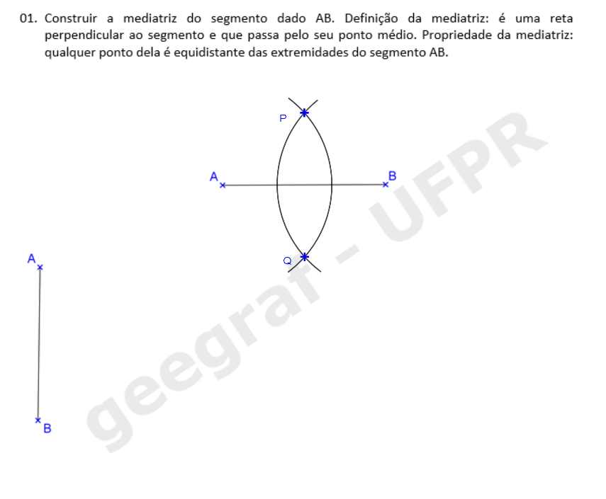
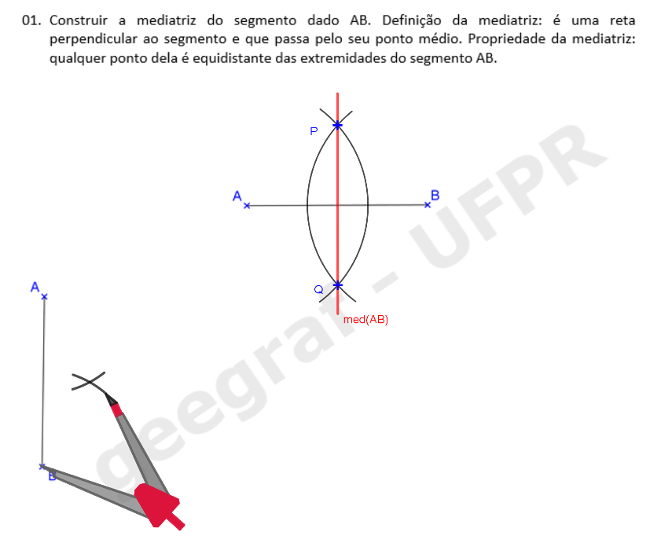
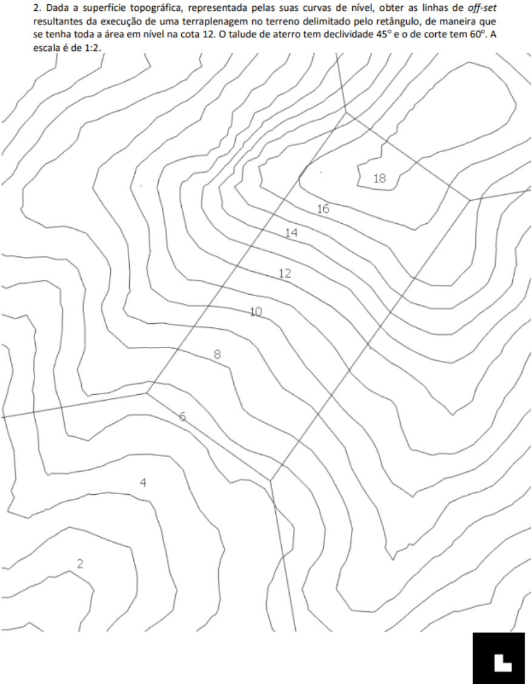

<head>
<link rel="stylesheet" href="scripts/style.css">
</head>

<h2 id="inicio">Visualização de propriedades de projeções, sólidos e aplicações</h2> 

  
Desenho Geométrico

<h3>Resolução do Exercício 1 da pág. 1: mediatriz</h3>
  <ul class="slider">
      <li>
           <input type="radio" id="slide1" name="slide" checked>
           <label for="slide1">passos: 1</label>
           
           <figcaption>Com a ponta seca em A, desenhe um arco com raio maior do que a metade de AB.</figcaption>
       </li>
       <li>
           <input type="radio" id="slide2" name="slide">
           <label for="slide2">2</label>
           
           <figcaption>Com a ponta seca em B, desenhe um arco com o mesmo raio usado no passo anterior.</figcaption>
       </li>
       <li>
           <input type="radio" id="slide3" name="slide">
           <label for="slide3">3</label>
           
           <figcaption>Os pontos de interseção dos arcos são P e Q.</figcaption>
       </li>
       <li>
           <input type="radio" id="slide4" name="slide">
           <label for="slide4">4</label>
           
           <figcaption>Desenhe a reta que passa pelos pontos de interseção dos arcos.</figcaption>
       </li>
       <li>
           <input type="radio" id="slide5" name="slide">
           <label for="slide5">5</label>
           
           <figcaption>Pronto! A mediatriz do segmento AB está construída.</figcaption>
       </li>
    </ul>
    
  

  <ul class="slider">
       <li>
           <input type="radio" id="slide6" name="slide" checked>
           <label for="slide6">passos: 1</label>
           
           <figcaption>No caso em que AB está próximo da margem da folha, podemos desenhar dois arcos: o primeiro com a ponta seca em A e um raio maior do que a metade de AB.</figcaption>
       </li>
       <li>
           <input type="radio" id="slide7" name="slide">
           <label for="slide7">2</label>
           
           <figcaption>Com a ponta seca em B, podemos desenhar um arco com a mesma medida usada no ponto A.</figcaption>
       </li>
       <li>
           <input type="radio" id="slide8" name="slide">
           <label for="slide8">3</label>
           
           <figcaption>Podemos desenhar um arco com medida diferente da que usamos nos passos anteriores para encontrar o segundo ponto da mediatriz.</figcaption>
       </li>
       <li>
           <input type="radio" id="slide9" name="slide">
           <label for="slide9">4</label>
           
           <figcaption>Desenhando os arcos com centros em A e B com mesma medida, encontramos os pontos P e Q da mediatriz.</figcaption>
       </li>
       <li>
           <input type="radio" id="slide10" name="slide">
           <label for="slide10">5</label>
           
           <figcaption>Desenhe a reta que passa pelos pontos P e Q.</figcaption>
       </li>
       <li>
           <input type="radio" id="slide11" name="slide">
           <label for="slide11">6</label>
           
           <figcaption>Pronto! A mediatriz do segmento AB está construída.</figcaption>
       </li>
  </ul>
  
   <a href="#desenho"> voltar ao topo</a>

  
Propriedades das projeções cilíndricas

  <h3>Propriedade 1, pág. 15</h3>
    
      <figcaption>Visualização da Propriedade 1 com Realidade Virtual (RV) e Realidade Aumentada (RA). Neste caso, a reta r não é paralela à direção d.</figcaption>
       
    

      <figcaption>Visualização da Propriedade 1 com RV e RA. Neste caso, as retas r e d são paralelas</figcaption>
       
  

  <h3>Propriedade 2, pág. 16</h3>
    
      <figcaption>Visualização da Propriedade 2 com RV e RA. Neste caso, r e s estão em planos projetantes distintos.</figcaption>
       
    

       <figcaption>Visualização da Propriedade 2 com RV e RA. Neste caso, r e s estão em um mesmo plano projetante.</figcaption>
     
  

<h3>Exercícios 4 e 5, págs. 20 e 21</h3>

  <figcaption>Visualização do item c do Exercício 4 com RV e RA.</figcaption>
 

  <figcaption>Visualização do item a do Exercício 5 com RV e RA.</figcaption>
 

  <figcaption>Visualização do item c do Exercício 5 com RV e RA.</figcaption>
 

<h3>Propriedade 7, pág. 22</h3>

  <figcaption>Visualização da propriedade 7 com RV e RA.</figcaption>
 
 <a href="#propriedades"> voltar ao topo</a>

  
Pontos e segmentos em épura

<h3>Exemplo de pontos em épura, pág. 27</h3>

  <figcaption>Visualização do exercício da página 27 com RV e RA.</figcaption>
 

<h3>Verdadeira grandeza de um segmento, pág. 28</h3>

  <figcaption>Visualização em RA e RV do rebatimento usado para encontrar a verdadeira grandeza de um segmento AB.</figcaption>
 
 <a href="#pontos"> voltar ao topo</a>

  
Sólidos em Projeções Cotadas

<h3>Pirâmide de base hexagonal, pág. 53</h3>

  <figcaption>Visualização em RA e RV do Exercício 2.</figcaption>
 

<h3>Pirâmide de base quadrada, pág. 56</h3>

  <figcaption>Visualização em RA e RV do Exercício 1.</figcaption>
 

<h3>Prisma de base hexagonal, pág. 56</h3>

  <figcaption>Visualização em RA e RV do Exercício 2.</figcaption>
 
 <a href="#solidos"> voltar ao topo</a>

  
Reta de declive e Rebatimento de um plano qualquer

<h3>Exemplo da pág. 63</h3>

  <figcaption>Visualização em RA e RV da representação da reta de declive de um plano qualquer.</figcaption>
 
<h3>Exemplo da pág. 66</h3>

  <figcaption>Visualização em RA e RV do rebatimento de um plano qualquer no plano horizontal de projeções.</figcaption>
 
 <a href="#rebatimento"> voltar ao topo</a>

  
Interseções de planos

<h3>Exemplo da pág. 74</h3>

  <figcaption>Visualização em RA e RV da interseção de um plano horizontal e um plano vertical.</figcaption>
 
<h3>Exemplo da pág. 74</h3>

  <figcaption>Visualização em RA e RV da interseção entre um plano qualquer e um plano horizontal.</figcaption>
 
<h3>Exemplo da pág. 75</h3>

  <figcaption>Visualização em RA e RV da interseção de um plano qualquer e um plano vertical.</figcaption>
 
<h3>Exemplo da pág. 75</h3>

  <figcaption>Visualização em RA e RV da interseção entre dois planos quaisquer.</figcaption>
 
 <a href="#intersecoes"> voltar ao topo</a>

  
Representações de telhados

 Para ver os telhados em Realidade Aumentada, visite o site:
 
<a href="https://paulohscwb.github.io/cotadas/telhados.html"> https://paulohscwb.github.io/cotadas/telhados.html</a>

<h3>Terminologia, pág. 79</h3>

  <figcaption>Visualização em RA e RV de um telhado com a terminologia utilizada.</figcaption>
 

<h3>Exercício 3.3, pág. 83</h3>

  <figcaption>Visualização em RA e RV do exercício 3.3: telhado com inclinações iguais.</figcaption>
 

<h3>Exercício 3.4, pág. 84</h3>

  <figcaption>Visualização em RA e RV do exercício 3.4: telhado com inclinações iguais.</figcaption>
 

<h3>Exercício 3.5, pág. 85</h3>

  <figcaption>Visualização em RA e RV do exercício 3.5: telhado com inclinações iguais.</figcaption>
 

<h3>Exercício 3.6, pág. 86</h3>

  <figcaption>Visualização em RA e RV do exercício 3.6: telhado com inclinações iguais.</figcaption>
 

<h3>Exercício 3.7, pág. 87</h3>

  <figcaption>Visualização em RA e RV do exercício 3.7: telhado com inclinações iguais.</figcaption>
 

<h3>Exercício 3.8, pág. 88</h3>

  <figcaption>Visualização em RA e RV do exercício 3.8: telhado com inclinações iguais.</figcaption>
 

<h3>Exercício 3.9, pág. 89</h3>

  <figcaption>Visualização em RA e RV do exercício 3.9: telhado com inclinações iguais.</figcaption>
 

<h3>Exercício 4.3, pág. 92</h3>

  <figcaption>Visualização em RA e RV do exercício 4.3: telhado com inclinações diferentes.</figcaption>
 

<h3>Exercício 4.4, pág. 93</h3>

  <figcaption>Visualização em RA e RV do exercício 4.4: telhado com inclinações diferentes.</figcaption>
 

<h3>Exercício 4.5, pág. 94</h3>

  <figcaption>Visualização em RA e RV do exercício 4.5: telhado com inclinações diferentes.</figcaption>
 

<h3>Exercício 4.6, pág. 95</h3>

  <figcaption>Visualização em RA e RV do exercício 4.6: telhado com inclinações e níveis diferentes.</figcaption>
 
 <a href="#telhados"> voltar ao topo</a>

  
Superfícies Topográficas

 Para ver as superfícies topográficas em Realidade Aumentada, visite o site:
 
<a href="https://paulohscwb.github.io/cotadas/superficies.html"> https://paulohscwb.github.io/cotadas/superficies.html</a>

<h3>Curvas de nível, pág. 97</h3>

  <figcaption>Visualização em RA e RV da superfície topográfica com suas respectivas curvas de nível.</figcaption>
 

<h3>Exercício 1, pág. 99</h3>

  <figcaption>Visualização em RA e RV do exercício 1 com suas curvas de nível.</figcaption>
 

<h3>Exercício 2, pág. 103</h3>

  <figcaption>Visualização em RA e RV do exercício 2: perfil topográfico de um terreno.</figcaption>
 

<h3>Exercício 3, pág. 104</h3>

  <figcaption>Visualização em RA e RV do exercício 3: perfil topográfico de um terreno.</figcaption>
 

<h3>Exercício da pág. 106</h3>

  <figcaption>Visualização em RA e RV do exercício da página 106: seção plana de um terreno.</figcaption>
 

<h3>Exercício da pág. 111</h3>

  <figcaption>Visualização em RA e RV do exercício da página 111: cortes de um terreno para construção de uma estrada.</figcaption>
 

<h3>Exercício 2, pág. 114</h3>

 
  <figcaption>Visualização em RA e RV do exercício 2: seção mista de um terreno (corte e aterro).</figcaption>
 <a href="#superficies"> voltar ao topo</a>

 <b>desenvolvido por:</b> Paulo Henrique Siqueira - Universidade Federal do Paraná 
 <b>contato:</b> paulohscwb@gmail.com 
  Este site contém algumas partes da <a href="http://www.exatas.ufpr.br/portal/degraf_paulo/wp-content/uploads/sites/4/2014/09/Cotadas_2020.pdf" target="_blank">apostila de Projeções Cotadas</a> usada em sala de aula para visualizar os objetos com Realidade Virtual (RV) e Realidade Aumentada (RA). As propriedades de projeções, os sólidos e as maquetes podem ser vistos em RA com os marcadores indicados, e através dos links criados nos marcadores, os objetos podem ser vistos em RV. 
 Para ver os objetos em Realidade Aumentada, visite o site:
 
<a href="https://paulohscwb.github.io/cotadas/ra.html"> https://paulohscwb.github.io/cotadas/ra.html</a>

 em qualquer navegador com um dispositivo de webcam (smartphone, tablet ou notebook).
 O acesso aos sites de Realidade Virtual é feito clicando no círculo azul que aparece em cima dos marcadores.
  

  <b>Referências</b>
 O ambiente Realidade Aumentada foi criado com os scripts de <b>Jerome Etienne</b>: <a href="https://github.com/jeromeetienne/AR.js"> AR.js - Augmented Reality for the Web</a>.
 Os scripts de órbita desenvolvidos por <b>Kevin Ngo</b> foram usados nas páginas de RV: <a href="https://github.com/supermedium/superframe/tree/master/components/orbit-controls/"> Orbit controls for A-Frame</a>.
 As faces de poliedros foram criadas com a função desenvolvida por <b>Andreas Plesch</b>: <a href="https://github.com/andreasplesch/aframe-faceset-component"> Geometry from vertices and faces</a>.
