<head>
<link rel="stylesheet" href="scripts/style.css">
</head>

<h2 id="inicio">Visualização de propriedades de projeções, sólidos e aplicações</h2> 

  
Desenho Geométrico

  

Exercício 1 da pág. 1: mediatriz

  
 Vamos utilizar a régua e o compasso para resolver este exercício. Clique nos botões do passo a passo para fazer a construção na sua apostila.

  <ul class="slider">
      <li>
           <input type="radio" id="slide1" name="slide" checked>
           <label for="slide1">passos: 1</label>
           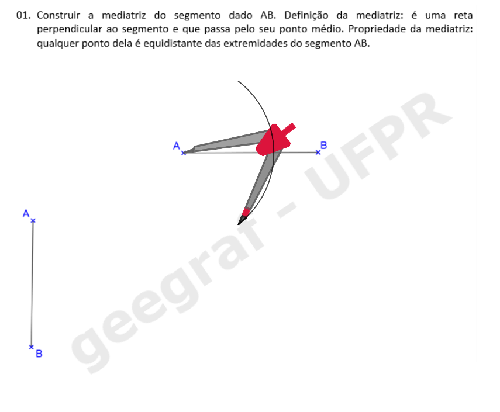
           <figcaption>Com a ponta seca em <b>A</b>, desenhe um arco com raio maior do que a metade de <b>AB</b>.</figcaption>
       </li>
       <li>
           <input type="radio" id="slide2" name="slide">
           <label for="slide2">2</label>
           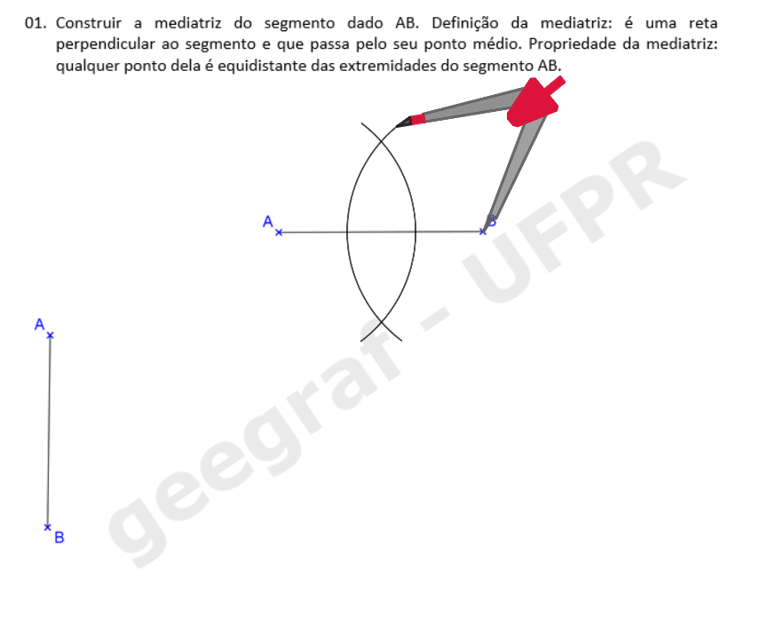
           <figcaption>Com a ponta seca em <b>B</b>, desenhe um arco com o mesmo raio usado no passo anterior.</figcaption>
       </li>
       <li>
           <input type="radio" id="slide3" name="slide">
           <label for="slide3">3</label>
           
           <figcaption>Os pontos de interseção dos arcos são <b>P</b> e <b>Q</b>.</figcaption>
       </li>
       <li>
           <input type="radio" id="slide4" name="slide">
           <label for="slide4">4</label>
           
           <figcaption>Desenhe a reta que passa pelos pontos de interseção dos arcos.</figcaption>
       </li>
       <li>
           <input type="radio" id="slide5" name="slide">
           <label for="slide5">5</label>
           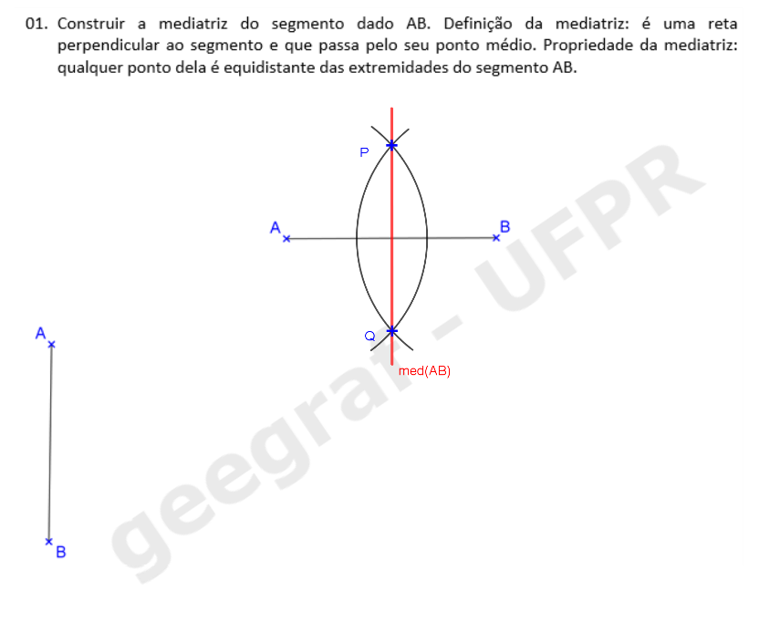
           <figcaption>Pronto! A mediatriz do segmento <b>AB</b> está construída.</figcaption>
       </li>
    </ul>
    
  

  
Agora veja como fica a construção da mediatriz do segmento <b>AB</b> próximo da margem da folha.

  <ul class="slider">
       <li>
           <input type="radio" id="slide6" name="slide" checked>
           <label for="slide6">passos: 1</label>
           
           <figcaption>Podemos começar desenhando um arco com a ponta seca em <b>A</b> e um raio maior do que a metade de <b>AB</b>.</figcaption>
       </li>
       <li>
           <input type="radio" id="slide7" name="slide">
           <label for="slide7">2</label>
           
           <figcaption>Com a ponta seca em <b>B</b>, podemos desenhar um arco com a mesma medida usada no ponto <b>A</b>.</figcaption>
       </li>
       <li>
           <input type="radio" id="slide8" name="slide">
           <label for="slide8">3</label>
           
           <figcaption>Podemos desenhar um arco com medida diferente da que usamos nos passos anteriores para encontrar o segundo ponto da mediatriz.</figcaption>
       </li>
       <li>
           <input type="radio" id="slide9" name="slide">
           <label for="slide9">4</label>
           
           <figcaption>Desenhando os arcos com centros em <b>A</b> e <b>B</b> com mesma medida, encontramos os pontos <b>P</b> e <b>Q</b> da mediatriz.</figcaption>
       </li>
       <li>
           <input type="radio" id="slide10" name="slide">
           <label for="slide10">5</label>
           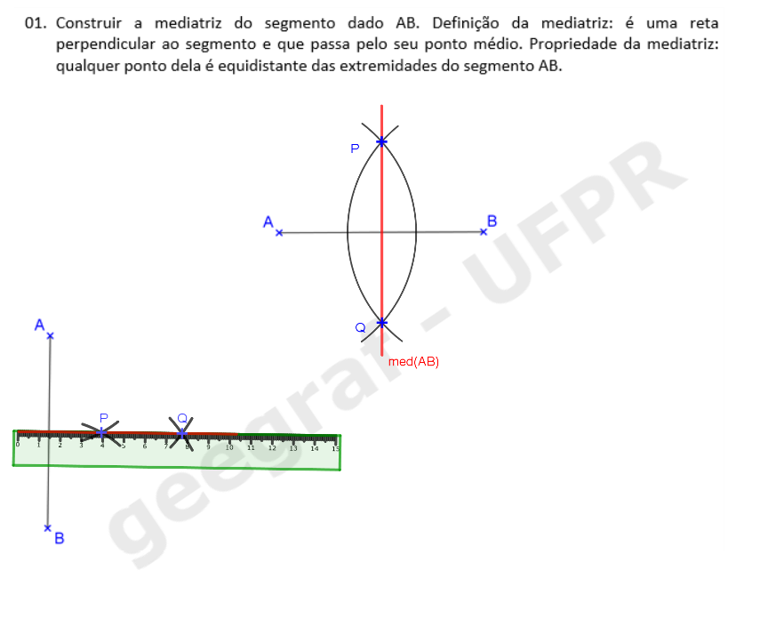
           <figcaption>Desenhe a reta que passa pelos pontos <b>P</b> e <b>Q</b>.</figcaption>
       </li>
       <li>
           <input type="radio" id="slide11" name="slide">
           <label for="slide11">6</label>
           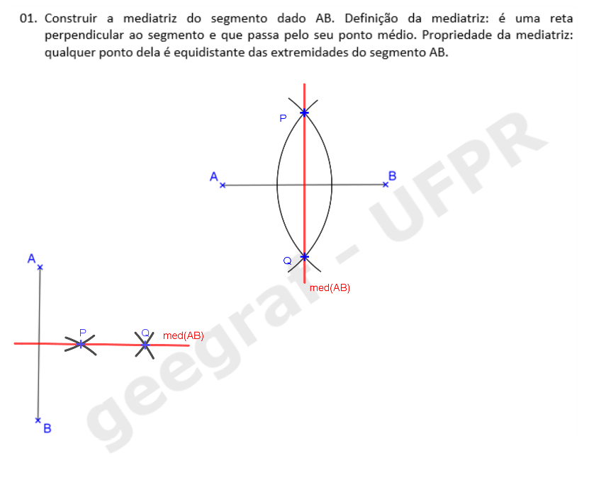
           <figcaption>Pronto! A mediatriz do segmento <b>AB</b> está construída.</figcaption>
       </li>
  </ul>
  
  

  

  

Exercício 2 da pág. 2: reta paralela

  
 Podemos utilizar a régua e um dos esquadros ou a régua e o compasso para resolver este exercício. Primeiro, veja como é a construção com a régua e o esquadro de 45o.

  <ul class="slider">
      <li>
           <input type="radio" id="slide12" name="slide" checked>
           <label for="slide12">passos: 1</label>
           
           <figcaption>Alinhe um dos catetos do esquadro com a reta <b>r</b>.</figcaption>
       </li>
       <li>
           <input type="radio" id="slide13" name="slide">
           <label for="slide13">2</label>
           
           <figcaption>Coloque a régua como apoio na hipotenusa do esquadro. A régua ficará fixa.</figcaption>
       </li>
       <li>
           <input type="radio" id="slide14" name="slide">
           <label for="slide14">3</label>
           
           <figcaption>Deslize o esquadro até chegar na posição do ponto <b>P</b>. Lembre-se de não mover a régua.</figcaption>
       </li>
       <li>
           <input type="radio" id="slide15" name="slide">
           <label for="slide15">4</label>
           
           <figcaption>Desenhe a reta que passa pelo ponto <b>P</b> com o cateto do esquadro.</figcaption>
       </li>
       <li>
           <input type="radio" id="slide16" name="slide">
           <label for="slide16">5</label>
           
           <figcaption>Pronto! A reta paralela <b>s // r</b> está construída.</figcaption>
       </li>
    </ul>
    
  

  
 Agora veja os passos da construção feita com régua e compasso.

  <ul class="slider">
      <li>
           <input type="radio" id="slide17" name="slide" checked>
           <label for="slide17">passos: 1</label>
           
           <figcaption>Desenhe um arco com a ponta seca em <b>P</b>, que intercepte a reta <b>r</b> no ponto <b>Q</b>.</figcaption>
       </li>
       <li>
           <input type="radio" id="slide18" name="slide">
           <label for="slide18">2</label>
           
           <figcaption>Com a ponta seca em <b>Q</b>, use o mesmo raio <b>PQ</b> para marcar o ponto <b>R</b> na reta <b>r</b>.</figcaption>
       </li>
       <li>
           <input type="radio" id="slide19" name="slide">
           <label for="slide19">3</label>
           
           <figcaption>Desenhe o arco com a ponta seca em <b>R</b>, com a mesma medida <b>PQ</b>, interceptando o primeiro arco que você desenhou no ponto <b>S</b>.</figcaption>
       </li>
       <li>
           <input type="radio" id="slide20" name="slide">
           <label for="slide20">4</label>
           
           <figcaption>Desenhe a reta que passa pelos pontos <b>P</b> e <b>S</b> com a régua.</figcaption>
       </li>
       <li>
           <input type="radio" id="slide21" name="slide">
           <label for="slide21">5</label>
           
           <figcaption>Pronto! A reta paralela <b>s // r</b> está construída.</figcaption>
       </li>
    </ul>
    
  

  

  

Exercício 3 da pág. 2: reta perpendicular

  
 Vamos utilizar a régua e um dos esquadros para resolver este exercício. Clique nos botões do passo a passo para fazer a construção na sua apostila.

  <ul class="slider">
      <li>
           <input type="radio" id="slide22" name="slide" checked>
           <label for="slide22">passos: 1</label>
           
           <figcaption>Alinhe um dos catetos do esquadro com a reta <b>r</b>.</figcaption>
       </li>
       <li>
           <input type="radio" id="slide23" name="slide">
           <label for="slide23">2</label>
           
           <figcaption>Coloque a régua como apoio na hipotenusa do esquadro. A régua ficará fixa.</figcaption>
       </li>
       <li>
           <input type="radio" id="slide24" name="slide">
           <label for="slide24">3</label>
           
           <figcaption>Deslize o esquadro até o cateto vertical chegar na posição do ponto <b>P</b>. Lembre-se de não mover a régua.</figcaption>
       </li>
       <li>
           <input type="radio" id="slide25" name="slide">
           <label for="slide25">4</label>
           
           <figcaption>Desenhe a reta que passa pelo ponto <b>P</b>.</figcaption>
       </li>
       <li>
           <input type="radio" id="slide26" name="slide">
           <label for="slide26">5</label>
           
           <figcaption>Pronto! A reta perpendicular <b>p</b> está construída.</figcaption>
       </li>
       <li>
           <input type="radio" id="slide27" name="slide" checked>
           <label for="slide27">6</label>
           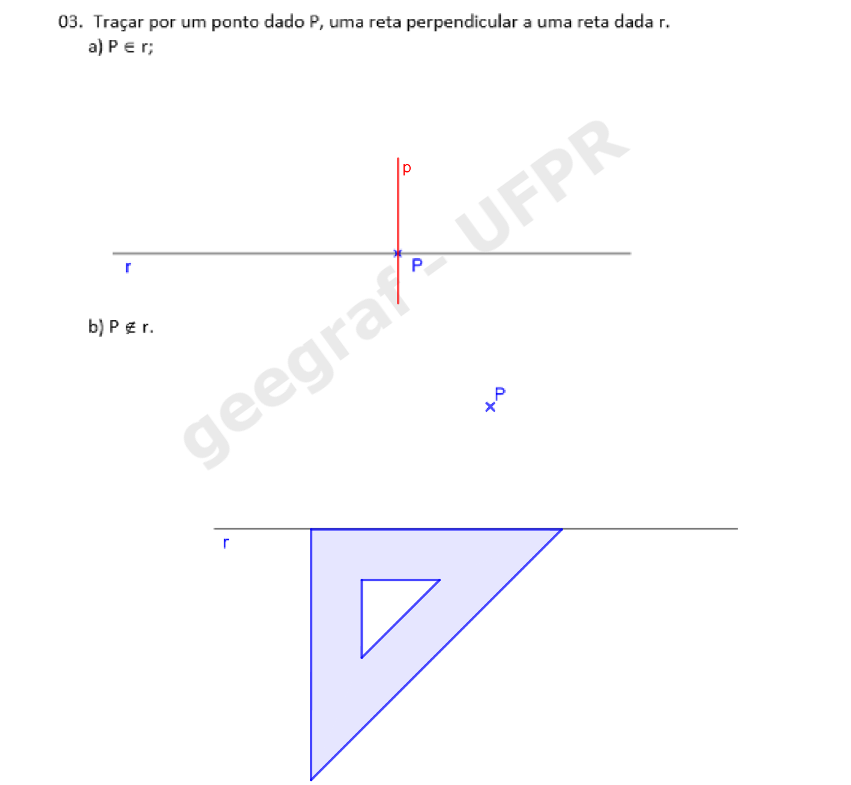
           <figcaption>Alinhe um dos catetos do esquadro com a reta <b>r</b>.</figcaption>
       </li>
       <li>
           <input type="radio" id="slide28" name="slide">
           <label for="slide28">7</label>
           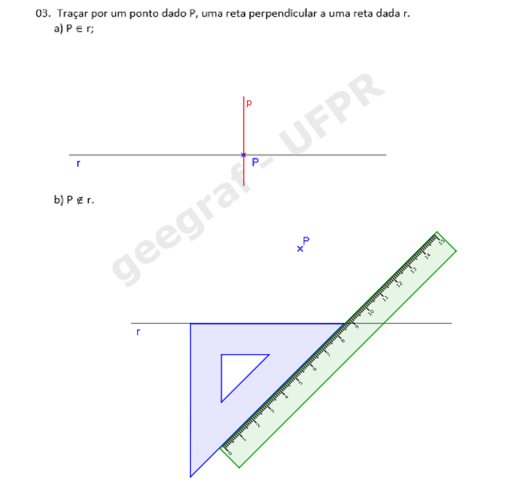
           <figcaption>Coloque a régua como apoio na hipotenusa do esquadro. A régua ficará fixa.</figcaption>
       </li>
       <li>
           <input type="radio" id="slide29" name="slide">
           <label for="slide29">8</label>
           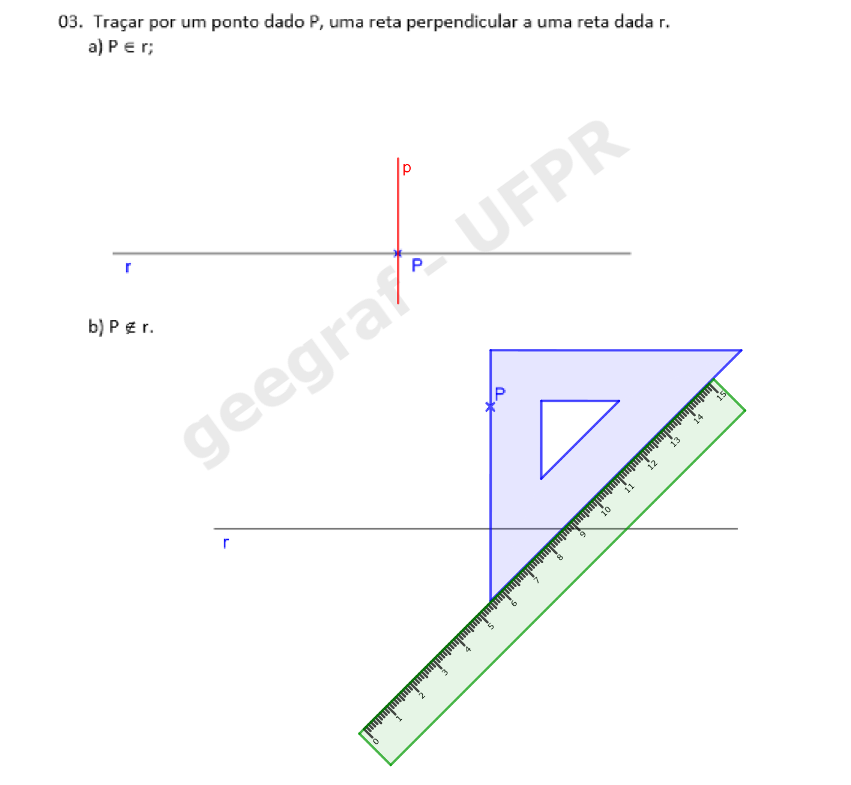
           <figcaption>Deslize o esquadro até o cateto vertical chegar na posição do ponto <b>P</b>. Lembre-se de não mover a régua.</figcaption>
       </li>
       <li>
           <input type="radio" id="slide30" name="slide">
           <label for="slide30">9</label>
           
           <figcaption>Desenhe a reta que passa pelo ponto <b>P</b>.</figcaption>
       </li>
       <li>
           <input type="radio" id="slide31" name="slide">
           <label for="slide31">10</label>
           
           <figcaption>Pronto! A reta perpendicular <b>p</b> está construída.</figcaption>
       </li>
    </ul>
    
  

    
Agora veja como fica a construção da reta perpendicular à reta <b>r</b> que passa por <b>P</b> usando régua e compasso.

  <ul class="slider">
       <li>
           <input type="radio" id="slide32" name="slide" checked>
           <label for="slide32">passos: 1</label>
           
           <figcaption>Com a ponta seca em <b>P</b> desenhe um arco para a esquerda obtendo o ponto <b>Q</b> sobre a reta <b>r</b> e um arco para a direita obtendo o ponto <b>R</b> sobre a reta. Ambos os arcos com o mesmo raio.</figcaption>
       </li>
       <li>
           <input type="radio" id="slide33" name="slide">
           <label for="slide33">2</label>
           
           <figcaption>Com a ponta seca em <b>Q</b>, desenhe um arco com raio maior do que a metade de <b>QR</b>.</figcaption>
       </li>
       <li>
           <input type="radio" id="slide34" name="slide">
           <label for="slide34">3</label>
           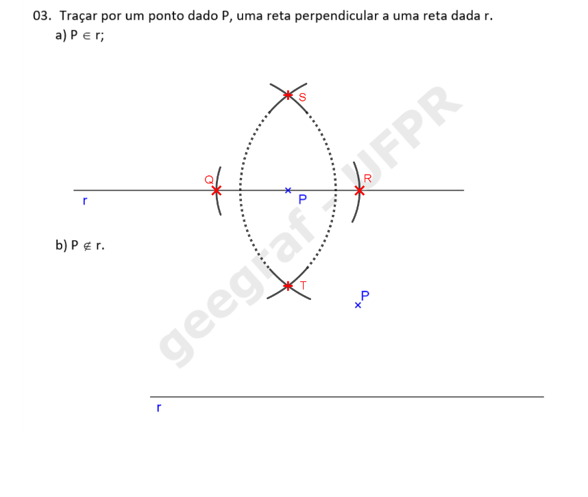
           <figcaption>Com a ponta seca em <b>R</b>, desenhe um arco com o mesmo raio usado no passo anterior. Os pontos de interseção dos arcos são <b>S</b> e <b>T</b>.</figcaption>
       </li>
       <li>
           <input type="radio" id="slide35" name="slide">
           <label for="slide35">4</label>
           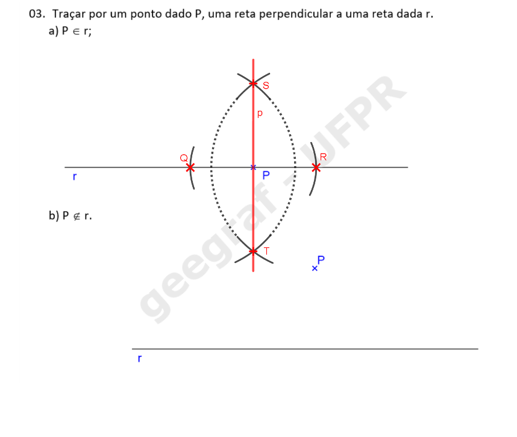
           <figcaption>Desenhe a reta que passa pelos pontos <b>S</b> e <b>T</b> de interseção dos arcos. Pronto! A perpendicular à reta <b>r</b> que passa pelo ponto <b>P</b> está construída!</figcaption>
       </li>
       <li>
           <input type="radio" id="slide36" name="slide">
           <label for="slide36">5</label>
           
           <figcaption>Com a ponta seca em <b>P</b> desenhe um arco com raio maior que a distância de <b>P</b> à reta <b>r</b>, obtendo os pontos <b>Q</b> e <b>R</b> sobre a reta <b>r</b>.</figcaption>
       </li>
       <li>
           <input type="radio" id="slide37" name="slide">
           <label for="slide37">6</label>
           
           <figcaption>Com a ponta seca em <b>Q</b> desenhe um arco.</figcaption>
       </li>
      <li>
           <input type="radio" id="slide38" name="slide">
           <label for="slide38">7</label>
           
           <figcaption>Com a ponta seca em <b>R</b> desenhe um arco com o mesmo raio do passo anterior, obtendo o ponto <b>S</b>.</figcaption>
       </li>
       <li>
           <input type="radio" id="slide39" name="slide">
           <label for="slide39">8</label>
           
           <figcaption>Desenhe a reta <b>p</b> que passa pelos pontos <b>P</b> e <b>S</b>. Pronto! A reta <b>p</b> é perpendicular à reta <b>r</b> e passa pelo ponto <b>P</b>. Note que essa construção é baseada na construção da mediatriz de um segmento dado!</figcaption>
       </li>
  </ul>
  
  

  

  

Exercício 4 da pág. 2: bissetriz

  
 Vamos utilizar a régua e o compasso para resolver este exercício. Clique nos botões do passo a passo para fazer a construção na sua apostila.

  <ul class="slider">
      <li>
           <input type="radio" id="slide40" name="slide" checked>
           <label for="slide40">passos: 1</label>
           
           <figcaption>Com a ponta seca no vértice <b>O</b> do ângulo desenhe um arco obtendo os pontos <b>P</b> e <b>Q</b>, cada um em um lado do ângulo.</figcaption>
       </li>
       <li>
           <input type="radio" id="slide41" name="slide">
           <label for="slide41">2</label>
           
           <figcaption>Com a ponta seca no ponto <b>P</b> desenhe um arco.</figcaption>
       </li>
	   <li>
           <input type="radio" id="slide41a" name="slide">
           <label for="slide41a">3</label>
           
           <figcaption>Com a ponta seca em <b>Q</b> desenhe um arco com o mesmo raio do passo anterior, obtendo o ponto <b>R</b>.</figcaption>
       </li>
       <li>
           <input type="radio" id="slide42" name="slide">
           <label for="slide42">4</label>
           
           <figcaption>Desenhe a reta <b>OR</b> que é a bissetriz do ângulo dado.</figcaption>
       </li>
       <li>
           <input type="radio" id="slide43" name="slide">
           <label for="slide43">5</label>
           
           <figcaption>Note que construímos dois triângulos: um verde e outro laranja.</figcaption>
       </li>
       <li>
           <input type="radio" id="slide44" name="slide">
           <label for="slide44">6</label>
           
           <figcaption>Esses triângulos são congruentes (iguais) e por isso os ângulos <b>&alpha;</b> e <b>&beta;</b> são também congruentes.</figcaption>
       </li>
    </ul>
    
  

  

  

Exercício 5 da pág. 3: transporte de ângulos

  
 Vamos utilizar a régua e o compasso para resolver este exercício. Clique nos botões do passo a passo para fazer a construção na sua apostila.

  <ul class="slider">
      <li>
           <input type="radio" id="slide45" name="slide" checked>
           <label for="slide45">passos: 1</label>
           
           <figcaption>Com a ponta seca no vértice <b>O</b> do ângulo desenhe um arco obtendo os pontos <b>R</b> e <b>Q</b>, cada um em um lado do ângulo.</figcaption>
       </li>
       <li>
           <input type="radio" id="slide46" name="slide">
           <label for="slide46">2</label>
           
           <figcaption>Com o mesmo raio do passo anterior, desenhe um arco agora com vértice no ponto <b>P</b>, obtendo o ponto <b>S</b> sobre a reta <b>r</b>.</figcaption>
       </li>
	   <li>
           <input type="radio" id="slide47" name="slide">
           <label for="slide47">3</label>
           
           <figcaption>Agora meça com o compasso o tamanho do segmento <b>QR</b>.</figcaption>
       </li>
       <li>
           <input type="radio" id="slide48" name="slide">
           <label for="slide48">4</label>
           
           <figcaption>Com raio <b>QR</b> desenhe um arco com centro no ponto <b>S</b>, obtendo o ponto <b>T</b> sobre o segundo arco desenhado.</figcaption>
       </li>
       <li>
           <input type="radio" id="slide49" name="slide">
           <label for="slide49">5</label>
           
           <figcaption>Construa a reta <b>PT</b>. O ângulo <b>&alpha;</b> obtido é congruente ao ângulo <b>&alpha;</b> dado. Note que o triângulo <b>ROQ</b> é congruente ao <b>TPS</b>, por isso que os ângulos são também congruentes.</figcaption>
       </li>
    </ul>
    
  

  

   <a href="#desenho"> voltar ao topo</a>

  
Propriedades das projeções cilíndricas

  
Leia o conteúdo das páginas 12 e 13 da apostila. Agora vamos começar a trabalhar com as projeções de objetos e figuras em um plano <b>&pi;'</b>.
 
  

Projeção Cônica, pág. 14

    
    <figcaption>Para projetar um ponto <b>A</b> qualquer do espaço usando a projeção cônica, basta definir a reta projetante <b>a</b>, que passa pelo centro de projeção <b>O</b> e pelo ponto <b>A</b>. A interseção desta reta com o plano <b>&pi;'</b> é a projeção <b>A'</b> do ponto <b>A</b>.</figcaption>
    <a href="vr/proj_conica.html" target="_blank"> Visualização em 3D</a>
  

  

  

Projeção Cilíndrica, pág. 14

    
    <figcaption>Para projetar um ponto <b>A</b> qualquer do espaço usando a projeção cilíndrica, basta definir a reta projetante <b>a</b>, paralela à direção <b>d</b> e que passa pelo ponto <b>A</b>. A interseção desta reta com o plano <b>&pi;'</b> é a projeção <b>A'</b> do ponto <b>A</b>. Se a reta <b>d</b> formar ângulo <b>0 < &theta; < 90o</b>, a projeção é chamada <b>oblíqua</b>. Quando <b>&theta; = 90o</b>, temos a projeção <b>ortogonal</b>.</figcaption>
    <a href="vr/proj_cilindrica.html" target="_blank"> Projeção cilíndrica <b>oblíqua</b> em 3D</a>
     <a href="vr/proj_cilindrica_orto.html" target="_blank"> Projeção cilíndrica <b>ortogonal</b> em 3D</a>
  

  

  

Recursos de Realidade Aumentada e Realidade Virtual

    
Esta apostila tem recursos programados em Realidade Aumentada e Realidade Virtal. Você pode acessar estes recursos usando o seguinte endereço:

    
<a href="https://paulohscwb.github.io/cotadas/ra.html"> https://paulohscwb.github.io/cotadas/ra.html</a>

    Os ambientes podem ser acessados em qualquer navegador com um dispositivo de webcam (smartphone, tablet ou notebook).
     O acesso aos sites de Realidade Virtual é feito clicando no círculo azul que aparece em cima dos marcadores.
      

  
    Veja o vídeo de demonstração do uso destes recursos:
    

      <iframe src="https://drive.google.com/file/d/1Tg2c6pOoDNESEAvl9kvXgRGv81D-U0Kw/preview" width="100%"></iframe>
    

  

  

  

Propriedade 1, pág. 15

    
      <figcaption>Quando a reta <b>r</b> não é paralela à direção <b>d</b>, a sua projeção <b>r'</b> é uma reta.</figcaption>
      <a href="vr/p1.html" target="_blank"> Propriedade em 3D: projeção <b>oblíqua</b></a>
	   <a href="vr/p1_orto.html" target="_blank"> Propriedade em 3D: projeção <b>ortogonal</b></a>
    

      <figcaption>No caso em que as retas <b>r</b> e <b>d</b> são paralelas, a projeção <b>r'</b> é um ponto.</figcaption>
      <a href="vr/p1a.html" target="_blank"> Propriedade em 3D: projeção <b>oblíqua</b></a>
	   <a href="vr/p1a_orto.html" target="_blank"> Propriedade em 3D: projeção <b>ortogonal</b></a>
  

  

  

Propriedade 2, pág. 16

    
      <figcaption>Considerando <b>r</b> e <b>s</b> estão em planos projetantes distintos, as projeções <b>r'</b> e <b>s'</b> são paralelas.</figcaption>
      <a href="vr/p2.html" target="_blank"> Propriedade em 3D: projeção <b>oblíqua</b></a>
	   <a href="vr/p2_orto.html" target="_blank"> Propriedade em 3D: projeção <b>ortogonal</b></a>
    

      <figcaption>Se <b>r</b> e <b>s</b> estão em um mesmo plano projetante, as projeções <b>r'</b> e <b>s'</b> são coincidentes.</figcaption>
      <a href="vr/p2a.html" target="_blank"> Propriedade em 3D: projeção <b>oblíqua</b></a>
	   <a href="vr/p2a_orto.html" target="_blank"> Propriedade em 3D: projeção <b>ortogonal</b></a>
    

      <figcaption>Quando as retas <b>r</b> e <b>s</b> são paralelas à direção <b>d</b>, suas projeções <b>r'</b> e <b>s'</b> são pontos.</figcaption>
      <a href="vr/p2c.html" target="_blank"> Propriedade em 3D: projeção <b>oblíqua</b></a>
	   <a href="vr/p2c_orto.html" target="_blank"> Propriedade em 3D: projeção <b>ortogonal</b></a>
  

  

  

Propriedade 3, pág. 17

    
      <figcaption>A proporção entre as medidas dos segmentos paralelos <b>AB</b> e <b>CD</b> é a mesma de suas projeções, ou seja: <b>AB/CD = A'B'/C'D'</b>.</figcaption>
      <a href="vr/p3a.html" target="_blank"> Propriedade em 3D: projeção <b>oblíqua</b></a>
	   <a href="vr/p3a_orto.html" target="_blank"> Propriedade em 3D: projeção <b>ortogonal</b></a>
    

      <figcaption>Se os segmentos <b>AB</b> e <b>CD</b> são colineares, a mesma proporção entre as medidas é válida: <b>AB/CD = A'B'/C'D'</b>.</figcaption>
      <a href="vr/p3b.html" target="_blank"> Propriedade em 3D: projeção <b>oblíqua</b></a>
	   <a href="vr/p3b_orto.html" target="_blank"> Propriedade em 3D: projeção <b>ortogonal</b></a>
  

  

  

Propriedade 4, pág. 18

      
      <figcaption>Uma figura pertencente a um plano paralelo ao plano de projeções <b>&pi;'</b> fica projetada com o mesmo tamanho, sem redução ou ampliação de tamanho.</figcaption>
      <a href="vr/p4.html" target="_blank"> Propriedade em 3D: projeção <b>oblíqua</b></a>
	   <a href="vr/p4_orto.html" target="_blank"> Propriedade em 3D: projeção <b>ortogonal</b></a>
  

  

  

Propriedade 5, pág. 18

      
      <figcaption>Uma figura que pertence a um plano <b>&alpha;</b> paralelo à direção <b>d</b> de projeções tem projeção reduzida a um segmento.</figcaption>
      <a href="vr/p5.html" target="_blank"> Propriedade em 3D: projeção <b>oblíqua</b></a>
	   <a href="vr/p5_orto.html" target="_blank"> Propriedade em 3D: projeção <b>ortogonal</b></a>
  

  

  

Exercício 1 da pág. 19

  
 Vamos utilizar a régua e o compasso para resolver este exercício. De acordo com a propriedade 3, podemos encontrar a projeção do ponto médio de <b>AB</b> construindo a mediatriz da projeção deste segmento. Clique nos botões do passo a passo para fazer a construção na sua apostila.

  <ul class="slider">
      <li>
           <input type="radio" id="slide100" name="slide" checked>
           <label for="slide100">passos: 1</label>
           
           <figcaption>Com a ponta seca em <b>A'</b>, desenhe um arco com raio maior do que a metade de <b>A'B'</b>.</figcaption>
       </li>
       <li>
           <input type="radio" id="slide101" name="slide">
           <label for="slide101">2</label>
           
           <figcaption>Com a ponta seca em <b>B'</b>, desenhe um arco com o mesmo raio usado no passo anterior.</figcaption>
       </li>
       <li>
           <input type="radio" id="slide102" name="slide">
           <label for="slide102">3</label>
           
           <figcaption>Desenhe a reta que passa pelos pontos de interseção dos arcos usando a régua.</figcaption>
       </li>
       <li>
           <input type="radio" id="slide103" name="slide">
           <label for="slide103">4</label>
           
           <figcaption>A projeção do ponto médio <b>M'</b> está na interseção da mediatriz de <b>A'B'</b> com o segmento <b>A'B'</b>.</figcaption>
       </li>
       <li>
           <input type="radio" id="slide104" name="slide">
           <label for="slide104">5</label>
           
           <figcaption>Como os pontos <b>A'</b> e <b>B'</b> estão coincidentes, quer dizer que o segmento <b>AB</b> é paralelo à direção das projetantes. Logo, <b>M'</b> coincide com <b>A'</b> e <b>B'</b>.</figcaption>
       </li>
    </ul>
    
  

  

  

Exercício 2 da pág. 19 (item a)

  
 Vamos utilizar a régua, o compasso e o par de esquadros para resolver este exercício. De acordo com a propriedade 2, podemos encontrar a projeção dos lados de um paralelogramo utilizando a construção de retas paralelas.

  <ul class="slider">
      <li>
           <input type="radio" id="slide105" name="slide" checked>
           <label for="slide105">passos: 1</label>
           
           <figcaption>A projeção do lado <b>C'D'</b> será paralela ao segmento <b>A'B'</b>. Logo, podemos desenhar a reta <b>C'D' // A'B'</b> com o uso de esquadros.</figcaption>
       </li>
       <li>
           <input type="radio" id="slide106" name="slide">
           <label for="slide106">2</label>
           
           <figcaption>Alinhando o esquadro de 45o com <b>A'B'</b>, coloque como apoio o outro esquadro ou a régua. Deslize o esquadro de 45o deixando o outro esquadro ou a régua fixo.</figcaption>
       </li>
       <li>
           <input type="radio" id="slide107" name="slide">
           <label for="slide107">3</label>
           
           <figcaption>Usando a mesma construção, você pode desenhar a reta paralela a <b>A'D'</b>, ou usar o compasso. Pela propriedade 3, <b>A'B' = C'D'</b>, logo, podemos "pegar" a medida <b>A'B'</b> com o compasso... </figcaption>
       </li>
       <li>
           <input type="radio" id="slide108" name="slide">
           <label for="slide108">4</label>
           
           <figcaption>... e desenhá-la com centro em <b>D'</b> e o raio <b>A'B'</b>. Logo, encontramos o ponto <b>C'</b>.</figcaption>
       </li>
       <li>
           <input type="radio" id="slide109" name="slide">
           <label for="slide109">5</label>
           
           <figcaption>Pronto! O paralelogramo está construído. Agora é sua vez de fazer o item b!</figcaption>
       </li>
    </ul>
    
  

  

  

Exercício 2 da pág. 19 (item c)

  
 Vamos utilizar a régua e o compasso para resolver este exercício. De acordo com a propriedade 5, o paralelogramo está em um plano paralelo à direção <b>d</b> das projetantes.

  <ul class="slider">
      <li>
           <input type="radio" id="slide110" name="slide" checked>
           <label for="slide110">passos: 1</label>
           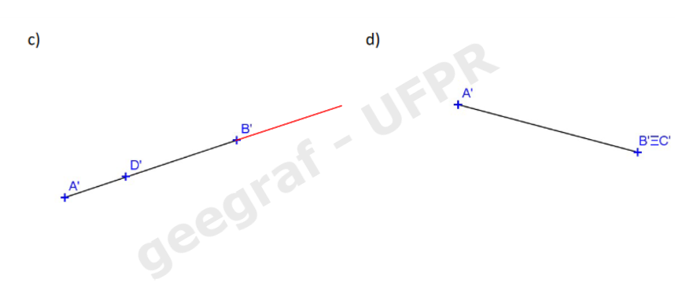
           <figcaption>O vértice <b>C'</b> do paralelogramo estará no prolongamento da reta <b>A'B'</b>.</figcaption>
       </li>
       <li>
           <input type="radio" id="slide111" name="slide">
           <label for="slide111">2</label>
           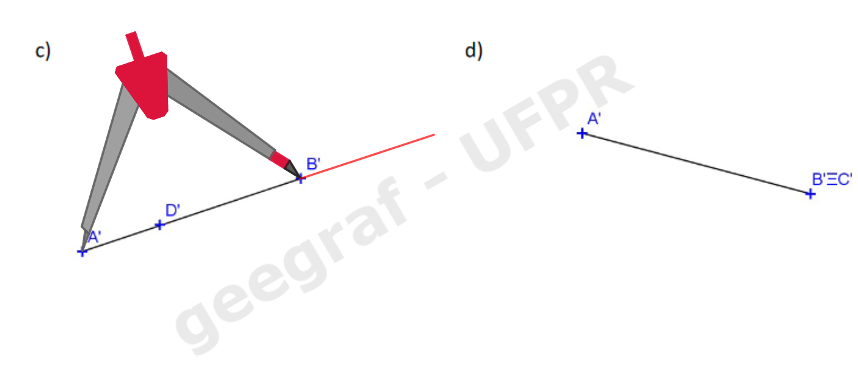
           <figcaption>De acordo com a propriedade 3, os segmentos <b>A'B'</b> e <b>C'D'</b> são iguais. Logo, podemos "pegar" a medida <b>A'B'</b> com o compasso...</figcaption>
       </li>
       <li>
           <input type="radio" id="slide112" name="slide">
           <label for="slide112">3</label>
           
           <figcaption>... e desenhar o arco com medida <b>A'B'</b> no prolongamento deste segmento.</figcaption>
       </li>
       <li>
           <input type="radio" id="slide113" name="slide">
           <label for="slide113">4</label>
           
           <figcaption>Assim, encontramos o vértice <b>C'</b> do paralelogramo.</figcaption>
       </li>
    </ul>
    
  

  

  

Exercício 3 da pág. 20 (item a)

  
 Vamos utilizar a régua e o compasso para resolver este exercício.

  <ul class="slider">
      <li>
           <input type="radio" id="slide114" name="slide" checked>
           <label for="slide114">passos: 1</label>
           
           <figcaption>Relembrando uma propriedade do paralelogramo: as diagonais interceptam-se em seus respectivos pontos médios. Logo, pela propriedade 3, <b>A'M' = M'C'</b>.</figcaption>
       </li>
       <li>
           <input type="radio" id="slide115" name="slide">
           <label for="slide115">2</label>
           
           <figcaption>Logo, podemos "pegar" a medida <b>A'B'</b> com o compasso e prolongar o segmento <b>A'M'</b>.</figcaption>
       </li>
       <li>
           <input type="radio" id="slide116" name="slide">
           <label for="slide116">3</label>
           
           <figcaption>Para encontrar <b>C'</b>, basta desenhar o arco com medida <b>A'M'</b> no prolongamento de <b>A'M'</b>.</figcaption>
       </li>
       <li>
           <input type="radio" id="slide117" name="slide">
           <label for="slide117">4</label>
           
           <figcaption>O mesmo acontece com os segmentos <b>B'M'</b> e <b>M'D'</b>. Logo, podemos "pegar" a medida <b>B'M'</b> com o compasso...</figcaption>
       </li>
       <li>
           <input type="radio" id="slide118" name="slide">
           <label for="slide118">5</label>
           
           <figcaption>... e podemos desenhar o arco com centro em <b>M'</b> e raio <b>B'M'</b>.</figcaption>
       </li>
       <li>
           <input type="radio" id="slide119" name="slide">
           <label for="slide119">6</label>
           
           <figcaption>Pronto! O paralelogramo está construído. Não esqueça de desenhar os lados desta figura.</figcaption>
       </li>
    </ul>
    
  

  

  

Exercício 3 da pág. 20 (item b)

  
 Vamos utilizar a régua e o compasso para resolver este exercício.

  <ul class="slider">
      <li>
           <input type="radio" id="slide120" name="slide" checked>
           <label for="slide120">passos: 1</label>
           
        <figcaption>Como as projeções dos vértices <b>A'</b> e <b>B'</b> são coincidentes, pela propriedade 1, podemos concluir que <b>AB // d</b>. Portanto, temos que <b>C'D' // d</b>.</figcaption>
       </li>
       <li>
           <input type="radio" id="slide121" name="slide">
           <label for="slide121">2</label>
           
         <figcaption>Podemos "pegar" a medida entre os pontos <b>A'=B'</b> e <b>M'</b> com o compasso e prolongar o segmento que une estes pontos.</figcaption>
       </li>
       <li>
           <input type="radio" id="slide122" name="slide">
           <label for="slide122">3</label>
           
           <figcaption>Os pontos <b>C'</b> e <b>D'</b> também coincidem, pois <b>AB // CD</b>.  Para encontrar <b>C'=D'</b>, basta desenhar o arco com medida <b>A'M'</b> no prolongamento de <b>A'M'</b>.</figcaption>
       </li>
       <li>
           <input type="radio" id="slide123" name="slide">
           <label for="slide123">4</label>
           
           <figcaption>O paralelogramo está construído. Use o link abaixo para visualizar em 3D a propriedade que usamos. Agora você pode construir o item c deste exercício.</figcaption>
       </li>
    </ul>
    
    <a href="vr/20_03b.html" target="_blank"> Visualização em 3D</a>
  

  

  

Exercício 4 da pág. 20 (item a)

  
 Vamos utilizar a régua e o compasso para resolver este exercício.

  <ul class="slider">
      <li>
           <input type="radio" id="slide124" name="slide" checked>
           <label for="slide124">passos: 1</label>
           
        <figcaption>Relembrando a propriedade do baricentro: A distância do baricentro a um vértice mede 2/3 da mediana, ou seja, <b>CG = 2CM/3</b> ou <b>GM = CM/3.</b></figcaption>
       </li>
       <li>
           <input type="radio" id="slide125" name="slide">
           <label for="slide125">2</label>
           
         <figcaption>Pela propriedade 3, a medida <b>G'M'</b> mede <b>CM/3</b>. Então vamos construir a mediatriz do segmento <b>A'B'</b>.</figcaption>
       </li>
       <li>
           <input type="radio" id="slide126" name="slide">
           <label for="slide126">3</label>
           
         <figcaption>Usando os arcos de mesma medida, com centros em <b>A'</b> e <b>B'</b>, obtemos os pontos que definem a mediatriz de <b>A'B'</b>.</figcaption>
       </li>
       <li>
           <input type="radio" id="slide127" name="slide">
           <label for="slide127">4</label>
           
         <figcaption>Unindo os pontos <b>M'</b> e <b>G'</b>, podemos usar o compasso para "pegar" a medida <b>G'M'</b>.</figcaption>
       </li>
       <li>
           <input type="radio" id="slide128" name="slide">
           <label for="slide128">5</label>
           
           <figcaption>Com o centro em <b>G'</b>, marcamos uma vez o segmento com medida igual a <b>G'M'</b>.</figcaption>
       </li>
       <li>
           <input type="radio" id="slide129" name="slide">
           <label for="slide129">6</label>
           
           <figcaption>Na sequência, marcamos novamente um segmento com a mesma medida. Assim, encontramos <b>G'C' = 2G'M'</b>.</figcaption>
       </li>
       <li>
           <input type="radio" id="slide130" name="slide">
           <label for="slide130">7</label>
           
           <figcaption>Agora você pode desenhar os lados do triângulo <b>A'B'C'</b>.</figcaption>
       </li> 
    </ul>
    
  

  

Exercício 4 da pág. 20 (item b)

  
 Vamos utilizar a régua e o compasso para resolver este exercício.

  <ul class="slider">
      <li>
           <input type="radio" id="slide131" name="slide" checked>
           <label for="slide131">passos: 1</label>
           
        <figcaption>Vamos usar a mesma propriedade do item anterior: A distância do baricentro a um vértice mede 2/3 da mediana, ou seja, <b>CG = 2CM/3</b> ou <b>GM = CM/3.</b></figcaption>
       </li>
       <li>
           <input type="radio" id="slide132" name="slide">
           <label for="slide132">2</label>
           
         <figcaption>Pela propriedade 2, se os pontos <b>A'</b> e <b>B'</b> coincidem, o lado <b>AB</b> é paralelo à direção <b>d</b>. Logo, o ponto <b>M'</b> também coincide com <b>A'</b> e <b>B'</b>.</figcaption>
       </li>
       <li>
           <input type="radio" id="slide133" name="slide">
           <label for="slide133">3</label>
           
         <figcaption>Logo, podemos prolongar a reta <b>A'G'</b> para encontrar a projeção do vértice <b>C</b>. Usando o compasso, "pegamos" a medida <b>A'G'</b> e podemos marcá-la a partir de <b>G'</b></figcaption>
       </li>
       <li>
           <input type="radio" id="slide134" name="slide">
           <label for="slide134">4</label>
           
         <figcaption>Marcando-se duas vezes esta medida <b>A'G'</b> encontramos a projeção <b>C'</b>. Neste caso, o triângulo <b>ABC</b> fica projetado como um segmento.</figcaption>
       </li>
	   <li>
           <input type="radio" id="slide135" name="slide">
           <label for="slide135">5</label>
           
         <figcaption>Use o link abaixo para visualizar o exercício em 3D. Agora é sua vez de construir o item c.</figcaption>
       </li>
    </ul>
	
    <a href="vr/20_04b.html" target="_blank"> Visualização em 3D</a>
  

  

  

Exercício 4 da pág. 20 (item c)

  
 Resolva este exercício com a ajuda da visualização em 3D com o link abaixo.

  	
    <a href="vr/p_ex4c_triangulo.html" target="_blank"> Visualização em 3D</a>
  

  

  

Exercício 5 da pág. 21 (item a)

  
 Vamos utilizar a régua e o compasso para resolver este exercício.

  <ul class="slider">
      <li>
           <input type="radio" id="slide136" name="slide" checked>
           <label for="slide136">passos: 1</label>
           
        <figcaption>Relembrando as propriedades do hexágono regular: os lados são iguais ao raio da circunferência circunscrita, e os raios são paralelos aos lados.</figcaption>
       </li>
       <li>
           <input type="radio" id="slide137" name="slide">
           <label for="slide137">2</label>
           
         <figcaption>Pela propriedade 3, os segmentos <b>A'O'</b> e <b>B'C'</b> terão projeções com mesma medida e serão paralelos. Logo, podemos construir a paralela a <b>A'O'</b> que passa por <b>B'</b>.</figcaption>
       </li>
       <li>
           <input type="radio" id="slide138" name="slide">
           <label for="slide138">3</label>
           
         <figcaption>Alinhando a hipotenusa de um esquadro e apoiando este esquadro com a régua ou outro esquadro, basta deslizar o esquadro que você alinhou até chegar em <b>B'</b>.</figcaption>
       </li>
       <li>
           <input type="radio" id="slide139" name="slide">
           <label for="slide139">4</label>
           
         <figcaption>Como <b>AO = BC</b> e <b>AO // BC</b>, pelas propriedades 2 e 3 temos que <b>A'O' = B'C'</b> e <b>A'O' // B'C'</b>. Podemos "pegar" a medida <b>A'O'</b> com o compasso...</figcaption>
       </li>
	   <li>
           <input type="radio" id="slide140" name="slide">
           <label for="slide140">5</label>
           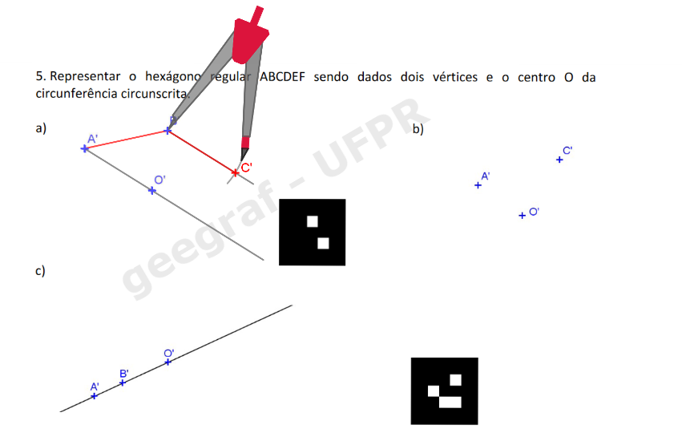
         <figcaption>... e marcá-la na paralela construída, a partir do ponto <b>B'</b>. Assim, encontramos a projeção do ponto <b>C'</b>.</figcaption>
       </li>
	   <li>
           <input type="radio" id="slide141" name="slide">
           <label for="slide141">6</label>
           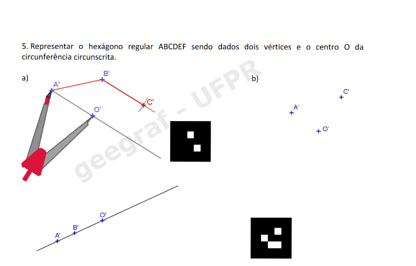
         <figcaption>Usando a propriedade 3, como <b>A</b>, <b>O</b> e <b>D</b> são colineares, temos que <b>A'O' = O'D'</b>. Podemos "pegar" essa medida com o compasso...</figcaption>
       </li>
	   <li>
           <input type="radio" id="slide142" name="slide">
           <label for="slide142">7</label>
           
         <figcaption>... e desenhar o arco com centro em <b>O'</b>. Assim, encontramos o vértice <b>D'</b>.</figcaption>
       </li>
	   <li>
           <input type="radio" id="slide143" name="slide">
           <label for="slide143">8</label>
           
         <figcaption>Podemos fazer a mesma construção com os segmentos <b>O'F' = O'C'</b> para encontrar <b>F'</b>.</figcaption>
       </li>
	   <li>
           <input type="radio" id="slide144" name="slide">
           <label for="slide144">9</label>
           
         <figcaption>E para fechar o hexágono, fazemos a mesma construção com os segmentos <b>B'O' = O'E'</b>. Use o link abaixo para visualizar o exercício em 3D.</figcaption>
       </li>
    </ul>
	
    <a href="vr/p_ex5a_hexagono.html" target="_blank"> Visualização em 3D</a>
  

  

  

Exercícios 4 e 5, págs. 20 e 21

  

    <figcaption>Visualização do item c do Exercício 5 com RV e RA.</figcaption>
    
  

  

  

Visualização da Propriedade 7, pág. 22

  
    <figcaption>Visualização da propriedade 7 com RV e RA.</figcaption>
    
  

 <a href="#propriedades"> voltar ao topo</a>

  
Pontos, retas e segmentos em épura

<h3>Exemplo de pontos em épura, pág. 27</h3>

  <figcaption>Visualização do exercício da página 27 com RV e RA.</figcaption>
  

<h3>Verdadeira grandeza de um segmento, pág. 28</h3>

  <figcaption>Visualização em RA e RV do rebatimento usado para encontrar a verdadeira grandeza de um segmento AB.</figcaption>
  

Condições de incidência, pág. 47 (5o caso)

  
 Vamos verificar se as retas são paralelas ou concorrentes, considerando a reta <b>s</b> qualquer e a reta <b>r</b> vertical. Como pertencem ao mesmo plano projetante, elas são necessariamente concorrentes, basta encontrar o ponto <b>P</b> de concorrência. Usando o método do rebatimento, siga os seguintes passos:</b>
  <ul class="slider">
      <li>
           <input type="radio" id="slide308" name="slide" checked>
           <label for="slide308">passos: 1</label>
           
        <figcaption>: Marcar a cota do ponto <b>A</b></figcaption>
       </li>
       <li>
           <input type="radio" id="slide309" name="slide">
           <label for="slide309">2</label>
           
         <figcaption>Marcar a cota do ponto <b>B</b></figcaption>
       </li>
       <li>
           <input type="radio" id="slide310" name="slide">
           <label for="slide310">3</label>
           
         <figcaption>Representar a reta s rebatida, unindo <b>A'1</b> e <b>B'1</b></figcaption>
       </li>
       <li>
           <input type="radio" id="slide311" name="slide">
           <label for="slide311">4</label>
           
         <figcaption>Rebater a reta <b>r</b>.</figcaption>
       </li>
	   <li>
           <input type="radio" id="slide312" name="slide">
           <label for="slide312">5</label>
           
         <figcaption>Verificar que a cota do ponto <b>P</b>, de intersecção entre as retas tem cota <b>5</b></figcaption>
       </li>
	</ul>
	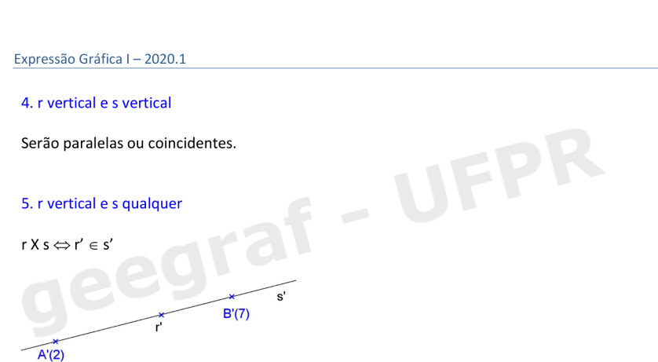
  

  

Condições de incidência, pág. 47 (6o caso)

  
 Vamos verificar se as retas são paralelas ou concorrentes considerando as retas r e s quaisquer. Devemos verificar o ponto de interseção tem a mesma cota nas duas retas, para isso utilizamos o método do rebatimento.

  <ul class="slider">
      <li>
           <input type="radio" id="slide300" name="slide" checked>
           <label for="slide300">passos: 1</label>
           
        <figcaption>Marcar a cota do ponto <b>A'(2)</b>.</b></figcaption>
       </li>
       <li>
           <input type="radio" id="slide301" name="slide">
           <label for="slide301">2</label>
           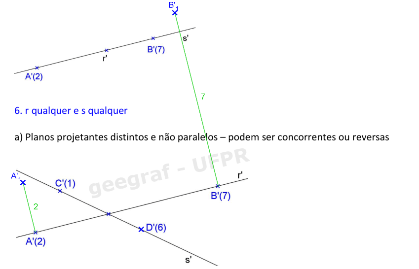
         <figcaption>Marcar a cota do ponto <b>B'(7)</b></figcaption>
       </li>
       <li>
           <input type="radio" id="slide302" name="slide">
           <label for="slide302">3</label>
           
         <figcaption>Representar a reta rebatida unindo <b>A'1</b> e <b>B'1</b></figcaption>
       </li>
       <li>
           <input type="radio" id="slide303" name="slide">
           <label for="slide303">4</label>
           
         <figcaption>Verificar qual é a cota do ponto <b>P</b> na reta <b>r</b> rebatida. A cota do ponto <b>P</b> na reta <b>r</b> é <b>4</b>.</figcaption>
       </li>
	   <li>
           <input type="radio" id="slide304" name="slide">
           <label for="slide304">5</label>
           
         <figcaption>Rebater a reta <b>s</b>, marcando a cota do ponto <b>C'(1)</b></figcaption>
       </li>
	   <li>
           <input type="radio" id="slide305" name="slide">
           <label for="slide305">6</label>
           
         <figcaption>Marcar a cota do ponto <b>D'(6)</b></figcaption>
       </li>
	   <li>
           <input type="radio" id="slide306" name="slide">
           <label for="slide306">7</label>
           
         <figcaption>Representar a reta <b>s</b> rebatida</figcaption>
       </li>
	   <li>
           <input type="radio" id="slide307" name="slide">
           <label for="slide307">8</label>
           
         <figcaption>Verificar que a cota do ponto <b>P</b> na reta <b>s</b> também é <b>4</b>. Portanto as retas <b>r</b> e <b>s</b> são concorrentes no ponto <b>P</b> de cota <b>4</b></figcaption>
       </li>
    </ul>
	
  

  

   <a href="#pontos"> voltar ao topo</a>

  
Sólidos em Projeções Cotadas

<h3>Pirâmide de base hexagonal, pág. 53</h3>
  
  <figcaption>Visualização em RA e RV do Exercício 2.</figcaption>
  

<h3>Pirâmide de base quadrada, pág. 56</h3>
  
  <figcaption>Visualização em RA e RV do Exercício 1.</figcaption>
  

<h3>Prisma de base hexagonal, pág. 56</h3>
  
  <figcaption>Visualização em RA e RV do Exercício 2.</figcaption>
  
 <a href="#solidos"> voltar ao topo</a>

  
Reta de declive e Rebatimento de um plano qualquer

<h3>Exemplo da pág. 63</h3>
  
  <figcaption>Visualização em RA e RV da representação da reta de declive de um plano qualquer.</figcaption>
  
<h3>Exemplo da pág. 66</h3>

  <figcaption>Visualização em RA e RV do rebatimento de um plano qualquer no plano horizontal de projeções.</figcaption>
  
 <a href="#rebatimento"> voltar ao topo</a>

  
Interseções de planos

<h3>Exemplo da pág. 74</h3>
  
  <figcaption>Visualização em RA e RV da interseção de um plano horizontal e um plano vertical.</figcaption>
  
<h3>Exemplo da pág. 74</h3>

  <figcaption>Visualização em RA e RV da interseção entre um plano qualquer e um plano horizontal.</figcaption>
  
<h3>Exemplo da pág. 75</h3>

  <figcaption>Visualização em RA e RV da interseção de um plano qualquer e um plano vertical.</figcaption>
  
<h3>Exemplo da pág. 75</h3>

  <figcaption>Visualização em RA e RV da interseção entre dois planos quaisquer.</figcaption>
  
 <a href="#intersecoes"> voltar ao topo</a>

  
Representações de telhados

 Para ver os telhados em Realidade Aumentada, visite o site:
 
<a href="https://paulohscwb.github.io/cotadas/telhados.html"> https://paulohscwb.github.io/cotadas/telhados.html</a>

<h3>Terminologia, pág. 79</h3>

  <figcaption>Visualização em RA e RV de um telhado com a terminologia utilizada.</figcaption>
  

<h3>Exercício 3.3, pág. 83</h3>

  <figcaption>Visualização em RA e RV do exercício 3.3: telhado com inclinações iguais.</figcaption>
  

<h3>Exercício 3.4, pág. 84</h3>

  <figcaption>Visualização em RA e RV do exercício 3.4: telhado com inclinações iguais.</figcaption>
  

<h3>Exercício 3.5, pág. 85</h3>

  <figcaption>Visualização em RA e RV do exercício 3.5: telhado com inclinações iguais.</figcaption> 
  

<h3>Exercício 3.6, pág. 86</h3>

  <figcaption>Visualização em RA e RV do exercício 3.6: telhado com inclinações iguais.</figcaption>
  

<h3>Exercício 3.7, pág. 87</h3>

  <figcaption>Visualização em RA e RV do exercício 3.7: telhado com inclinações iguais.</figcaption>
  

<h3>Exercício 3.8, pág. 88</h3>

  <figcaption>Visualização em RA e RV do exercício 3.8: telhado com inclinações iguais.</figcaption>
  

<h3>Exercício 3.9, pág. 89</h3>

  <figcaption>Visualização em RA e RV do exercício 3.9: telhado com inclinações iguais.</figcaption>
  

<h3>Exercício 4.3, pág. 92</h3>

  <figcaption>Visualização em RA e RV do exercício 4.3: telhado com inclinações diferentes.</figcaption>
  

<h3>Exercício 4.4, pág. 93</h3>

  <figcaption>Visualização em RA e RV do exercício 4.4: telhado com inclinações diferentes.</figcaption>
  

<h3>Exercício 4.5, pág. 94</h3>

  <figcaption>Visualização em RA e RV do exercício 4.5: telhado com inclinações diferentes.</figcaption>
  

<h3>Exercício 4.6, pág. 95</h3>

  <figcaption>Visualização em RA e RV do exercício 4.6: telhado com inclinações e níveis diferentes.</figcaption>
  
 <a href="#telhados"> voltar ao topo</a>

  
Superfícies Topográficas

 Para ver as superfícies topográficas em Realidade Aumentada, visite o site:
 
<a href="https://paulohscwb.github.io/cotadas/superficies.html"> https://paulohscwb.github.io/cotadas/superficies.html</a>

<h3>Curvas de nível, pág. 97</h3>
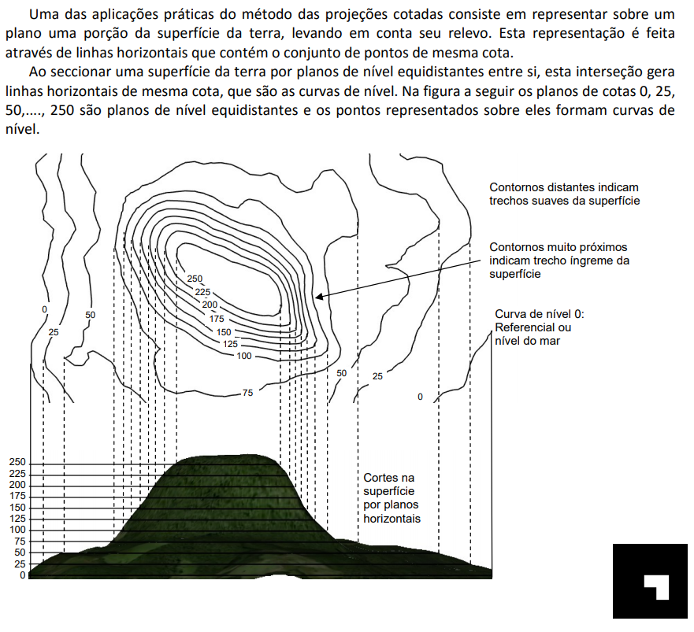
  <figcaption>Visualização em RA e RV da superfície topográfica com suas respectivas curvas de nível.</figcaption>
  

<h3>Exercício 1, pág. 99</h3>

  <figcaption>Visualização em RA e RV do exercício 1 com suas curvas de nível.</figcaption>
  

<h3>Exercício 2, pág. 103</h3>

  <figcaption>Visualização em RA e RV do exercício 2: perfil topográfico de um terreno.</figcaption>
  

<h3>Exercício 3, pág. 104</h3>

  <figcaption>Visualização em RA e RV do exercício 3: perfil topográfico de um terreno.</figcaption>
  

<h3>Exercício da pág. 106</h3>

  <figcaption>Visualização em RA e RV do exercício da página 106: seção plana de um terreno.</figcaption>
  

<h3>Exercício da pág. 111</h3>

  <figcaption>Visualização em RA e RV do exercício da página 111: cortes de um terreno para construção de uma estrada.</figcaption>
  

<h3>Exercício 2, pág. 114</h3>

 
  <figcaption>Visualização em RA e RV do exercício 2: seção mista de um terreno (corte e aterro).</figcaption>
  <a href="#superficies"> voltar ao topo</a>

 <b>desenvolvido por:</b> Paulo Henrique Siqueira - Universidade Federal do Paraná 
 <b>contato:</b> paulohscwb@gmail.com 
  Este site contém algumas partes da <a href="http://www.exatas.ufpr.br/portal/degraf_paulo/wp-content/uploads/sites/4/2014/09/Cotadas_2020.pdf" target="_blank">apostila de Projeções Cotadas</a> usada em sala de aula para visualizar os objetos com Realidade Virtual (RV) e Realidade Aumentada (RA). As propriedades de projeções, os sólidos e as maquetes podem ser vistos em RA com os marcadores indicados, e através dos links criados nos marcadores, os objetos podem ser vistos em RV. 
 Para ver os objetos em Realidade Aumentada, visite o site:
 
<a href="https://paulohscwb.github.io/cotadas/ra.html"> https://paulohscwb.github.io/cotadas/ra.html</a>

 em qualquer navegador com um dispositivo de webcam (smartphone, tablet ou notebook).
 O acesso aos sites de Realidade Virtual é feito clicando no círculo azul que aparece em cima dos marcadores.
  

  <b>Referências</b>
 O ambiente Realidade Aumentada foi criado com os scripts de <b>Jerome Etienne</b>: <a href="https://github.com/jeromeetienne/AR.js"> AR.js - Augmented Reality for the Web</a>.
 Os scripts de órbita desenvolvidos por <b>Kevin Ngo</b> foram usados nas páginas de RV: <a href="https://github.com/supermedium/superframe/tree/master/components/orbit-controls/"> Orbit controls for A-Frame</a>.
 As faces de poliedros foram criadas com a função desenvolvida por <b>Andreas Plesch</b>: <a href="https://github.com/andreasplesch/aframe-faceset-component"> Geometry from vertices and faces</a>.
