<head>
<link rel="stylesheet" href="scripts/style.css">
</head>

<h2 id="inicio">Visualização de propriedades de projeções, sólidos e aplicações</h2> 

  
Desenho Geométrico: pág. 1-10

  

	  
   

&#x1f4cf; &#x1f4d0; resolução: 1o segmento

	

 Vamos utilizar a régua e o compasso para resolver este exercício. Clique nos botões do passo a passo para fazer a construção na sua apostila.

	  <ul class="slider">
		  <li>
			   <input type="radio" id="slide1" name="slide" checked>
			   <label for="slide1">1</label>
			   
			   <figcaption>Com a ponta seca em <b>A</b>, desenhe um arco com raio maior do que a metade de <b>AB</b>.</figcaption>
		   </li>
		   <li>
			   <input type="radio" id="slide2" name="slide">
			   <label for="slide2">2</label>
			   
			   <figcaption>Com a ponta seca em <b>B</b>, desenhe um arco com o mesmo raio usado no passo anterior.</figcaption>
		   </li>
		   <li>
			   <input type="radio" id="slide3" name="slide">
			   <label for="slide3">3</label>
			   
			   <figcaption>Os pontos de interseção dos arcos são <b>P</b> e <b>Q</b>.</figcaption>
		   </li>
		   <li>
			   <input type="radio" id="slide4" name="slide">
			   <label for="slide4">4</label>
			   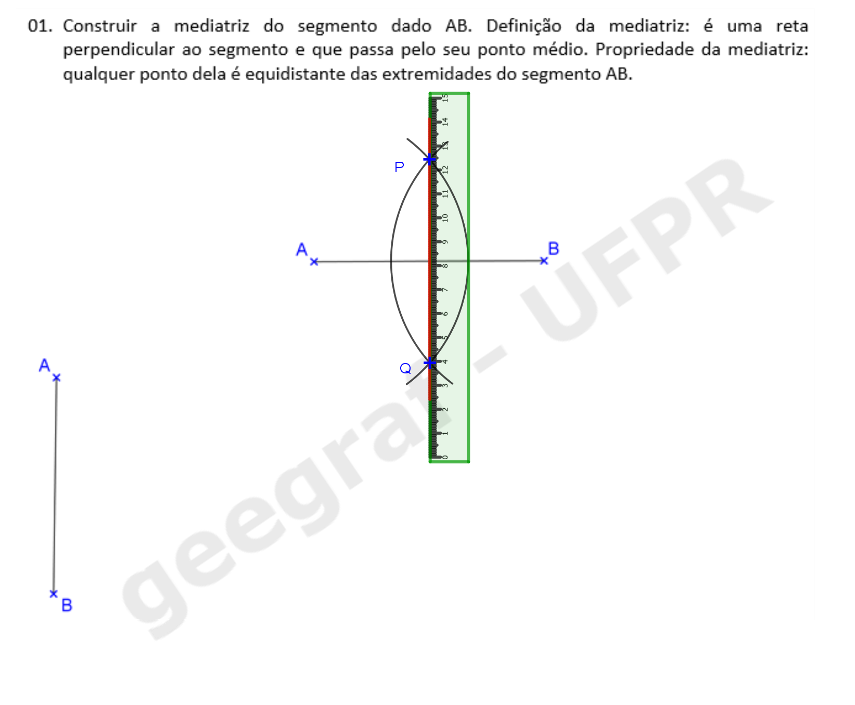
			   <figcaption>Desenhe a reta que passa pelos pontos de interseção dos arcos.</figcaption>
		   </li>
		   <li>
			   <input type="radio" id="slide5" name="slide">
			   <label for="slide5">5</label>
			   
			   <figcaption>Pronto! A mediatriz do segmento <b>AB</b> está construída.</figcaption>
		   </li>
		</ul>
		
	

  

  

&#x1f4cf; &#x1f4d0; resolução: 2o segmento

  

Agora veja como fica a construção da mediatriz do segmento <b>AB</b> próximo da margem da folha.

  <ul class="slider">
       <li>
           <input type="radio" id="slide6" name="slide" checked>
           <label for="slide6">1</label>
           
           <figcaption>Podemos começar desenhando um arco com a ponta seca em <b>A</b> e um raio maior do que a metade de <b>AB</b>.</figcaption>
       </li>
       <li>
           <input type="radio" id="slide7" name="slide">
           <label for="slide7">2</label>
           
           <figcaption>Com a ponta seca em <b>B</b>, podemos desenhar um arco com a mesma medida usada no ponto <b>A</b>.</figcaption>
       </li>
       <li>
           <input type="radio" id="slide8" name="slide">
           <label for="slide8">3</label>
           
           <figcaption>Podemos desenhar um arco com medida diferente da que usamos nos passos anteriores para encontrar o segundo ponto da mediatriz.</figcaption>
       </li>
       <li>
           <input type="radio" id="slide9" name="slide">
           <label for="slide9">4</label>
           
           <figcaption>Desenhando os arcos com centros em <b>A</b> e <b>B</b> com mesma medida, encontramos os pontos <b>P</b> e <b>Q</b> da mediatriz.</figcaption>
       </li>
       <li>
           <input type="radio" id="slide10" name="slide">
           <label for="slide10">5</label>
           
           <figcaption>Desenhe a reta que passa pelos pontos <b>P</b> e <b>Q</b>.</figcaption>
       </li>
       <li>
           <input type="radio" id="slide11" name="slide">
           <label for="slide11">6</label>
           
           <figcaption>Pronto! A mediatriz do segmento <b>AB</b> está construída.</figcaption>
       </li>
  </ul>
  
  

  

  

  

	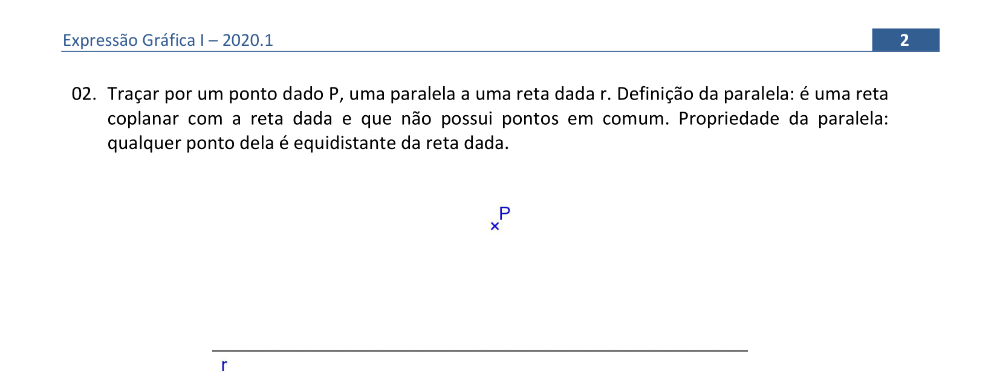
  

&#x1f4cf; &#x1f4d0; Exercício 2 com esquadros

  

Podemos utilizar a régua e um dos esquadros ou a régua e o compasso para resolver este exercício. Primeiro, veja como é a construção com a régua e o esquadro de 45o.

  <ul class="slider">
      <li>
           <input type="radio" id="slide12" name="slide" checked>
           <label for="slide12">1</label>
           
           <figcaption>Alinhe um dos catetos do esquadro com a reta <b>r</b>.</figcaption>
       </li>
       <li>
           <input type="radio" id="slide13" name="slide">
           <label for="slide13">2</label>
           
           <figcaption>Coloque a régua como apoio na hipotenusa do esquadro. A régua ficará fixa.</figcaption>
       </li>
       <li>
           <input type="radio" id="slide14" name="slide">
           <label for="slide14">3</label>
           
           <figcaption>Deslize o esquadro até chegar na posição do ponto <b>P</b>. Lembre-se de não mover a régua.</figcaption>
       </li>
       <li>
           <input type="radio" id="slide15" name="slide">
           <label for="slide15">4</label>
           
           <figcaption>Desenhe a reta que passa pelo ponto <b>P</b> com o cateto do esquadro.</figcaption>
       </li>
       <li>
           <input type="radio" id="slide16" name="slide">
           <label for="slide16">5</label>
           
           <figcaption>Pronto! A reta paralela <b>s // r</b> está construída.</figcaption>
       </li>
    </ul>
    
  

  

  

&#x1f4cf; &#x1f4d0; Exercício 2 com compasso

  

 Agora veja os passos da construção feita com régua e compasso.

  <ul class="slider">
      <li>
           <input type="radio" id="slide17" name="slide" checked>
           <label for="slide17">1</label>
           
           <figcaption>Desenhe um arco com a ponta seca em <b>P</b>, que intercepte a reta <b>r</b> no ponto <b>Q</b>.</figcaption>
       </li>
       <li>
           <input type="radio" id="slide18" name="slide">
           <label for="slide18">2</label>
           
           <figcaption>Com a ponta seca em <b>Q</b>, use o mesmo raio <b>PQ</b> para marcar o ponto <b>R</b> na reta <b>r</b>.</figcaption>
       </li>
       <li>
           <input type="radio" id="slide19" name="slide">
           <label for="slide19">3</label>
           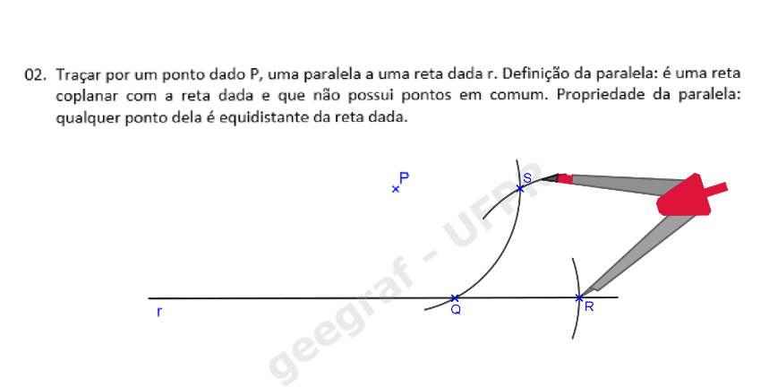
           <figcaption>Desenhe o arco com a ponta seca em <b>R</b>, com a mesma medida <b>PQ</b>, interceptando o primeiro arco que você desenhou no ponto <b>S</b>.</figcaption>
       </li>
       <li>
           <input type="radio" id="slide20" name="slide">
           <label for="slide20">4</label>
           
           <figcaption>Desenhe a reta que passa pelos pontos <b>P</b> e <b>S</b> com a régua.</figcaption>
       </li>
       <li>
           <input type="radio" id="slide21" name="slide">
           <label for="slide21">5</label>
           
           <figcaption>Pronto! A reta paralela <b>s // r</b> está construída.</figcaption>
       </li>
    </ul>
    
	

  

  

&#x1f4cf; &#x1f4d0; Exercício 3 com esquadros

  

 Vamos utilizar a régua e um dos esquadros para resolver este exercício. Clique nos botões do passo a passo para fazer a construção na sua apostila.

  <ul class="slider">
      <li>
           <input type="radio" id="slide22" name="slide" checked>
           <label for="slide22">1</label>
           
           <figcaption>Alinhe um dos catetos do esquadro com a reta <b>r</b>.</figcaption>
       </li>
       <li>
           <input type="radio" id="slide23" name="slide">
           <label for="slide23">2</label>
           
           <figcaption>Coloque a régua como apoio na hipotenusa do esquadro. A régua ficará fixa.</figcaption>
       </li>
       <li>
           <input type="radio" id="slide24" name="slide">
           <label for="slide24">3</label>
           
           <figcaption>Deslize o esquadro até o cateto vertical chegar na posição do ponto <b>P</b>. Lembre-se de não mover a régua.</figcaption>
       </li>
       <li>
           <input type="radio" id="slide25" name="slide">
           <label for="slide25">4</label>
           
           <figcaption>Desenhe a reta que passa pelo ponto <b>P</b>.</figcaption>
       </li>
       <li>
           <input type="radio" id="slide26" name="slide">
           <label for="slide26">5</label>
           
           <figcaption>Pronto! A reta perpendicular <b>p</b> está construída.</figcaption>
       </li>
       <li>
           <input type="radio" id="slide27" name="slide" checked>
           <label for="slide27">6</label>
           
           <figcaption>Alinhe um dos catetos do esquadro com a reta <b>r</b>.</figcaption>
       </li>
       <li>
           <input type="radio" id="slide28" name="slide">
           <label for="slide28">7</label>
           
           <figcaption>Coloque a régua como apoio na hipotenusa do esquadro. A régua ficará fixa.</figcaption>
       </li>
       <li>
           <input type="radio" id="slide29" name="slide">
           <label for="slide29">8</label>
           
           <figcaption>Deslize o esquadro até o cateto vertical chegar na posição do ponto <b>P</b>. Lembre-se de não mover a régua.</figcaption>
       </li>
       <li>
           <input type="radio" id="slide30" name="slide">
           <label for="slide30">9</label>
           
           <figcaption>Desenhe a reta que passa pelo ponto <b>P</b>.</figcaption>
       </li>
       <li>
           <input type="radio" id="slide31" name="slide">
           <label for="slide31">10</label>
           
           <figcaption>Pronto! A reta perpendicular <b>p</b> está construída.</figcaption>
       </li>
    </ul>
    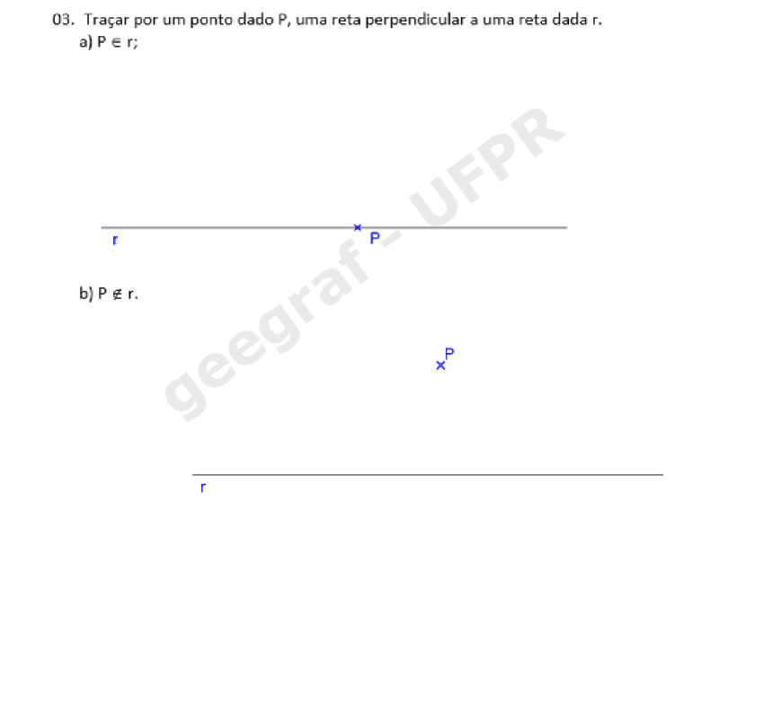
	

  

  

&#x1f4cf; &#x1f4d0; Exercício 3 com compasso

    

Agora veja como fica a construção da reta perpendicular à reta <b>r</b> que passa por <b>P</b> usando régua e compasso.

	<ul class="slider">
       <li>
           <input type="radio" id="slide32" name="slide" checked>
           <label for="slide32">1</label>
           
           <figcaption>Com a ponta seca em <b>P</b> desenhe um arco para a esquerda obtendo o ponto <b>Q</b> sobre a reta <b>r</b> e um arco para a direita obtendo o ponto <b>R</b> sobre a reta. Ambos os arcos com o mesmo raio.</figcaption>
       </li>
       <li>
           <input type="radio" id="slide33" name="slide">
           <label for="slide33">2</label>
           
           <figcaption>Com a ponta seca em <b>Q</b>, desenhe um arco com raio maior do que a metade de <b>QR</b>.</figcaption>
       </li>
       <li>
           <input type="radio" id="slide34" name="slide">
           <label for="slide34">3</label>
           
           <figcaption>Com a ponta seca em <b>R</b>, desenhe um arco com o mesmo raio usado no passo anterior. Os pontos de interseção dos arcos são <b>S</b> e <b>T</b>.</figcaption>
       </li>
       <li>
           <input type="radio" id="slide35" name="slide">
           <label for="slide35">4</label>
           
           <figcaption>Desenhe a reta que passa pelos pontos <b>S</b> e <b>T</b> de interseção dos arcos. Pronto! A perpendicular à reta <b>r</b> que passa pelo ponto <b>P</b> está construída!</figcaption>
       </li>
       <li>
           <input type="radio" id="slide36" name="slide">
           <label for="slide36">5</label>
           
           <figcaption>Com a ponta seca em <b>P</b> desenhe um arco com raio maior que a distância de <b>P</b> à reta <b>r</b>, obtendo os pontos <b>Q</b> e <b>R</b> sobre a reta <b>r</b>.</figcaption>
       </li>
       <li>
           <input type="radio" id="slide37" name="slide">
           <label for="slide37">6</label>
           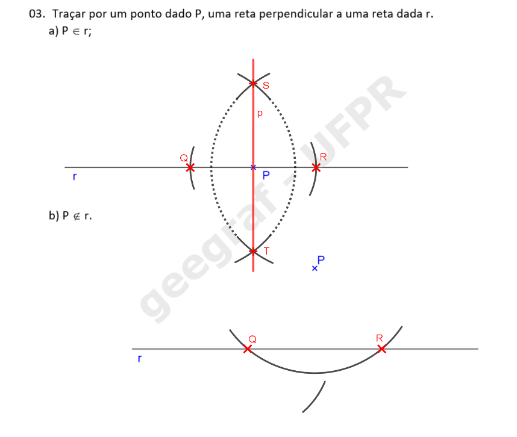
           <figcaption>Com a ponta seca em <b>Q</b> desenhe um arco.</figcaption>
       </li>
      <li>
           <input type="radio" id="slide38" name="slide">
           <label for="slide38">7</label>
           
           <figcaption>Com a ponta seca em <b>R</b> desenhe um arco com o mesmo raio do passo anterior, obtendo o ponto <b>S</b>.</figcaption>
       </li>
       <li>
           <input type="radio" id="slide39" name="slide">
           <label for="slide39">8</label>
           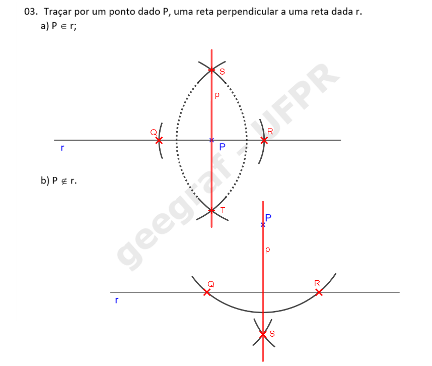
           <figcaption>Desenhe a reta <b>p</b> que passa pelos pontos <b>P</b> e <b>S</b>. Pronto! A reta <b>p</b> é perpendicular à reta <b>r</b> e passa pelo ponto <b>P</b>. Note que essa construção é baseada na construção da mediatriz de um segmento dado!</figcaption>
       </li>
  </ul>
  
  

  

  

&#x1f4cf; &#x1f4d0; Exercício 4

  

 Vamos utilizar a régua e o compasso para resolver este exercício. Clique nos botões do passo a passo para fazer a construção na sua apostila.

  <ul class="slider">
      <li>
           <input type="radio" id="slide40" name="slide" checked>
           <label for="slide40">1</label>
           
           <figcaption>Com a ponta seca no vértice <b>O</b> do ângulo desenhe um arco obtendo os pontos <b>P</b> e <b>Q</b>, cada um em um lado do ângulo.</figcaption>
       </li>
       <li>
           <input type="radio" id="slide41" name="slide">
           <label for="slide41">2</label>
           
           <figcaption>Com a ponta seca no ponto <b>P</b> desenhe um arco.</figcaption>
       </li>
	   <li>
           <input type="radio" id="slide41a" name="slide">
           <label for="slide41a">3</label>
           
           <figcaption>Com a ponta seca em <b>Q</b> desenhe um arco com o mesmo raio do passo anterior, obtendo o ponto <b>R</b>.</figcaption>
       </li>
       <li>
           <input type="radio" id="slide42" name="slide">
           <label for="slide42">4</label>
           
           <figcaption>Desenhe a reta <b>OR</b> que é a bissetriz do ângulo dado.</figcaption>
       </li>
       <li>
           <input type="radio" id="slide43" name="slide">
           <label for="slide43">5</label>
           
           <figcaption>Note que construímos dois triângulos: um verde e outro laranja.</figcaption>
       </li>
       <li>
           <input type="radio" id="slide44" name="slide">
           <label for="slide44">6</label>
           
           <figcaption>Esses triângulos são congruentes (iguais) e por isso os ângulos <b>&alpha;</b> e <b>&beta;</b> são também congruentes.</figcaption>
       </li>
    </ul>
    
	

  

  

   <a href="#desenho"> voltar ao topo</a>
  

	
  

&#x1f4cf; &#x1f4d0; Exercício 5

  

 Vamos utilizar a régua e o compasso para resolver este exercício. Clique nos botões do passo a passo para fazer a construção na sua apostila.

  <ul class="slider">
      <li>
           <input type="radio" id="slide45" name="slide" checked>
           <label for="slide45">1</label>
           
           <figcaption>Com a ponta seca no vértice <b>O</b> do ângulo desenhe um arco obtendo os pontos <b>R</b> e <b>Q</b>, cada um em um lado do ângulo.</figcaption>
       </li>
       <li>
           <input type="radio" id="slide46" name="slide">
           <label for="slide46">2</label>
           
           <figcaption>Com o mesmo raio do passo anterior, desenhe um arco agora com vértice no ponto <b>P</b>, obtendo o ponto <b>S</b> sobre a reta <b>r</b>.</figcaption>
       </li>
	   <li>
           <input type="radio" id="slide47" name="slide">
           <label for="slide47">3</label>
           
           <figcaption>Agora meça com o compasso o tamanho do segmento <b>QR</b>.</figcaption>
       </li>
       <li>
           <input type="radio" id="slide48" name="slide">
           <label for="slide48">4</label>
           
           <figcaption>Com raio <b>QR</b> desenhe um arco com centro no ponto <b>S</b>, obtendo o ponto <b>T</b> sobre o segundo arco desenhado.</figcaption>
       </li>
       <li>
           <input type="radio" id="slide49" name="slide">
           <label for="slide49">5</label>
           
           <figcaption>Construa a reta <b>PT</b>. O ângulo <b>&alpha;</b> obtido é congruente ao ângulo <b>&alpha;</b> dado. Note que o triângulo <b>ROQ</b> é congruente ao <b>TPS</b>, por isso que os ângulos são também congruentes.</figcaption>
       </li>
    </ul>
    
	

  

  

&#x1f4cf; &#x1f4d0; Exercício 6 com régua e compasso

  

 Vamos utilizar a régua e o compasso para resolver este exercício. Clique nos botões do passo a passo para fazer a construção na sua apostila.

  <h4>Ângulos de 60o e 30o:</h4>
  <ul class="slider">
      <li>
           <input type="radio" id="slide50" name="slide" checked>
           <label for="slide50">1</label>
           
           <figcaption>Desenhe uma reta <b>r</b> e marque dois pontos <b>A</b> e <b>B</b> sobre ela.</figcaption>
       </li>
       <li>
           <input type="radio" id="slide51" name="slide">
           <label for="slide51">2</label>
           
           <figcaption>Construa o arco de centro <b>A</b> e raio <b>AB</b> e o arco de centro <b>B</b> e raio <b>AB</b> obtendo o ponto <b>C</b>.</figcaption>
       </li>
	   <li>
           <input type="radio" id="slide52" name="slide">
           <label for="slide52">3</label>
           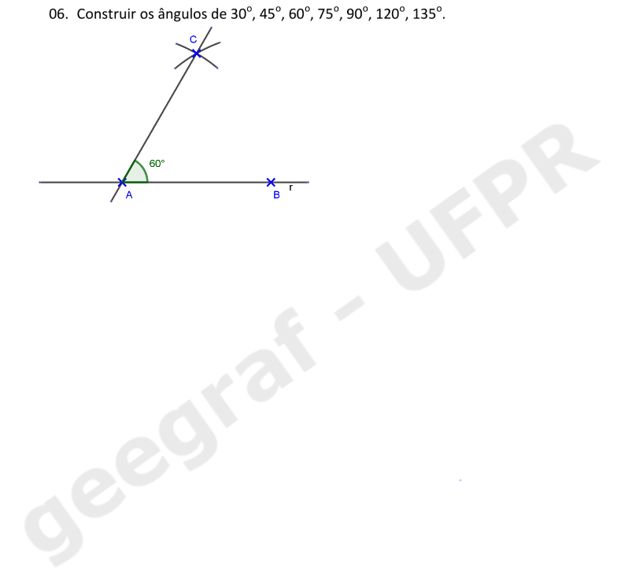
           <figcaption>Construa a reta <b>AC</b>. O ângulo <b>CAB</b> mede <b>60°</b>, pois o triângulo <b>ABC</b> construído é equilátero e, portanto, todos os seus ângulos internos medem <b>60°</b>.</figcaption>
       </li>
       <li>
           <input type="radio" id="slide53" name="slide">
           <label for="slide53">4</label>
           
           <figcaption>Essa construção fornece dois ângulos: o de <b>60°</b> e o de <b>120°</b>. Quando dois ângulos somam <b>180°</b> são chamados de suplementares.</figcaption>
       </li>
       <li>
           <input type="radio" id="slide54" name="slide">
           <label for="slide54">5</label>
           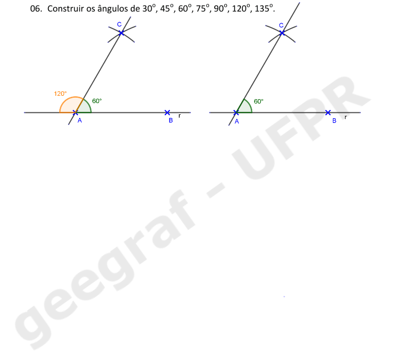
           <figcaption>Para obtermos o ângulo de <b>30°</b> basta dividir o ângulo de <b>60°</b> em duas partes iguais. Então construa novamente um ângulo de <b>60°</b> conforme vimos anteriormente.</figcaption>
       </li>
	   <li>
           <input type="radio" id="slide55" name="slide">
           <label for="slide55">6</label>
           
           <figcaption>Agora construa a bissetriz desse ângulo, obtendo a reta <b>AD</b>. O ângulo <b>DAB</b> mede <b>30°</b>. Que ângulo também obtivemos nessa construção? Lembre-se do ângulo suplementar!</figcaption>
       </li>
	   <li>
           <input type="radio" id="slide56" name="slide">
           <label for="slide56">7</label>
           
           <figcaption>Essa construção fornece também o suplemento do ângulo de <b>30°</b>, ou seja, o ângulo de <b>150°</b>.</figcaption>
       </li>
    </ul>
    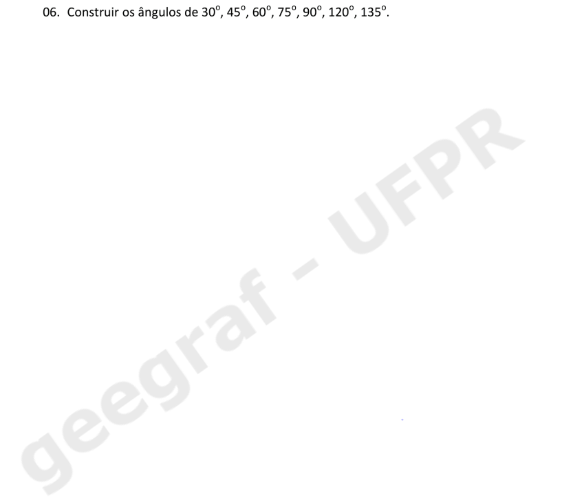
	

	<h4>Ângulos de 90o e 45o:</h4>
    <ul class="slider">
      <li>
           <input type="radio" id="slide57" name="slide" checked>
           <label for="slide57">1</label>
           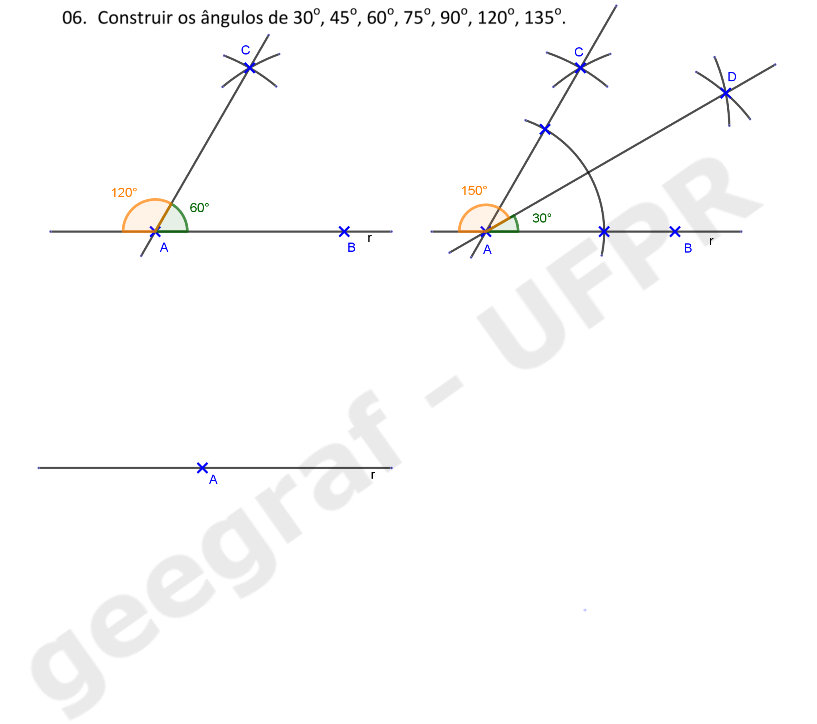
           <figcaption>Para construir um ângulo de <b>90°</b> com régua e compasso basta construir uma reta perpendicular. Lembra que já fizemos isso? Vamos repetir então. Desenhe uma reta <b>r</b> e marque um ponto <b>A</b> sobre ela. </figcaption>
       </li>
       <li>
           <input type="radio" id="slide58" name="slide">
           <label for="slide58">2</label>
           
           <figcaption>Com a ponta seca do compasso em <b>A</b>, marque um ponto <b>B</b> para a esquerda e um ponto <b>C</b> para a direita. Use o mesmo raio para esses arcos. </figcaption>
       </li>
	   <li>
           <input type="radio" id="slide59" name="slide">
           <label for="slide59">3</label>
           
           <figcaption>Com centro em <b>B</b> e um raio maior que a metade do segmento <b>BC</b> construa um arco, e faça o mesmo em <b>C</b>. Na interseção desses arcos obtemos os pontos <b>D</b> e <b>E</b>.</figcaption>
       </li>
       <li>
           <input type="radio" id="slide60" name="slide">
           <label for="slide60">4</label>
           
           <figcaption>A reta <b>DE</b> é perpendicular à reta <b>r</b> e, assim, o ângulo obtido mede <b>90°</b>,</figcaption>
       </li>
       <li>
           <input type="radio" id="slide61" name="slide">
           <label for="slide61">5</label>
           
           <figcaption>Para obtermos o ângulo de <b>45°</b> basta dividir o ângulo de <b>90°</b> em duas partes iguais. Então construa novamente um ângulo de <b>90°</b> conforme vimos anteriormente.</figcaption>
       </li>
	   <li>
           <input type="radio" id="slide62" name="slide">
           <label for="slide62">6</label>
           
           <figcaption>Agora construa a bissetriz desse ângulo, obtendo a reta <b>AF</b>. O ângulo <b>FAC</b> mede <b>45°</b>.</figcaption>
       </li>
	   <li>
           <input type="radio" id="slide63" name="slide">
           <label for="slide63">7</label>
           
           <figcaption>Lembra do ângulo suplementar? O suplemento do ângulo de <b>45°</b> mede <b>135°</b>.</figcaption>
       </li>
    </ul>
    
  

  <h4>Ângulos de 75o e 15o:</h4>
    <ul class="slider">
      <li>
           <input type="radio" id="slide64" name="slide" checked>
           <label for="slide64">1</label>
           
           <figcaption>Para construir um ângulo de <b>75°</b> basta dividir um ângulo de <b>150°</b> ao meio. Já sabemos construir um ângulo de <b>150°</b>, lembra? Comece construindo um ângulo <b>BAC</b> de <b>60°</b>. Construa um arco <b>BC</b> de tal forma que intercepte a reta <b>r</b> em dois pontos <b>B</b> e <b>F</b>.</figcaption>
       </li>
       <li>
           <input type="radio" id="slide65" name="slide">
           <label for="slide65">2</label>
           
           <figcaption>Construa sua bissetriz, obtendo um ângulo de <b>30°</b>. O suplemento do ângulo de <b>30°</b> irá medir <b>150°</b>. </figcaption>
       </li>
	   <li>
           <input type="radio" id="slide66" name="slide">
           <label for="slide66">3</label>
           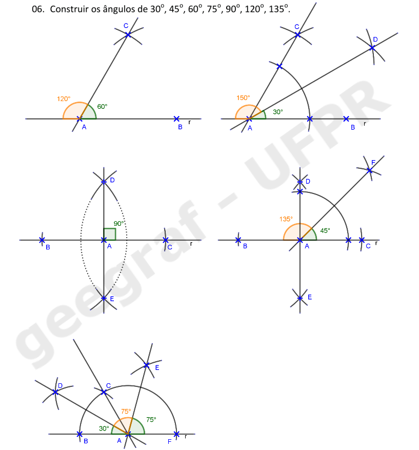
           <figcaption>Como o ângulo <b>DAF</b> mede <b>150°</b>, basta agora construir usa bissetriz, obtendo o ângulo de <b>75°</b>. Os ângulos <b>DAE</b> e <b>EAF</b> medem <b>75°</b>.</figcaption>
       </li>
       <li>
           <input type="radio" id="slide67" name="slide">
           <label for="slide67">4</label>
           
           <figcaption>Para construir um ângulo de <b>15°</b> basta construir um ângulo de <b>30°</b>. E para construir um ângulo de <b>30°</b> basta construir um de <b>60°</b>. Então vamos começar construindo um ângulo de <b>60°</b>.</figcaption>
       </li>
       <li>
           <input type="radio" id="slide68" name="slide">
           <label for="slide68">5</label>
           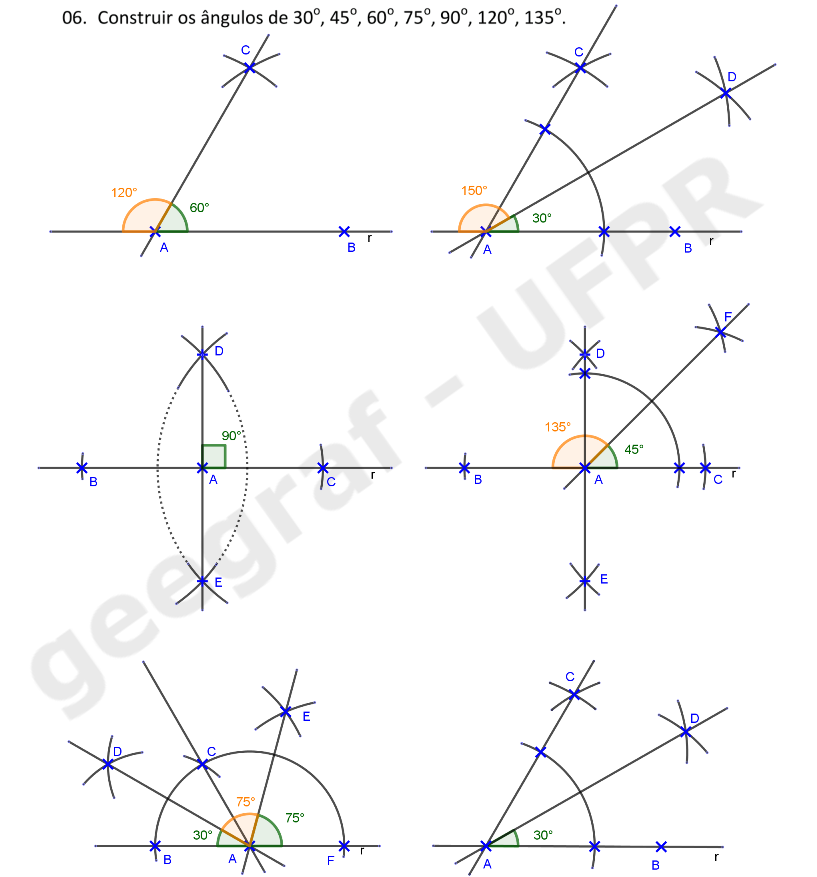
           <figcaption>Agora construa a bissetriz do ângulo de <b>60°</b>, obtendo dois ângulos de <b>30°</b>.</figcaption>
       </li>
	   <li>
           <input type="radio" id="slide69" name="slide">
           <label for="slide69">6</label>
           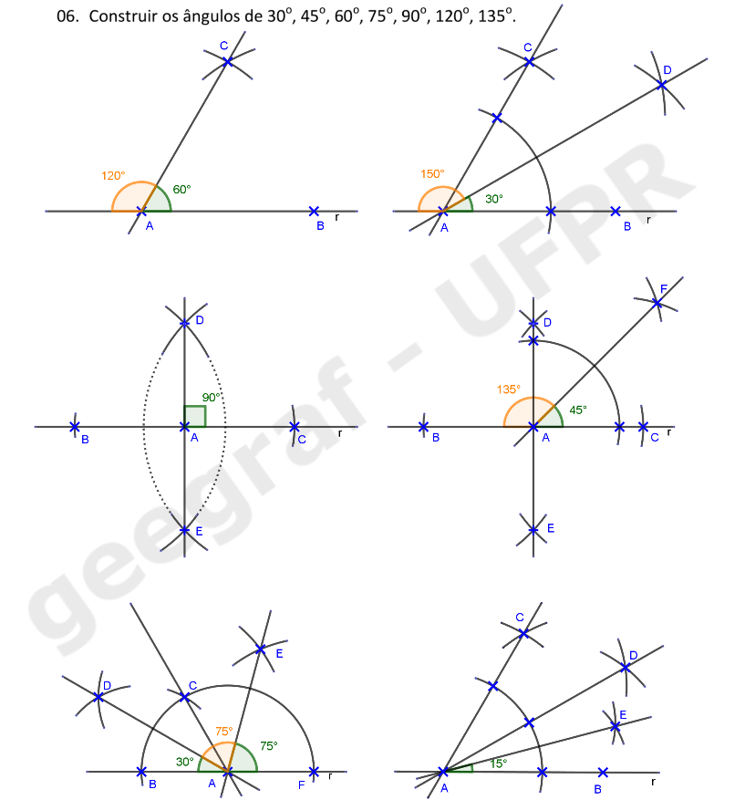
           <figcaption>Escolha um dos ângulos de <b>30°</b> e construa sua bissetriz, obtendo dois ângulos de <b>15°</b>.</figcaption>
       </li>
    </ul>
    
	

	

  

&#x1f4cf; &#x1f4d0; Exercício 6 com régua e esquadros

  

 Vamos utilizar a régua e os esquadros para resolver este exercício. Existem várias maneiras para construir ângulos usando os esquadros. Aqui veremos algumas. Clique nos botões do passo a passo para fazer a construção na sua apostila.

  <h4>Ângulos de 60o e 30o:</h4>
  <ul class="slider">
      <li>
           <input type="radio" id="slide70" name="slide" checked>
           <label for="slide70">1</label>
           
           <figcaption>Para construir o ângulo de <b>60°</b> desenhe uma reta <b>r</b> e encaixe o cateto menor do esquadro de <b>30/60</b> sobre essa reta. O ângulo da esquerda do esquadro mede <b>60°</b> e o de cima mede <b>30°</b>. Já temos o ângulo de <b>60°</b> formado com a reta! Mas não podemos ainda traçar o outro lado do ângulo de <b>60°</b> pois o vértice não estará definido!</figcaption>
       </li>
       <li>
           <input type="radio" id="slide71" name="slide">
           <label for="slide71">2</label>
           
           <figcaption>Use a régua para apoiar o outro cateto desse esquadro (você pode usar também o outro esquadro ao invés da régua).</figcaption>
       </li>
	   <li>
           <input type="radio" id="slide72" name="slide">
           <label for="slide72">3</label>
           
           <figcaption>Deslize o esquadro de <b>30/60</b> até que a hipotenusa corte a reta <b>r</b>. Mantenha fixa a régua.</figcaption>
       </li>
       <li>
           <input type="radio" id="slide73" name="slide">
           <label for="slide73">4</label>
           
           <figcaption>Desenhe a reta s concorrente com a reta <b>r</b> dada. Pronto! Agora o vértice <b>O</b> do ângulo está definido!</figcaption>
       </li>
       <li>
           <input type="radio" id="slide74" name="slide">
           <label for="slide74">5</label>
           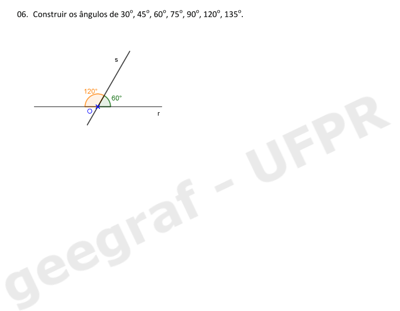
           <figcaption>Essa construção fornece dois ângulos: o de <b>60°</b> e o seu suplemento de <b>120°</b>.</figcaption>
       </li>
	   <li>
           <input type="radio" id="slide75" name="slide">
           <label for="slide75">6</label>
           
           <figcaption>Construir o ângulo de <b>30°</b> com os esquadros é muito parecido com o de <b>60°</b>. Desenhe uma reta <b>r</b> e agora encaixe o cateto maior do esquadro de <b>30/60</b> sobre a reta <b>r</b>. O ângulo da esquerda do esquadro mede <b>30°</b> e o de cima mede <b>60°</b>. Já temos o ângulo de <b>30°</b> formado, mas como na construção anterior, não podemos traçar o lado do ângulo ainda!</figcaption>
       </li>
	   <li>
           <input type="radio" id="slide76" name="slide">
           <label for="slide76">7</label>
           
           <figcaption>Vamos usar o esquadro de <b>45</b> apoiado no outro cateto. Podemos usar a régua também.</figcaption>
       </li>
	   <li>
           <input type="radio" id="slide77" name="slide">
           <label for="slide77">8</label>
           
           <figcaption>Deslize o esquadro de <b>30/60</b> até que a hipotenusa corte a reta <b>r</b>. Mantenha fixo o esquadro de <b>45</b>.</figcaption>
       </li>
	   <li>
           <input type="radio" id="slide78" name="slide">
           <label for="slide78">9</label>
           
           <figcaption>Desenhe a reta s concorrente com a reta <b>r</b> dada. Pronto! Agora o vértice <b>O</b> do ângulo está definido!</figcaption>
       </li>
	   <li>
           <input type="radio" id="slide79" name="slide">
           <label for="slide79">10</label>
           
           <figcaption>Essa construção fornece dois ângulos: o de <b>30°</b> e o seu suplemento de <b>150°</b>.</figcaption>
       </li>
    </ul>
    
	

	<h4>Ângulos de 90o e 45o:</h4>
    <ul class="slider">
      <li>
           <input type="radio" id="slide80" name="slide" checked>
           <label for="slide80">1</label>
           
           <figcaption>Lembra quando construímos uma reta perpendicular à outra reta? Então, o ângulo formado é reto, ou seja, de <b>90°</b>. Vamos repetir o processo agora. Desenhe uma reta <b>r</b> e encaixe um cateto do esquadro nessa reta (você pode usar qualquer esquadro agora).</figcaption>
       </li>
       <li>
           <input type="radio" id="slide81" name="slide">
           <label for="slide81">2</label>
           
           <figcaption>Use a régua para apoiar a hipotenusa desse esquadro (você pode usar também o outro esquadro ao invés da régua).</figcaption>
       </li>
	   <li>
           <input type="radio" id="slide82" name="slide">
           <label for="slide82">3</label>
           
           <figcaption>Deslize o esquadro até que o outro cateto corte a reta <b>r</b>. Mantenha fixa a régua.</figcaption>
       </li>
       <li>
           <input type="radio" id="slide83" name="slide">
           <label for="slide83">4</label>
           
           <figcaption>Desenhe a reta <b>s</b> concorrente com a reta <b>r</b> dada. Pronto! Agora o vértice <b>O</b> do ângulo está definido!</figcaption>
       </li>
       <li>
           <input type="radio" id="slide84" name="slide">
           <label for="slide84">5</label>
           
           <figcaption>Essa construção fornece dois ângulos retos.</figcaption>
       </li>
	   <li>
           <input type="radio" id="slide85" name="slide">
           <label for="slide85">6</label>
           
           <figcaption>Construir o ângulo de <b>45°</b> com os esquadros é muito parecido com o de <b>30°</b> e o de <b>60°</b>. Desenhe uma reta <b>r</b> e agora encaixe o cateto do esquadro de <b>45</b> sobre a reta <b>r</b>. Já temos o ângulo de <b>45°</b> formado, mas não podemos traçar o lado do ângulo ainda! Lembra o porquê?</figcaption>
       </li>
	   <li>
           <input type="radio" id="slide86" name="slide">
           <label for="slide86">7</label>
           
           <figcaption>Use o outro esquadro ou a régua para apoiar o outro cateto.</figcaption>
       </li>
	   <li>
           <input type="radio" id="slide87" name="slide">
           <label for="slide87">8</label>
           
           <figcaption>Deslize o esquadro de <b>45</b> até que a hipotenusa corte a reta <b>r</b>. Mantenha fixo o esquadro de <b>30/60</b>.</figcaption>
       </li>
	   <li>
           <input type="radio" id="slide88" name="slide">
           <label for="slide88">9</label>
           
           <figcaption>Desenhe a reta <b>s</b> concorrente com a reta <b>r</b> dada. Pronto! Agora o vértice O do ângulo está definido!</figcaption>
       </li>
	   <li>
           <input type="radio" id="slide89" name="slide">
           <label for="slide89">10</label>
           
           <figcaption>Essa construção fornece dois ângulos: o de <b>45°</b> e o seu suplemento de <b>135°</b>.</figcaption>
       </li>
    </ul>
    
  

  <h4>Ângulos de 75o e 15o:</h4>
    <ul class="slider">
      <li>
           <input type="radio" id="slide90" name="slide" checked>
           <label for="slide90">1</label>
           
           <figcaption>Para construir o ângulo de <b>75°</b> basta lembrar que ele é a soma de <b>30°</b> com <b>45°</b>. Desenhe uma reta <b>r</b> e agora encaixe o cateto maior do esquadro de <b>30/60</b> sobre a reta <b>r</b>, já temos um ângulo de <b>30°</b>.</figcaption>
       </li>
       <li>
           <input type="radio" id="slide91" name="slide">
           <label for="slide91">2</label>
           
           <figcaption>Agora encaixe a hipotenusa do esquadro de <b>45</b> na hipotenusa do esquadro de <b>30/60</b>. A soma dos dois ângulos da esquerda é <b>75°</b>, mas não podemos traçar o lado do ângulo ainda!</figcaption>
       </li>
	   <li>
           <input type="radio" id="slide92" name="slide">
           <label for="slide92">3</label>
           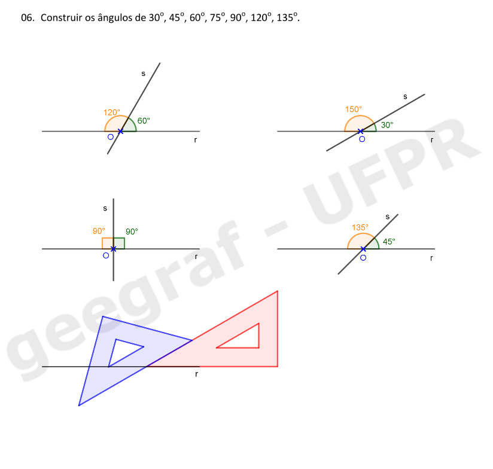
           <figcaption>Deslize o esquadro de <b>45</b> até que o cateto corte a reta <b>r</b>. Mantenha fixo o esquadro de <b>30/60</b>.</figcaption>
       </li>
       <li>
           <input type="radio" id="slide93" name="slide">
           <label for="slide93">4</label>
           
           <figcaption>Desenhe a reta <b>s</b> concorrente com a reta <b>r</b> dada utilizando o cateto do esquadro de <b>45</b>. Pronto! Agora o vértice <b>O</b> do ângulo está definido!</figcaption>
       </li>
       <li>
           <input type="radio" id="slide94" name="slide">
           <label for="slide94">5</label>
           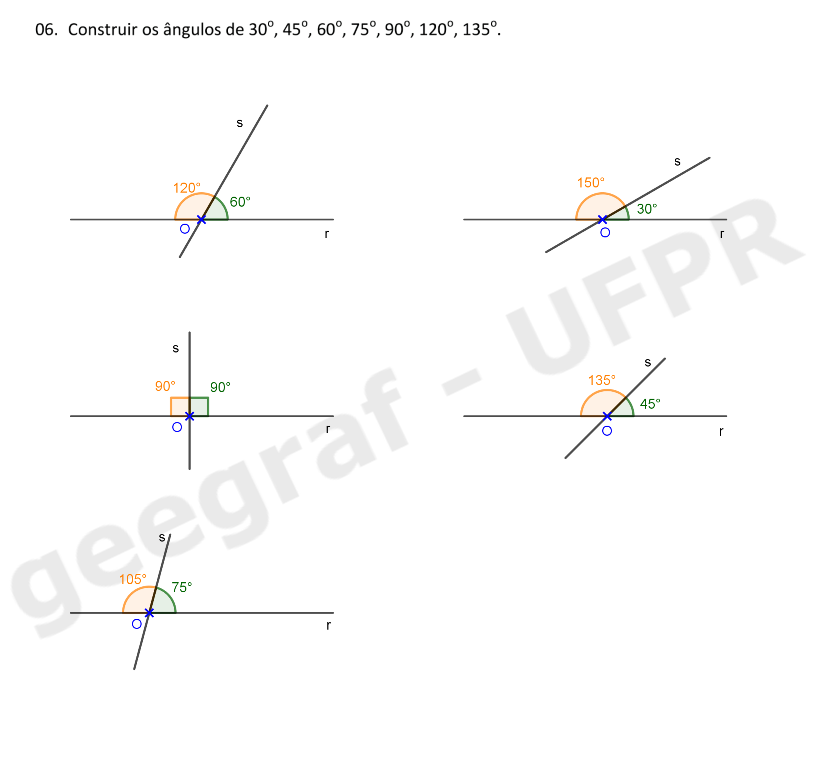
           <figcaption>Essa construção fornece dois ângulos: o de <b>75°</b> e o seu suplemento de <b>105°</b>.</figcaption>
       </li>
	   <li>
           <input type="radio" id="slide95" name="slide">
           <label for="slide95">6</label>
           
           <figcaption>A construção do ângulo de <b>15°</b> é parecida com a de <b>75°</b>. Desenhe uma reta <b>r</b> e agora encaixe o cateto menor do esquadro de <b>30/60</b> sobre a reta <b>r</b>, já temos um ângulo de <b>60°</b>.</figcaption>
       </li>
	   <li>
           <input type="radio" id="slide96" name="slide">
           <label for="slide96">7</label>
           
           <figcaption>Agora encaixe a hipotenusa do esquadro de <b>45</b> na hipotenusa do esquadro de <b>30/60</b>. A soma dos dois ângulos de cima é <b>75°</b> e como o ângulo da direita é de <b>90°</b> então o ângulo que aparecerá no lado esquerdo, após deslizarmos o esquadro de <b>45</b>, será de <b>15°</b>.</figcaption>
       </li>
	   <li>
           <input type="radio" id="slide97" name="slide">
           <label for="slide97">8</label>
           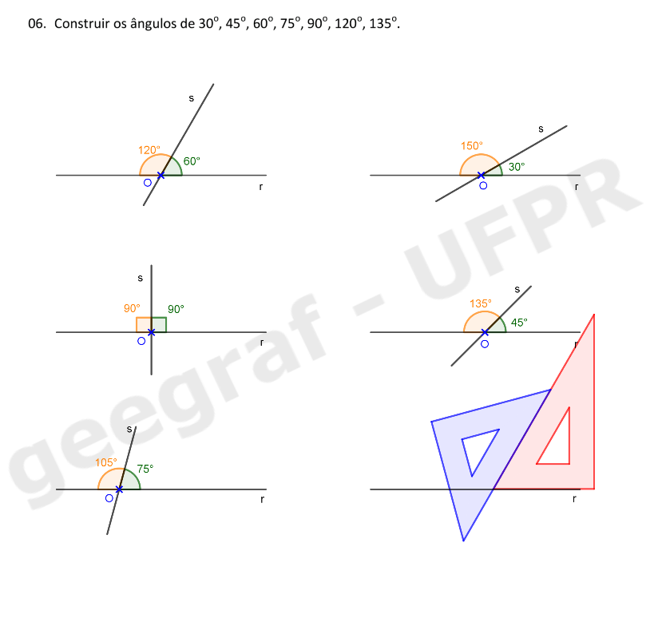
           <figcaption>Deslize o esquadro de <b>45</b> até que o cateto corte a reta <b>r</b>. Mantenha fixo o esquadro de <b>30/60</b>. </figcaption>
       </li>
	   <li>
           <input type="radio" id="slide98" name="slide">
           <label for="slide98">9</label>
           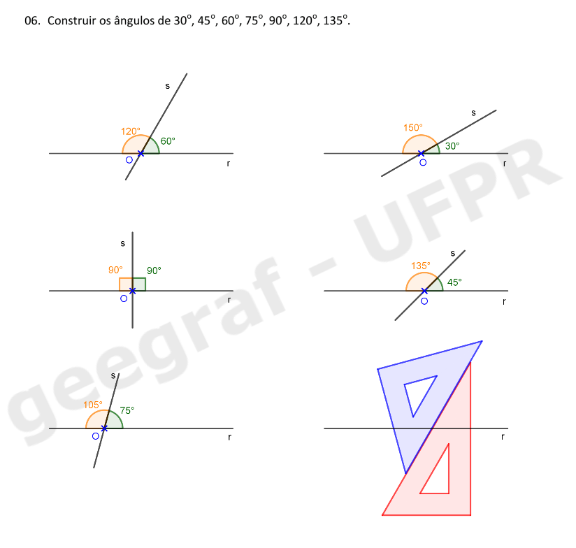
           <figcaption>Segure agora o esquadro de <b>45</b> e deslize o de <b>30/60</b>.</figcaption>
       </li>
	   <li>
           <input type="radio" id="slide99" name="slide">
           <label for="slide99">10</label>
           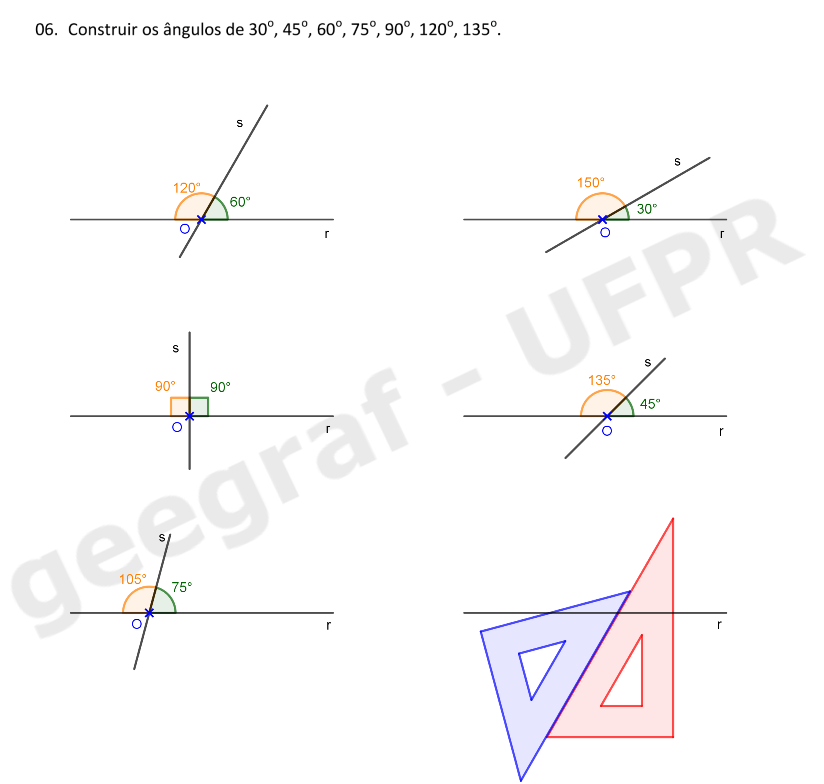
           <figcaption>Mantenha fixo agora o de <b>30/60</b> e deslize o de <b>45</b>.</figcaption>
       </li>
	   <li>
           <input type="radio" id="slide001" name="slide">
           <label for="slide001">11</label>
           
           <figcaption>Pronto! Só traçar a reta <b>s</b> utilizando o cateto de cima do esquadro de <b>45</b>.</figcaption>
       </li>
	   <li>
           <input type="radio" id="slide002" name="slide">
           <label for="slide002">12</label>
           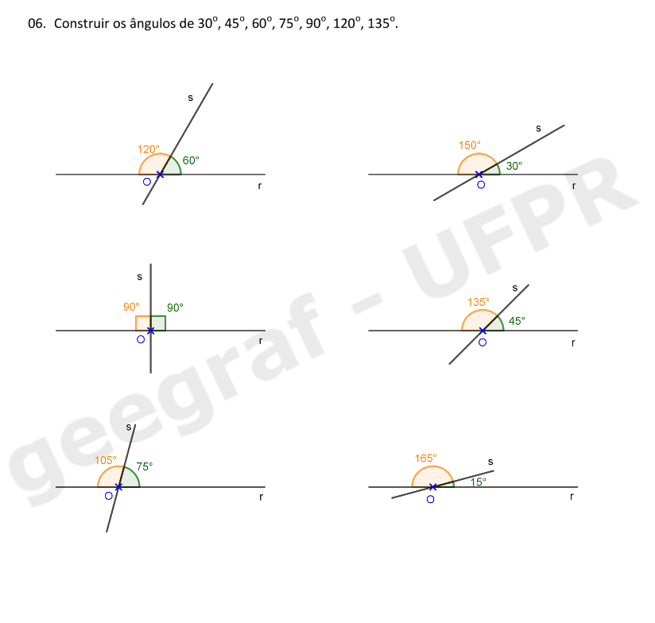
           <figcaption>Essa construção fornece dois ângulos: o de <b>15°</b> e o seu suplemento de <b>165°</b>.</figcaption>
       </li>
    </ul>
    
	

	

  

   <a href="#desenho"> voltar ao topo</a>
  

	
  

&#x1f4cf; &#x1f4d0; Exercício 7

  

Para dividirmos um segmento graficamente em partes iguais utilizamos o Teorema de Tales que diz que “Um feixe (conjunto) de retas paralelas determina sobre um feixe de retas concorrentes segmentos proporcionais correspondentes”.

  <ul class="slider">
      <li>
           <input type="radio" id="slide003" name="slide" checked>
           <label for="slide003">1</label>
           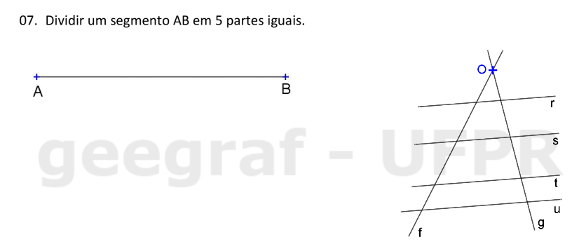
           <figcaption>Na figura da direita temos o feixe de retas paralelas: <b>r</b>, <b>s</b>, <b>t</b> e <b>u</b>, e o feixe de retas concorrentes em <b>O</b>: <b>f</b> e <b>g</b>. </figcaption>
       </li>
       <li>
           <input type="radio" id="slide004" name="slide">
           <label for="slide004">2</label>
           
           <figcaption>Essas paralelas determinam sobre as retas concorrentes os segmentos: <b>a</b>, <b>b</b> e <b>c</b>, e os seus correspondentes nesta ordem: <b>m</b>, <b>n</b> e <b>p</b>. Assim, o Teorema de Tales garante que os segmentos <b>a</b>, <b>b</b> e <b>c</b> são proporcionais aos segmentos correspondentes <b>m</b>, <b>n</b> e <b>p</b>. Ou seja, <b>a/m = b/n = c/p</b>. Note que podemos ter variações na forma de montar as proporções, por exemplo, <b>a/m = b/n</b> é análogo a <b>a/b=m/n</b>.</figcaption>
       </li>
	   <li>
           <input type="radio" id="slide005" name="slide">
           <label for="slide005">3</label>
           
           <figcaption>Vamos aplicar esse teorema na divisão gráfica do segmento dado <b>AB</b> em 5 partes iguais. Trace uma reta auxiliar passando por uma das extremidades do segmento <b>AB</b>, neste caso, foi por <b>A</b>. </figcaption>
       </li>
       <li>
           <input type="radio" id="slide006" name="slide">
           <label for="slide006">4</label>
           
           <figcaption>Precisamos marcar 5 unidades iguais sobre a reta auxiliar a partir do ponto <b>A</b>. Então abra o compasso com uma unidade arbitrária <b>u</b> (usamos aqui <b>u=1,5cm</b>).Construa um arco com centro em <b>A</b> e raio <b>u</b>, obtendo o ponto <b>1</b> sobre a reta auxiliar.</figcaption>
       </li>
       <li>
           <input type="radio" id="slide007" name="slide">
           <label for="slide007">5</label>
           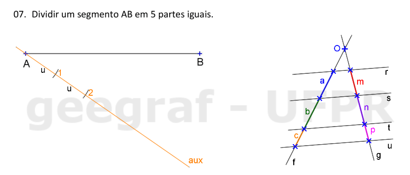
           <figcaption>Construa um novo arco agora com centro no ponto <b>1</b> e o mesmo raio <b>u</b>, obtendo o ponto <b>2</b> sobre a reta auxiliar.</figcaption>
       </li>
	   <li>
           <input type="radio" id="slide008" name="slide">
           <label for="slide008">6</label>
           
           <figcaption>Continue o processo até obter o ponto <b>5</b>. </figcaption>
       </li>
	   <li>
           <input type="radio" id="slide009" name="slide">
           <label for="slide009">7</label>
           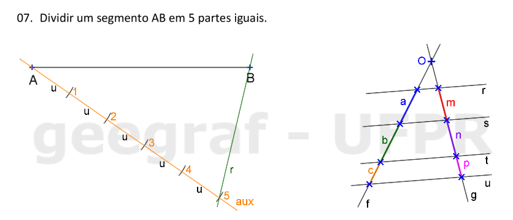
           <figcaption>Desenhe a reta <b>r</b> ligando os pontos <b>5</b> e <b>B</b>.</figcaption>
       </li>
	   <li>
           <input type="radio" id="slide010" name="slide">
           <label for="slide010">8</label>
           
           <figcaption>Trace com os esquadros uma reta <b>s</b> paralela à reta <b>r</b> que passe pelo ponto <b>4</b>, obtendo o ponto <b>F</b> sobre a reta <b>AB</b>.</figcaption>
       </li>
	   <li>
           <input type="radio" id="slide011" name="slide">
           <label for="slide011">9</label>
           
           <figcaption>Trace com os esquadros as demais retas paralelas passando pelos pontos <b>3</b>, <b>2</b> e <b>1</b>. Determinando sobre a reta <b>AB</b> os pontos <b>E</b>, <b>D</b> e <b>C</b>, respectivamente.</figcaption>
       </li>
	   <li>
           <input type="radio" id="slide012" name="slide">
           <label for="slide012">10</label>
           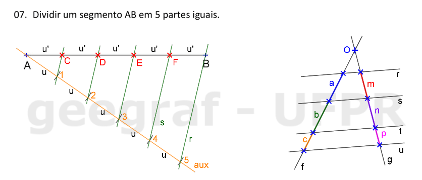
           <figcaption>Pelo Teorema de Tales como os segmentos <b>A1</b>, <b>12</b>, <b>23</b>, <b>34</b>, <b>45</b> são proporcionais a <b>u</b> então <b>AC</b>, <b>CD</b>, <b>DE</b>, <b>EF</b> e <b>FB</b> são proporcionais a <b>u’</b>. E, portanto, o segmento <b>AB</b> foi dividido graficamente em 5 partes iguais.</figcaption>
       </li>
    </ul>
    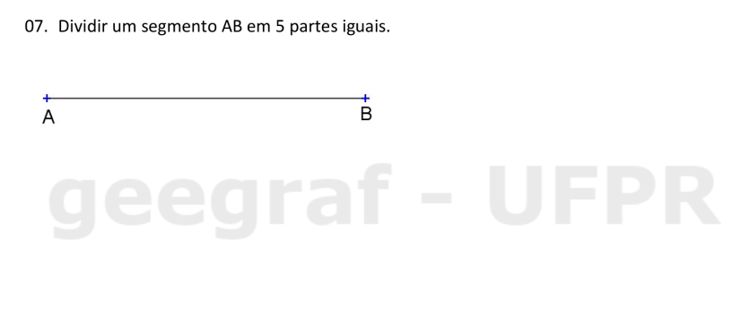
	

  

  

&#x1f4cf; &#x1f4d0; Exercício 8

  

Para dividirmos o segmento <b>AB</b> graficamente em partes proporcionais a números dados vamos aplicar o Teorema de Tales. Temos que construir um feixe de retas concorrentes cortadas por um feixe de paralelas, lembra?

  <ul class="slider">
      <li>
           <input type="radio" id="slide013" name="slide" checked>
           <label for="slide013">1</label>
           
           <figcaption>Comece traçando uma reta auxiliar passando por uma das extremidades do segmento <b>AB</b>, neste caso, foi por <b>A</b>.</figcaption>
       </li>
       <li>
           <input type="radio" id="slide014" name="slide">
           <label for="slide014">2</label>
           
           <figcaption>Como queremos dividir o segmento dado <b>AB</b> em partes proporcionais aos números dados <b>m</b>, <b>n</b> e <b>p</b>, vamos associá-los a segmentos de comprimentos <b>2cm</b>, <b>4,2cm</b> e <b>5,3cm</b>, respectivamente. Marque sobre a reta auxiliar, a partir do ponto <b>A</b>, um segmento m de medida <b>2cm</b>, obtendo o ponto <b>1</b>.</figcaption>
       </li>
	   <li>
           <input type="radio" id="slide015" name="slide">
           <label for="slide015">3</label>
           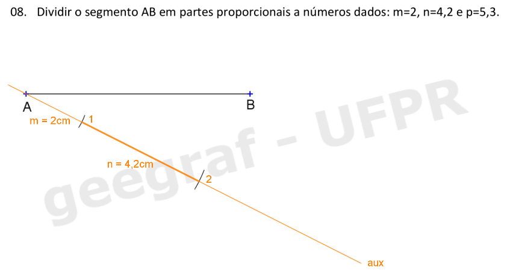
           <figcaption>A partir do ponto <b>1</b>, marque o segmento <b>n</b> de medida <b>4,2cm</b>, obtendo o ponto <b>2</b>.</figcaption>
       </li>
       <li>
           <input type="radio" id="slide016" name="slide">
           <label for="slide016">4</label>
           
           <figcaption>Marque o segmento <b>p</b> de comprimento <b>5,3cm</b>, a partir do ponto <b>2</b>, obtendo o ponto <b>3</b>.</figcaption>
       </li>
       <li>
           <input type="radio" id="slide017" name="slide">
           <label for="slide017">5</label>
           
           <figcaption>Desenhe a reta <b>r</b> ligando os pontos <b>3</b> e <b>B</b>.</figcaption>
       </li>
	   <li>
           <input type="radio" id="slide018" name="slide">
           <label for="slide018">6</label>
           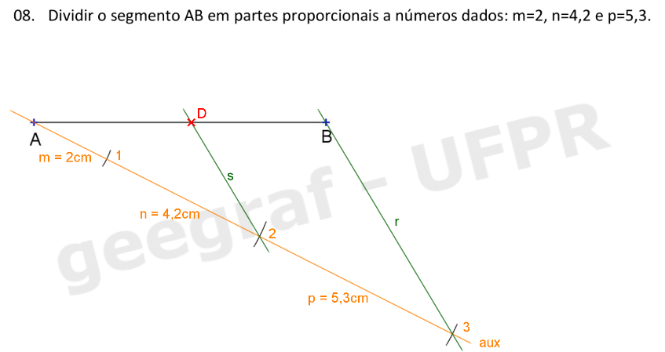
           <figcaption>Trace com os esquadros uma reta <b>s</b> paralela à reta <b>r</b> que passe pelo ponto <b>2</b>, obtendo o ponto <b>D</b> sobre a reta <b>AB</b>.</figcaption>
       </li>
	   <li>
           <input type="radio" id="slide019" name="slide">
           <label for="slide019">7</label>
           
           <figcaption>Trace com os esquadros uma reta <b>t</b> paralela à reta <b>r</b> (ou <b>s</b>) que passe pelo ponto <b>1</b>, obtendo o ponto <b>C</b> sobre a reta <b>AB</b>.</figcaption>
       </li>
	   <li>
           <input type="radio" id="slide020" name="slide">
           <label for="slide020">8</label>
           
           <figcaption>Pelo Teorema de Tales temos que os segmentos <b>AC</b>, <b>CD</b> e <b>DB</b> são proporcionais a <b>A1</b>, <b>12</b> e <b>23</b>, respectivamente. Ou seja, <b>a</b>, <b>b</b> e <b>c</b> são proporcionais a <b>m</b>, <b>n</b> e <b>p</b> nesta ordem. Assim, o segmento <b>AB</b> foi dividido em partes proporcionais pelos pontos <b>C</b> e <b>D</b> como pedido.</figcaption>
       </li>
    </ul>
    
	

  

  

&#x1f4cf; &#x1f4d0; Exercício 9

  

Para construir a circunferência pertencente aos pontos dados <b>A</b>, <b>B</b> e <b>C</b>, devemos encontrar o centro <b>O</b> da mesma para depois desenhá-la com o compasso. Antes de iniciarmos a construção devemos pensar na estratégia de solução! Acompanhe o desenvolvimento do raciocínio e depois a resolução gráfica!

  <ul class="slider">
      <li>
           <input type="radio" id="slide021" name="slide" checked>
           <label for="slide021">1</label>
           
           <figcaption>Vamos iniciar pensando no exercício resolvido, ou seja, na figura auxiliar da direita temos uma circunferência de centro O que passa pelos pontos <b>A</b>, <b>B</b> e <b>C</b>. Vamos procurar uma relação do centro <b>O</b> com os dados do exercício.</figcaption>
       </li>
       <li>
           <input type="radio" id="slide022" name="slide">
           <label for="slide022">2</label>
           
           <figcaption>Note que a distância do centro <b>O</b> ao ponto <b>A</b> é <b>r</b>, o mesmo acontece com o ponto <b>C</b>, ou seja, a distância do centro <b>O</b> ao ponto <b>C</b> também é <b>r</b>. Não sabemos quanto mede <b>r</b>, mas conhecemos que <b>O</b> é equidistante de <b>A</b> e <b>C</b>!</figcaption>
       </li>
	   <li>
           <input type="radio" id="slide023" name="slide">
           <label for="slide023">3</label>
           
           <figcaption>Assim, o ponto <b>O</b> pertence à mediatriz do segmento <b>AC</b>! Lembra que vimos essa propriedade da mediatriz?</figcaption>
       </li>
       <li>
           <input type="radio" id="slide024" name="slide">
           <label for="slide024">4</label>
           
           <figcaption>Agora vamos observar que a distância do centro <b>O</b> ao ponto <b>C</b> é <b>r</b>, e que a distância do centro <b>O</b> ao ponto <b>B</b> também é <b>r</b>. Assim, o ponto <b>O</b> é equidistante de <b>B</b> e <b>C</b>! </figcaption>
       </li>
       <li>
           <input type="radio" id="slide025" name="slide">
           <label for="slide025">5</label>
           
           <figcaption>Logo, o ponto O pertence à mediatriz do segmento <b>BC</b>! </figcaption>
       </li>
	   <li>
           <input type="radio" id="slide026" name="slide">
           <label for="slide026">6</label>
           
           <figcaption>Portanto, já temos a estratégia de solução: para obtermos o centro <b>O</b> basta construir as mediatrizes dos segmentos <b>AC</b> e <b>BC</b>! Agora vamos à construção gráfica!</figcaption>
       </li>
	   <li>
           <input type="radio" id="slide027" name="slide">
           <label for="slide027">7</label>
           
           <figcaption>Construa a mediatriz do segmento <b>AC</b>.</figcaption>
       </li>
	   <li>
           <input type="radio" id="slide028" name="slide">
           <label for="slide028">8</label>
           
           <figcaption>Construa a mediatriz do segmento <b>BC</b>.</figcaption>
       </li>
	   <li>
           <input type="radio" id="slide029" name="slide">
           <label for="slide029">9</label>
           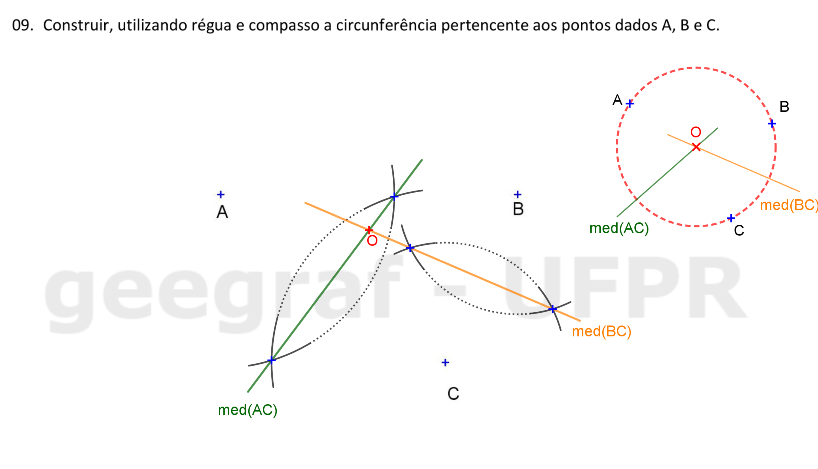
           <figcaption>Obtenha o ponto <b>O</b> na interseção da <b>med(AC)</b> com a <b>med(BC)</b>.</figcaption>
       </li>
	   <li>
           <input type="radio" id="slide030" name="slide">
           <label for="slide030">10</label>
           
           <figcaption>Pronto! Agora é só construir a circunferência de centro <b>O</b> que ela passará pelos pontos dados <b>A</b>, <b>B</b> e <b>C</b>. Note que poderíamos ter utilizado também a mediatriz do segmento <b>AB</b> ao invés de alguma outra. Não construímos as três mediatrizes, bastam duas apenas!</figcaption>
       </li>
    </ul>
    
	

  

  

   <a href="#desenho"> voltar ao topo</a>
  

	
  

&#x1f4cf; &#x1f4d0; Exercício 10

  

Num triângulo <b>ABC</b>, o lado oposto ao vértice <b>A</b> é denotado por <b>a=BC</b>, o lado oposto ao <b>B</b> é denotado por <b>b=AC</b> e o lado oposto ao <b>C</b> é denotado por <b>c=AB</b>. Para construir um triângulo <b>ABC</b> dados os lados é necessário determinar a posição dos seus vértices <b>A</b>, <b>B</b> e <b>C</b>. Vamos à construção!

  <ul class="slider">
      <li>
           <input type="radio" id="slide031" name="slide" checked>
           <label for="slide031">1</label>
           
           <figcaption>Construa uma reta suporte <b>r</b>.</figcaption>
       </li>
       <li>
           <input type="radio" id="slide032" name="slide">
           <label for="slide032">2</label>
           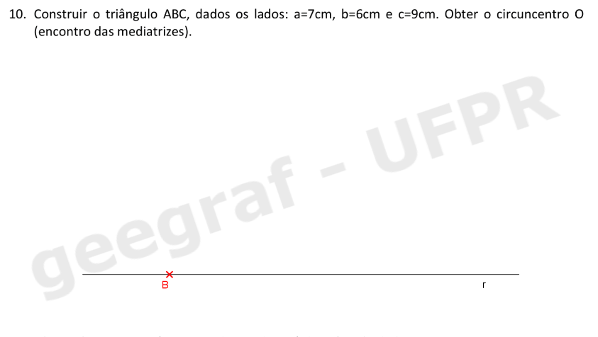
           <figcaption>Marque um ponto <b>B</b> sobre a mesma. Esse será o primeiro vértice do triângulo que queremos construir.</figcaption>
       </li>
	   <li>
           <input type="radio" id="slide033" name="slide">
           <label for="slide033">3</label>
           
           <figcaption>Vamos agora obter o vértice <b>C</b>! Sabemos que a distância entre <b>B</b> e <b>C</b> mede <b>a=7cm</b>. Basta então construir o arco de centro em <b>B</b> e raio <b>a=7cm</b>, na interseção com a reta <b>r</b> teremos <b>C</b>.</figcaption>
       </li>
       <li>
           <input type="radio" id="slide034" name="slide">
           <label for="slide034">4</label>
           
           <figcaption>Falta somente o vértice <b>A</b>! Sabemos que a distância entre <b>B</b> e <b>A</b> mede <b>c=9cm</b>. Logo, A estará sobre uma circunferência de centro <b>B</b> e raio <b>c=9cm</b>! Construa essa primeira circunferência!</figcaption>
       </li>
       <li>
           <input type="radio" id="slide035" name="slide">
           <label for="slide035">5</label>
           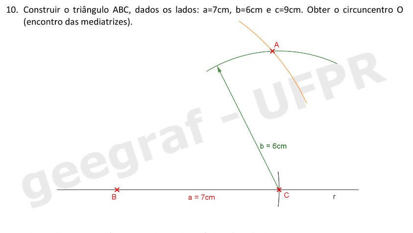
           <figcaption>Sabemos que a distância entre <b>C</b> e A mede <b>b=6cm</b>. Assim, A estará sobre uma circunferência de centro <b>C</b> e raio <b>b=6cm</b>! Construa essa segunda circunferência! Na interseção dessas duas circunferências obtemos o vértice <b>A</b> do triângulo!</figcaption>
       </li>
	   <li>
           <input type="radio" id="slide036" name="slide">
           <label for="slide036">6</label>
           
           <figcaption>Pronto! Com os três vértices determinados podemos representar agora o triângulo <b>ABC</b>.</figcaption>
       </li>
	   <li>
           <input type="radio" id="slide037" name="slide">
           <label for="slide037">7</label>
           
           <figcaption>Para obter o circuncentro <b>O</b> basta construir as mediatrizes dos lados do triângulo <b>ABC</b>. Temos três lados e, portanto, três mediatrizes. Basta construir duas apenas. Construa a mediatriz do lado <b>AB</b>.</figcaption>
       </li>
	   <li>
           <input type="radio" id="slide038" name="slide">
           <label for="slide038">8</label>
           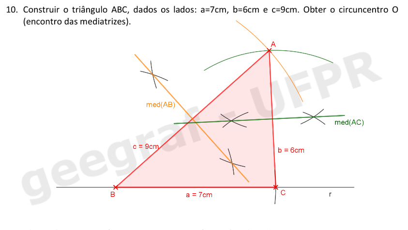
           <figcaption>Construa a mediatriz do lado <b>AC</b>. </figcaption>
       </li>
	   <li>
           <input type="radio" id="slide039" name="slide">
           <label for="slide039">9</label>
           
           <figcaption>Essas duas mediatrizes se encontram no ponto <b>O</b> denominado de Circuncentro do triângulo <b>ABC</b>. Note que esse ponto é equidistante das extremidades dos segmentos <b>AB</b> e <b>AC</b> e, portanto, é equidistante dos três pontos ao mesmo tempo!</figcaption>
       </li>
	   <li>
           <input type="radio" id="slide040" name="slide">
           <label for="slide040">10</label>
           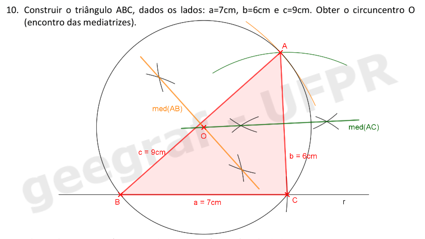
           <figcaption>Logo, o circuncentro <b>O</b> é o centro da circunferência circunscrita ao triângulo <b>ABC</b>!</figcaption>
       </li>
    </ul>
    
	

  

  

&#x1f4cf; &#x1f4d0; Exercício 11

  

Para obter o baricentro <b>G</b> do triângulo precisamos construir as medianas do mesmo. Uma mediana é um segmento que une um vértice do triângulo ao ponto médio do lado oposto. Veja como resolver o exercício.

  <ul class="slider">
      <li>
           <input type="radio" id="slide041" name="slide" checked>
           <label for="slide041">1</label>
           
           <figcaption>Vamos nomear os vértices do triângulo como <b>A</b>, <b>B</b> e <b>C</b>. Construa as mediatrizes dos lados <b>AB</b> e <b>AC</b>, obtendo também os pontos médios <b>Mc</b> e <b>Mb</b>, respectivamente.</figcaption>
       </li>
       <li>
           <input type="radio" id="slide043" name="slide">
           <label for="slide043">2</label>
           
           <figcaption>Desenhe o segmentomb ligando o ponto <b>B</b> ao ponto médio <b>Mb</b> do lado oposto, este é a mediana relativa ao lado <b>b</b>.</figcaption>
       </li>
	   <li>
           <input type="radio" id="slide042" name="slide">
           <label for="slide042">3</label>
           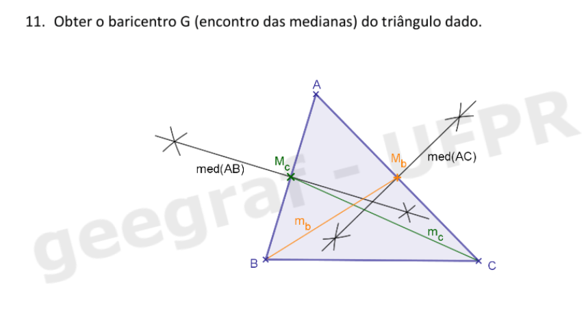
           <figcaption>Agora desenhe o segmento mcligando o ponto <b>C</b> ao ponto médio <b>Mc</b> do lado oposto, este é a mediana relativa ao lado <b>c</b>.</figcaption>
       </li>
       <li>
           <input type="radio" id="slide044" name="slide">
           <label for="slide044">4</label>
           
           <figcaption>A interseção das duas medianas <b>mb</b> e <b>mc</b> nos dá o baricentro <b>G</b> Note que não é preciso desenhar a terceira mediana <b>ma</b>!  O baricentro possui uma propriedade importante: ele divide cada mediana em duas partes, sendo que a parte que contém o vértice tem o dobro do tamanho da parte que contém o ponto médio. Meça no desenho para verificar!</figcaption>
       </li>
    </ul>
    
	

  

  

&#x1f4cf; &#x1f4d0; Exercício 12

  

Para obter o Incentro <b>I</b> do triângulo precisamos construir as bissetrizes internas do mesmo. Veja como resolver o exercício.

  <ul class="slider">
      <li>
           <input type="radio" id="slide045" name="slide" checked>
           <label for="slide045">1</label>
           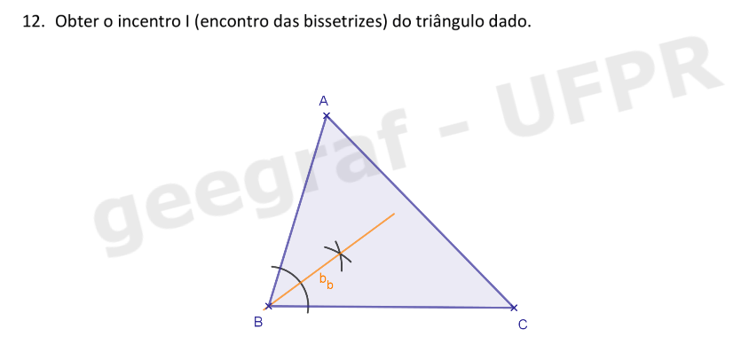
           <figcaption>Vamos nomear os vértices do triângulo como <b>A</b>, <b>B</b> e <b>C</b>. Construa a bissetriz <b>bb</b> do ângulo interno <b>B</b>.</figcaption>
       </li>
       <li>
           <input type="radio" id="slide046" name="slide">
           <label for="slide046">2</label>
           
           <figcaption>Construa a bissetriz <b>bc</b> do ângulo interno <b>bb</b>C</b>.</figcaption>
       </li>
	   <li>
           <input type="radio" id="slide047" name="slide">
           <label for="slide047">3</label>
           
           <figcaption>A interseção duas bissetrizes nos dá o Incentro <b>I</b> do triângulo <b>ABC</b>. Esse ponto <b>I</b> é equidistante dos três lados do triângulo e, portanto, ele é o centro de circunferência inscrita ao triângulo. Vamos obter essa circunferência!</figcaption>
       </li>
       <li>
           <input type="radio" id="slide048" name="slide">
           <label for="slide048">4</label>
           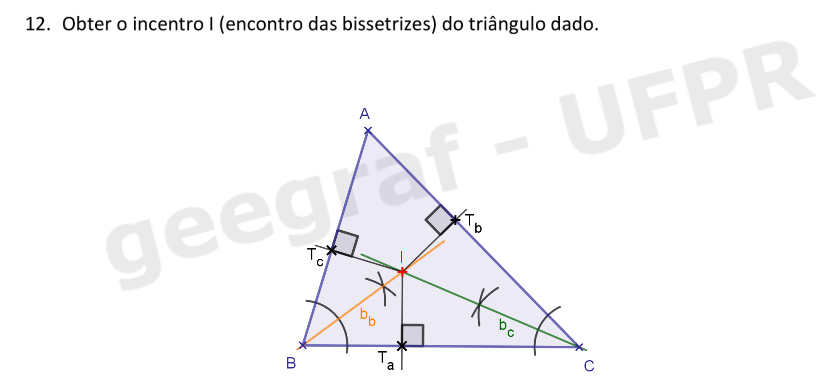
           <figcaption>Construa por <b>I</b> retas perpendiculares aos lados do triângulo, obtendo os pontos <b>Ta</b>, <b>Tb</b> e <b>Tc</b>. </figcaption>
       </li>
       <li>
           <input type="radio" id="slide049" name="slide">
           <label for="slide049">5</label>
           
           <figcaption>Construa a circunferência de centro no Incentro <b>I</b> e raio de <b>I</b> até <b>Ta</b>. Essa circunferência é tangente aos lados do triângulo <b>ABC</b>. </figcaption>
       </li>
    </ul>
    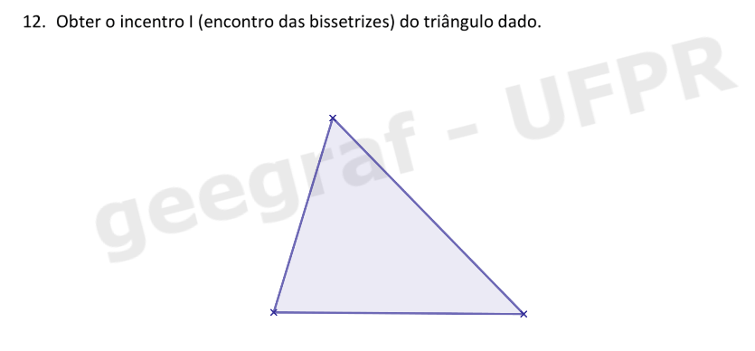
	

  

  

   <a href="#desenho"> voltar ao topo</a>
  

	
  

&#x1f4cf; &#x1f4d0; Exercício 13

  

Para obtermos o Ortocentro <b>H</b> do triângulo precisamos construir suas alturas.

  <ul class="slider">
      <li>
           <input type="radio" id="slide050" name="slide" checked>
           <label for="slide050">1</label>
           
           <figcaption>Construa pelo vértice <b>B</b> uma reta perpendicular ao lado oposto <b>b</b>, obtendo o ponto <b>Hb</b> sobre a reta <b>AC</b>. Essa reta é denominada de reta suporte da altura. E a altura relativa ao lado <b>b</b> é o segmento <b>BHb</b>.</figcaption>
       </li>
       <li>
           <input type="radio" id="slide051" name="slide">
           <label for="slide051">2</label>
           
           <figcaption>Agora construa pelo vértice <b>C</b> uma reta perpendicular ao lado oposto <b>c</b>, obtendo o ponto <b>Hc</b> sobre a reta <b>AB</b>. A altura relativa ao lado <b>c</b> é o segmento <b>CHc</b>.</figcaption>
       </li>
	   <li>
           <input type="radio" id="slide052" name="slide">
           <label for="slide052">3</label>
           
           <figcaption>A interseção das retas suportes das alturas nos fornece o Ortocentro <b>H</b> do triângulo <b>ABC</b>.</figcaption>
       </li>
    </ul>
    
	

  

  

   <a href="#desenho"> voltar ao topo</a>

  
Propriedades das projeções cilíndricas

  

	
Leia o conteúdo das páginas 11, 12 e 13 da apostila. Agora vamos começar a trabalhar com as projeções de objetos e figuras em um plano <b>&pi;'</b>.
 	
	
	 <a href="#propriedades"> voltar ao topo</a>
	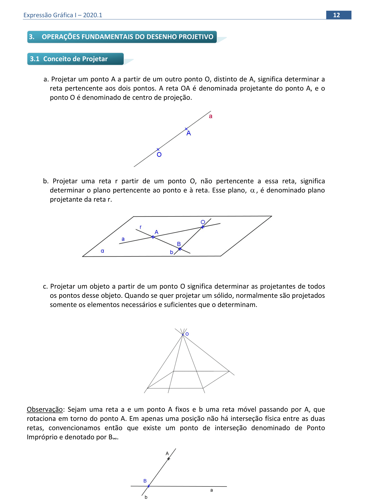
	 <a href="#propriedades"> voltar ao topo</a>
	
	 <a href="#propriedades"> voltar ao topo</a>
	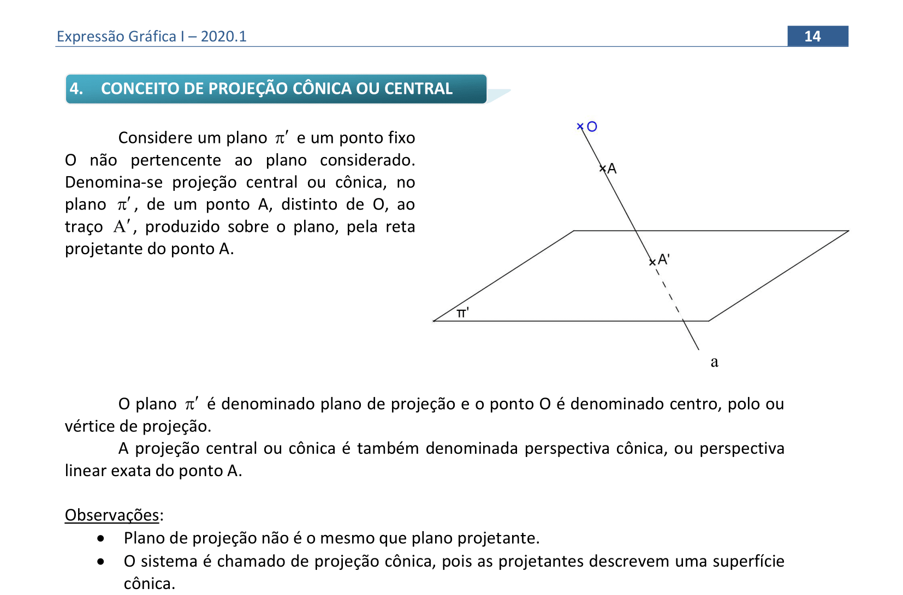
    <figcaption>Para projetar um ponto <b>A</b> qualquer do espaço usando a projeção cônica, basta definir a reta projetante <b>a</b>, que passa pelo centro de projeção <b>O</b> e pelo ponto <b>A</b>. A interseção desta reta com o plano <b>&pi;'</b> é a projeção <b>A'</b> do ponto <b>A</b>.</figcaption>
    <a href="vr/proj_conica.html" target="_blank" class="visu">Visualização em 3D</a>
	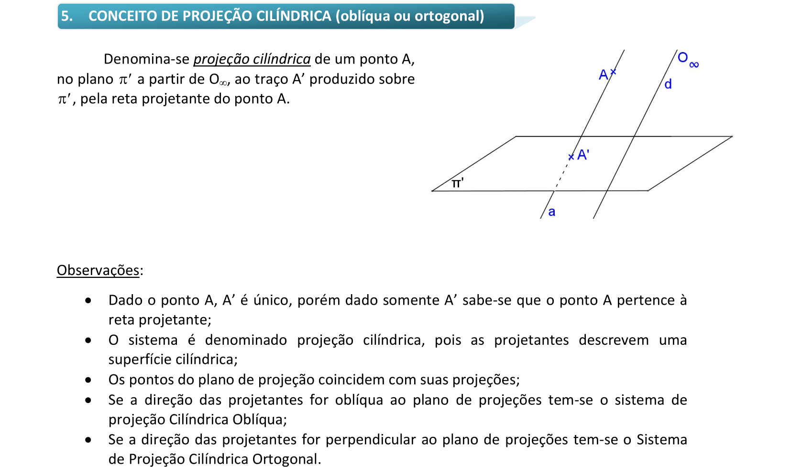
    <figcaption>Para projetar um ponto <b>A</b> qualquer do espaço usando a projeção cilíndrica, basta definir a reta projetante <b>a</b>, paralela à direção <b>d</b> e que passa pelo ponto <b>A</b>. A interseção desta reta com o plano <b>&pi;'</b> é a projeção <b>A'</b> do ponto <b>A</b>. Se a reta <b>d</b> formar ângulo <b>0 < &theta; < 90o</b>, a projeção é chamada <b>oblíqua</b>.</figcaption>
    <a href="vr/proj_cilindrica.html" target="_blank" class="visu">Projeção cilíndrica <b>oblíqua</b> em 3D</a>
    <figcaption>Quando <b>&theta; = 90o</b>, temos a projeção <b>ortogonal</b>.</figcaption>
	 <a href="vr/proj_cilindrica_orto.html" target="_blank" class="visu">Projeção cilíndrica <b>ortogonal</b> em 3D</a>
	 <a href="#propriedades"> voltar ao topo</a>
	
    <figcaption>Quando a reta <b>r</b> não é paralela à direção <b>d</b>, a sua projeção <b>r'</b> é uma reta.</figcaption>
    <a href="vr/p1.html" target="_blank" class="visu">Visualização em 3D da projeção <b>oblíqua</b></a>
	 <a href="vr/p1_orto.html" target="_blank" class="visu">Visualização em 3D da projeção <b>ortogonal</b></a>
	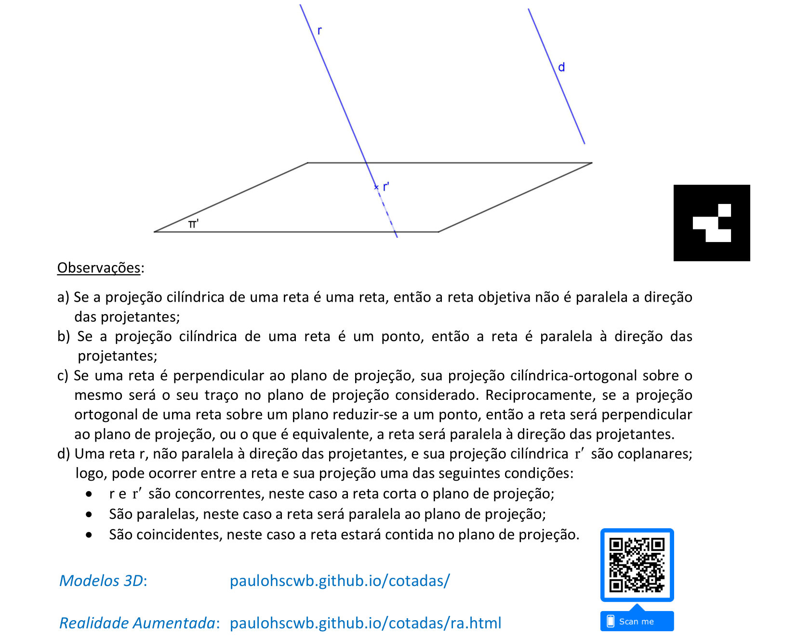
    <figcaption>No caso em que as retas <b>r</b> e <b>d</b> são paralelas, a projeção <b>r'</b> é um ponto.</figcaption>
	<a href="vr/p1a.html" target="_blank" class="visu">Visualização em 3D da projeção <b>oblíqua</b></a>
	 <a href="vr/p1a_orto.html" target="_blank" class="visu">Visualização em 3D da projeção <b>ortogonal</b></a>
	  

&#x1f453; Realidade Aumentada e Realidade Virtual

		
Esta apostila tem recursos programados em Realidade Aumentada e Realidade Virtal. Você pode acessar estes recursos usando o seguinte endereço:

		
<a href="https://paulohscwb.github.io/cotadas/ra.html"> https://paulohscwb.github.io/cotadas/ra.html</a>

		Os ambientes podem ser acessados em qualquer navegador com um dispositivo de webcam (smartphone, tablet ou notebook).
		 O acesso aos sites de Realidade Virtual é feito clicando no círculo azul que aparece em cima dos marcadores.
		  

  
		Veja o vídeo de demonstração do uso destes recursos:
		

		  <iframe src="https://drive.google.com/file/d/1Tg2c6pOoDNESEAvl9kvXgRGv81D-U0Kw/preview" width="100%"></iframe>
		

	  

	 <a href="#propriedades"> voltar ao topo</a>
	  
    <figcaption>Considerando <b>r</b> e <b>s</b> estão em planos projetantes distintos, as projeções <b>r'</b> e <b>s'</b> são paralelas.</figcaption>
    <a href="vr/p2.html" target="_blank" class="visu">Propriedade em 3D: projeção <b>oblíqua</b></a>
	 <a href="vr/p2_orto.html" target="_blank" class="visu">Propriedade em 3D: projeção <b>ortogonal</b></a>
      
	<figcaption>Se <b>r</b> e <b>s</b> estão em um mesmo plano projetante, as projeções <b>r'</b> e <b>s'</b> são coincidentes.</figcaption>
    <a href="vr/p2a.html" target="_blank" class="visu">Propriedade em 3D: projeção <b>oblíqua</b></a>
	 <a href="vr/p2a_orto.html" target="_blank" class="visu">Propriedade em 3D: projeção <b>ortogonal</b></a>
    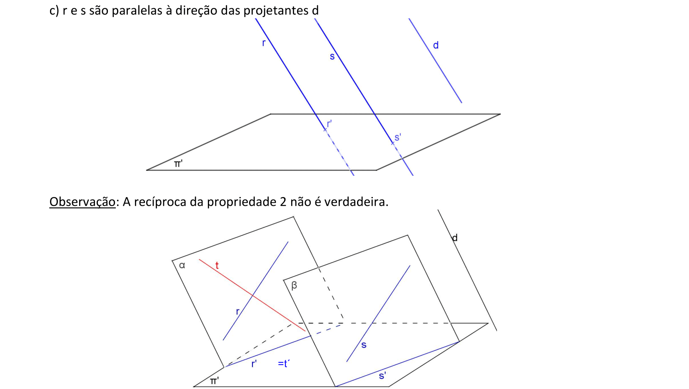  
    <figcaption>Quando as retas <b>r</b> e <b>s</b> são paralelas à direção <b>d</b>, suas projeções <b>r'</b> e <b>s'</b> são pontos.</figcaption>
    <a href="vr/p2c.html" target="_blank" class="visu">Propriedade em 3D: projeção <b>oblíqua</b></a>
	 <a href="vr/p2c_orto.html" target="_blank" class="visu">Propriedade em 3D: projeção <b>ortogonal</b></a>
	 <a href="#propriedades"> voltar ao topo</a>
    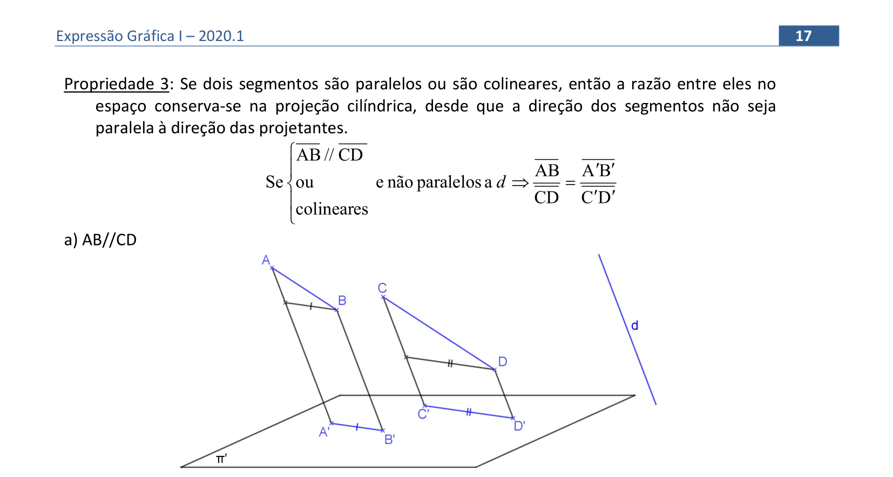 
    <figcaption>A proporção entre as medidas dos segmentos paralelos <b>AB</b> e <b>CD</b> é a mesma de suas projeções, ou seja: <b>AB/CD = A'B'/C'D'</b>.</figcaption>
    <a href="vr/p3a.html" target="_blank" class="visu">Propriedade em 3D: projeção <b>oblíqua</b></a>
	 <a href="vr/p3a_orto.html" target="_blank" class="visu">Propriedade em 3D: projeção <b>ortogonal</b></a>
    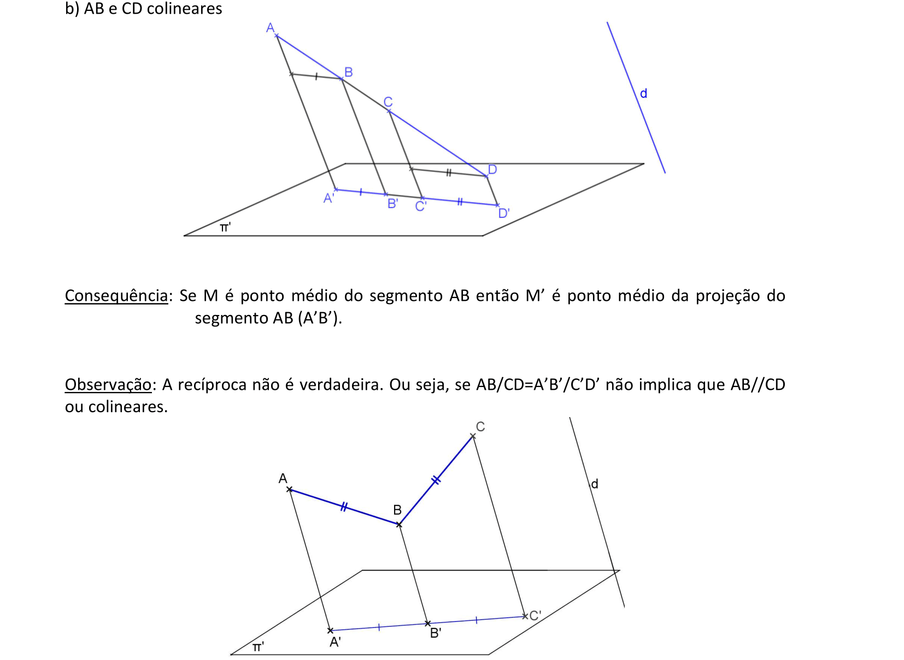 
    <figcaption>Se os segmentos <b>AB</b> e <b>CD</b> são colineares, a mesma proporção entre as medidas é válida: <b>AB/CD = A'B'/C'D'</b>.</figcaption>
    <a href="vr/p3b.html" target="_blank" class="visu">Propriedade em 3D: projeção <b>oblíqua</b></a>
	 <a href="vr/p3b_orto.html" target="_blank" class="visu">Propriedade em 3D: projeção <b>ortogonal</b></a>
	 <a href="#propriedades"> voltar ao topo</a>
	 
    <figcaption>Uma figura pertencente a um plano paralelo ao plano de projeções <b>&pi;'</b> fica projetada com o mesmo tamanho, sem redução ou ampliação de tamanho.</figcaption>
    <a href="vr/p4.html" target="_blank" class="visu">Propriedade em 3D: projeção <b>oblíqua</b></a>
	 <a href="vr/p4_orto.html" target="_blank" class="visu">Propriedade em 3D: projeção <b>ortogonal</b></a>
	 
    <figcaption>Uma figura que pertence a um plano <b>&alpha;</b> paralelo à direção <b>d</b> de projeções tem projeção reduzida a um segmento.</figcaption>
    <a href="vr/p5.html" target="_blank" class="visu">Propriedade em 3D: projeção <b>oblíqua</b></a>
	 <a href="vr/p5_orto.html" target="_blank" class="visu">Propriedade em 3D: projeção <b>ortogonal</b></a>
	 <a href="#propriedades"> voltar ao topo</a>
  
  

&#x1f4cf; &#x1f4d0; Resolução

  
 Vamos utilizar a régua e o compasso para resolver este exercício. De acordo com a propriedade 3, podemos encontrar a projeção do ponto médio de <b>AB</b> construindo a mediatriz da projeção deste segmento. Clique nos botões do passo a passo para fazer a construção na sua apostila.

  <ul class="slider">
       <li>
           <input type="radio" id="slide100" name="slide">
           <label for="slide100">1</label>
		   
		   <figcaption>Com a ponta seca em <b>A'</b>, desenhe um arco com raio maior do que a metade de <b>A'B'</b>.</figcaption>
       </li>
       <li>
           <input type="radio" id="slide101" name="slide">
           <label for="slide101">2</label>
           
           <figcaption>Com a ponta seca em <b>B'</b>, desenhe um arco com o mesmo raio usado no passo anterior.</figcaption>
       </li>
       <li>
           <input type="radio" id="slide102" name="slide">
           <label for="slide102">3</label>
           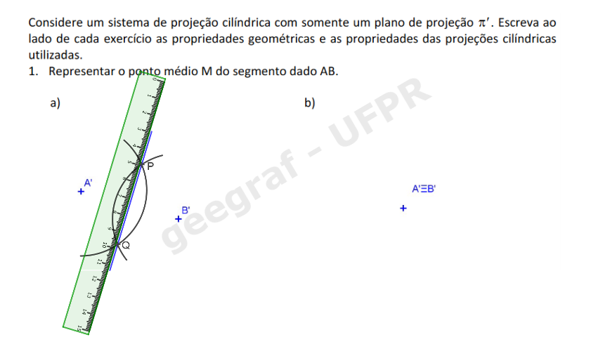
           <figcaption>Desenhe a reta que passa pelos pontos de interseção dos arcos usando a régua.</figcaption>
       </li>
       <li>
           <input type="radio" id="slide103" name="slide">
           <label for="slide103">4</label>
           
           <figcaption>A projeção do ponto médio <b>M'</b> está na interseção da mediatriz de <b>A'B'</b> com o segmento <b>A'B'</b>.</figcaption>
       </li>
       <li>
           <input type="radio" id="slide104" name="slide">
           <label for="slide104">5</label>
           
           <figcaption>Como os pontos <b>A'</b> e <b>B'</b> estão coincidentes, quer dizer que o segmento <b>AB</b> é paralelo à direção das projetantes. Logo, <b>M'</b> coincide com <b>A'</b> e <b>B'</b>.</figcaption>
       </li>
    </ul>
    
  

  
  

&#x1f4cf; &#x1f4d0; Resolução: itens a e b

  
 Vamos utilizar a régua, o compasso e os esquadros para resolver este exercício. De acordo com a propriedade 2, podemos encontrar a projeção dos lados de um paralelogramo utilizando a construção de retas paralelas.

  <ul class="slider">
      <li>
           <input type="radio" id="slide105" name="slide" checked>
           <label for="slide105">1</label>
           
           <figcaption>A projeção do lado <b>C'D'</b> será paralela ao segmento <b>A'B'</b>. Logo, podemos desenhar a reta <b>C'D' // A'B'</b> com o uso de esquadros.</figcaption>
       </li>
       <li>
           <input type="radio" id="slide106" name="slide">
           <label for="slide106">2</label>
           
           <figcaption>Alinhando o esquadro de 45o com <b>A'B'</b>, coloque como apoio o outro esquadro ou a régua. Deslize o esquadro de 45o deixando o outro esquadro ou a régua fixo.</figcaption>
       </li>
       <li>
           <input type="radio" id="slide107" name="slide">
           <label for="slide107">3</label>
           
           <figcaption>Usando a mesma construção, você pode desenhar a reta paralela a <b>A'D'</b>, ou usar o compasso. Pela propriedade 3, <b>A'B' = C'D'</b>, logo, podemos "pegar" a medida <b>A'B'</b> com o compasso... </figcaption>
       </li>
       <li>
           <input type="radio" id="slide108" name="slide">
           <label for="slide108">4</label>
           
           <figcaption>... e desenhá-la com centro em <b>D'</b> e o raio <b>A'B'</b>. Logo, encontramos o ponto <b>C'</b>.</figcaption>
       </li>
       <li>
           <input type="radio" id="slide109" name="slide">
           <label for="slide109">5</label>
           
           <figcaption>Pronto! O paralelogramo está construído. Agora é sua vez de fazer o item b!</figcaption>
       </li>
    </ul>
    
	

	<h4>Solução do item b</h4>
	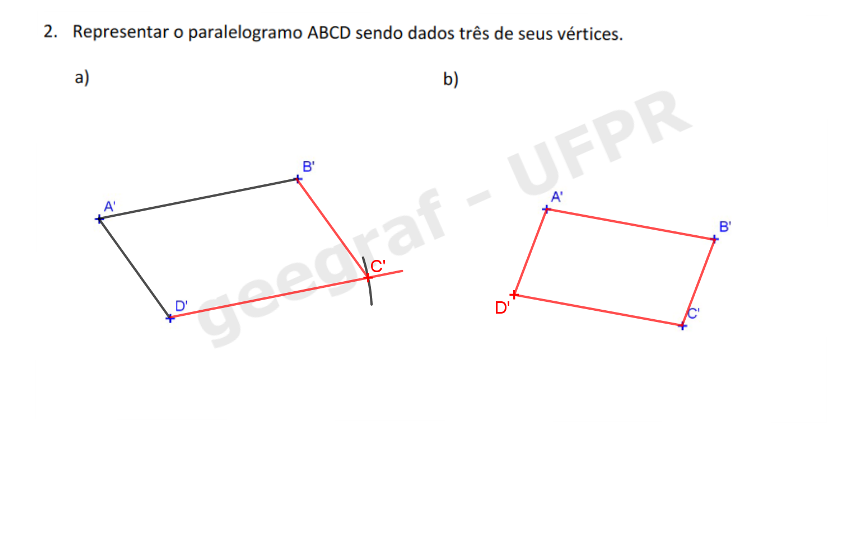
	<figcaption>A construção é parecida com a que fizemos no item a.</figcaption>
  

  

&#x1f4cf; &#x1f4d0; Resolução: itens c e d

  
 Vamos utilizar a régua e o compasso para resolver este exercício. De acordo com a propriedade 5, o paralelogramo está em um plano paralelo à direção <b>d</b> das projetantes.

  <ul class="slider">
      <li>
           <input type="radio" id="slide110" name="slide" checked>
           <label for="slide110">1</label>
           
           <figcaption>O vértice <b>C'</b> do paralelogramo estará no prolongamento da reta <b>A'B'</b>.</figcaption>
       </li>
       <li>
           <input type="radio" id="slide111" name="slide">
           <label for="slide111">2</label>
           
           <figcaption>De acordo com a propriedade 3, os segmentos <b>A'B'</b> e <b>C'D'</b> são iguais. Logo, podemos "pegar" a medida <b>A'B'</b> com o compasso...</figcaption>
       </li>
       <li>
           <input type="radio" id="slide112" name="slide">
           <label for="slide112">3</label>
           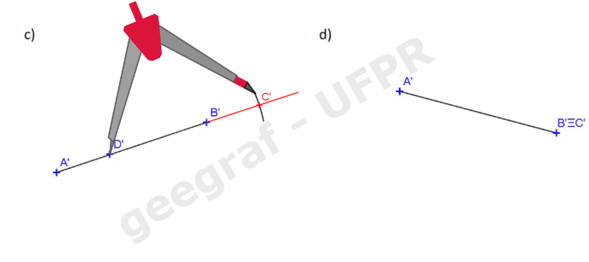
           <figcaption>... e desenhar o arco com medida <b>A'B'</b> no prolongamento deste segmento.</figcaption>
       </li>
       <li>
           <input type="radio" id="slide113" name="slide">
           <label for="slide113">4</label>
           
           <figcaption>Assim, encontramos o vértice <b>C'</b> do paralelogramo.</figcaption>
       </li>
    </ul>
    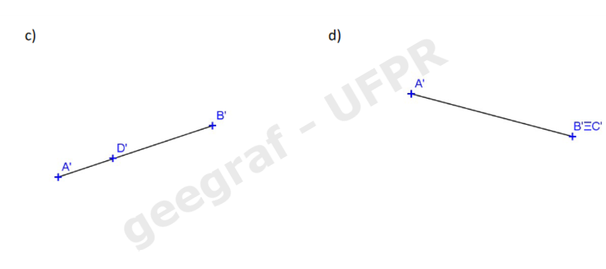
	

	<h4>Solução do item d</h4>
	
	<figcaption>Usando as mesmas propriedades usadas nos itens anteriores, podemos concluir que os vértices <b>A</b> e <b>D</b> coincidem.</figcaption>
  

   <a href="#propriedades"> voltar ao topo</a>
  
  

&#x1f4cf; &#x1f4d0; Resolução: item a

  
 Vamos utilizar a régua e o compasso para resolver este exercício.

  <ul class="slider">
      <li>
           <input type="radio" id="slide114" name="slide" checked>
           <label for="slide114">1</label>
           
           <figcaption>Relembrando uma propriedade do paralelogramo: as diagonais interceptam-se em seus respectivos pontos médios. Logo, pela propriedade 3, <b>A'M' = M'C'</b>.</figcaption>
       </li>
       <li>
           <input type="radio" id="slide115" name="slide">
           <label for="slide115">2</label>
           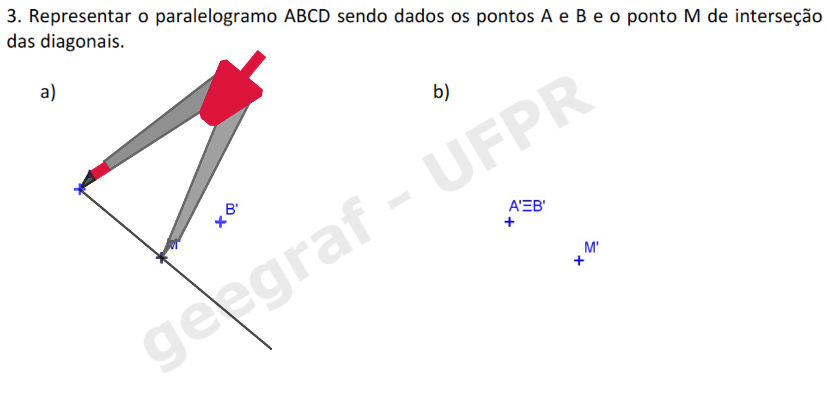
           <figcaption>Logo, podemos "pegar" a medida <b>A'B'</b> com o compasso e prolongar o segmento <b>A'M'</b>.</figcaption>
       </li>
       <li>
           <input type="radio" id="slide116" name="slide">
           <label for="slide116">3</label>
           
           <figcaption>Para encontrar <b>C'</b>, basta desenhar o arco com medida <b>A'M'</b> no prolongamento de <b>A'M'</b>.</figcaption>
       </li>
       <li>
           <input type="radio" id="slide117" name="slide">
           <label for="slide117">4</label>
           
           <figcaption>O mesmo acontece com os segmentos <b>B'M'</b> e <b>M'D'</b>. Logo, podemos "pegar" a medida <b>B'M'</b> com o compasso...</figcaption>
       </li>
       <li>
           <input type="radio" id="slide118" name="slide">
           <label for="slide118">5</label>
           
           <figcaption>... e podemos desenhar o arco com centro em <b>M'</b> e raio <b>B'M'</b>.</figcaption>
       </li>
       <li>
           <input type="radio" id="slide119" name="slide">
           <label for="slide119">6</label>
           
           <figcaption>Pronto! O paralelogramo está construído. Não esqueça de desenhar os lados desta figura.</figcaption>
       </li>
    </ul>
    
  

  

&#x1f4cf; &#x1f4d0; Resolução: itens b e c

  
 Vamos utilizar a régua e o compasso para resolver este exercício.

  <ul class="slider">
      <li>
           <input type="radio" id="slide120" name="slide" checked>
           <label for="slide120">1</label>
           
        <figcaption>Como as projeções dos vértices <b>A'</b> e <b>B'</b> são coincidentes, pela propriedade 1, podemos concluir que <b>AB // d</b>. Portanto, temos que <b>C'D' // d</b>.</figcaption>
       </li>
       <li>
           <input type="radio" id="slide121" name="slide">
           <label for="slide121">2</label>
           
         <figcaption>Podemos "pegar" a medida entre os pontos <b>A'=B'</b> e <b>M'</b> com o compasso e prolongar o segmento que une estes pontos.</figcaption>
       </li>
       <li>
           <input type="radio" id="slide122" name="slide">
           <label for="slide122">3</label>
           
           <figcaption>Os pontos <b>C'</b> e <b>D'</b> também coincidem, pois <b>AB // CD</b>.  Para encontrar <b>C'=D'</b>, basta desenhar o arco com medida <b>A'M'</b> no prolongamento de <b>A'M'</b>.</figcaption>
       </li>
       <li>
           <input type="radio" id="slide123" name="slide">
           <label for="slide123">4</label>
           
           <figcaption>O paralelogramo está construído. Use o link abaixo para visualizar em 3D a propriedade que usamos. Agora você pode construir o item c deste exercício.</figcaption>
       </li>
    </ul>
    
    <a href="vr/20_03b.html" target="_blank" class="visu">Visualização em 3D para o item b</a>
	

	<h4>Solução do item c</h4>
	
	<figcaption>Usando as propriedades dos itens a e b, você consegue fazer a construção deste paralelogramo.</figcaption>
  

  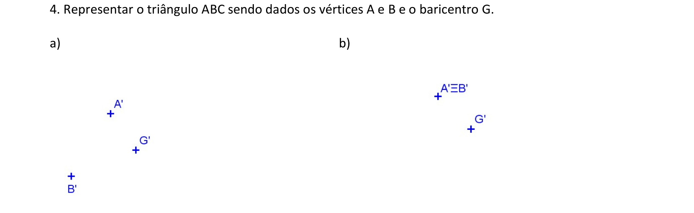
  

&#x1f4cf; &#x1f4d0; Resolução: item a

  
 Vamos utilizar a régua e o compasso para resolver este exercício.

  <ul class="slider">
      <li>
           <input type="radio" id="slide124" name="slide" checked>
           <label for="slide124">1</label>
           
        <figcaption>Relembrando a propriedade do baricentro: A distância do baricentro a um vértice mede 2/3 da mediana, ou seja, <b>CG = 2CM/3</b> ou <b>GM = CM/3.</b></figcaption>
       </li>
       <li>
           <input type="radio" id="slide125" name="slide">
           <label for="slide125">2</label>
           
         <figcaption>Pela propriedade 3, a medida <b>G'M'</b> mede <b>CM/3</b>. Então vamos construir a mediatriz do segmento <b>A'B'</b>.</figcaption>
       </li>
       <li>
           <input type="radio" id="slide126" name="slide">
           <label for="slide126">3</label>
           
         <figcaption>Usando os arcos de mesma medida, com centros em <b>A'</b> e <b>B'</b>, obtemos os pontos que definem a mediatriz de <b>A'B'</b>.</figcaption>
       </li>
       <li>
           <input type="radio" id="slide127" name="slide">
           <label for="slide127">4</label>
           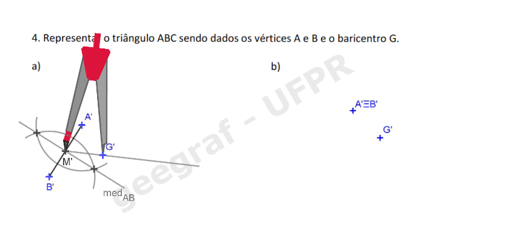
         <figcaption>Unindo os pontos <b>M'</b> e <b>G'</b>, podemos usar o compasso para "pegar" a medida <b>G'M'</b>.</figcaption>
       </li>
       <li>
           <input type="radio" id="slide128" name="slide">
           <label for="slide128">5</label>
           
           <figcaption>Com o centro em <b>G'</b>, marcamos uma vez o segmento com medida igual a <b>G'M'</b>.</figcaption>
       </li>
       <li>
           <input type="radio" id="slide129" name="slide">
           <label for="slide129">6</label>
           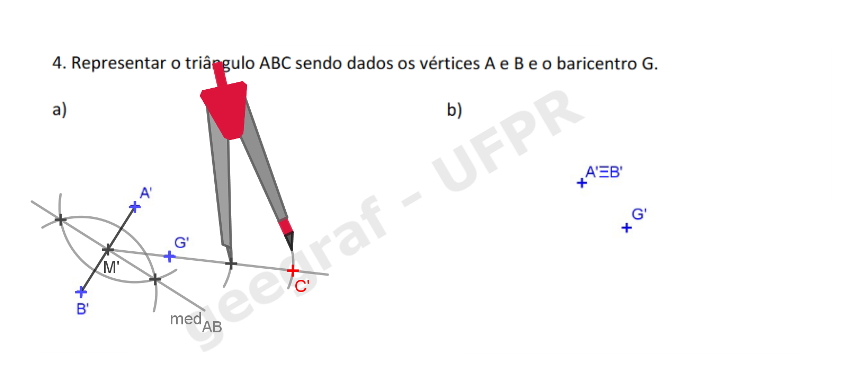
           <figcaption>Na sequência, marcamos novamente um segmento com a mesma medida. Assim, encontramos <b>G'C' = 2G'M'</b>.</figcaption>
       </li>
       <li>
           <input type="radio" id="slide130" name="slide">
           <label for="slide130">7</label>
           
           <figcaption>Agora você pode desenhar os lados do triângulo <b>A'B'C'</b>.</figcaption>
       </li> 
    </ul>
    
  

  

&#x1f4cf; &#x1f4d0; Resolução: itens b e c

  
 Vamos utilizar a régua e o compasso para resolver este exercício.

  <ul class="slider">
      <li>
           <input type="radio" id="slide131" name="slide" checked>
           <label for="slide131">1</label>
           
        <figcaption>Vamos usar a mesma propriedade do item anterior: A distância do baricentro a um vértice mede 2/3 da mediana, ou seja, <b>CG = 2CM/3</b> ou <b>GM = CM/3.</b></figcaption>
       </li>
       <li>
           <input type="radio" id="slide132" name="slide">
           <label for="slide132">2</label>
           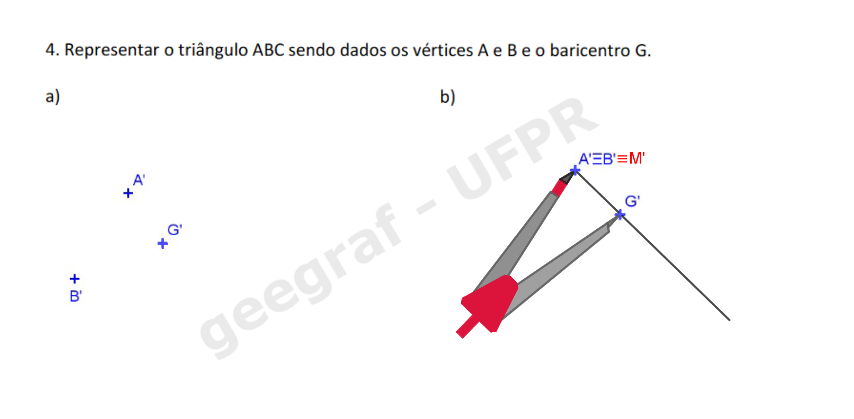
         <figcaption>Pela propriedade 2, se os pontos <b>A'</b> e <b>B'</b> coincidem, o lado <b>AB</b> é paralelo à direção <b>d</b>. Logo, o ponto <b>M'</b> também coincide com <b>A'</b> e <b>B'</b>.</figcaption>
       </li>
       <li>
           <input type="radio" id="slide133" name="slide">
           <label for="slide133">3</label>
           
         <figcaption>Logo, podemos prolongar a reta <b>A'G'</b> para encontrar a projeção do vértice <b>C</b>. Usando o compasso, "pegamos" a medida <b>A'G'</b> e podemos marcá-la a partir de <b>G'</b></figcaption>
       </li>
       <li>
           <input type="radio" id="slide134" name="slide">
           <label for="slide134">4</label>
           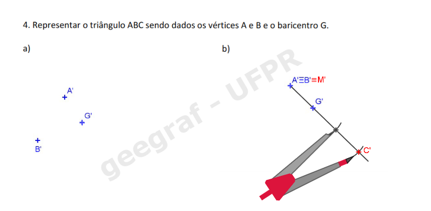
         <figcaption>Marcando-se duas vezes esta medida <b>A'G'</b> encontramos a projeção <b>C'</b>. Neste caso, o triângulo <b>ABC</b> fica projetado como um segmento.</figcaption>
       </li>
	   <li>
           <input type="radio" id="slide135" name="slide">
           <label for="slide135">5</label>
           
         <figcaption>Use o link abaixo para visualizar o exercício em 3D. Agora é sua vez de construir o item c.</figcaption>
       </li>
    </ul>
	
    <a href="vr/20_04b.html" target="_blank" class="visu">Visualização em 3D</a>
    

	<h4>Solução do item c.</h4>
  	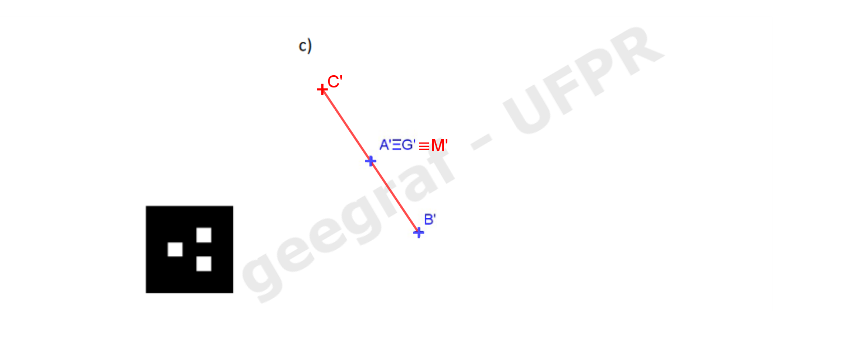
	<figcaption>Utilizando as mesmas propriedades dos itens anteriores, você consegue construir este triângulo. Use o link abaixo para te ajudar na visualização em 3D.</figcaption>
    <a href="vr/p_ex4c_triangulo.html" target="_blank" class="visu">Visualização em 3D do item c</a>
  

   <a href="#propriedades"> voltar ao topo</a>
  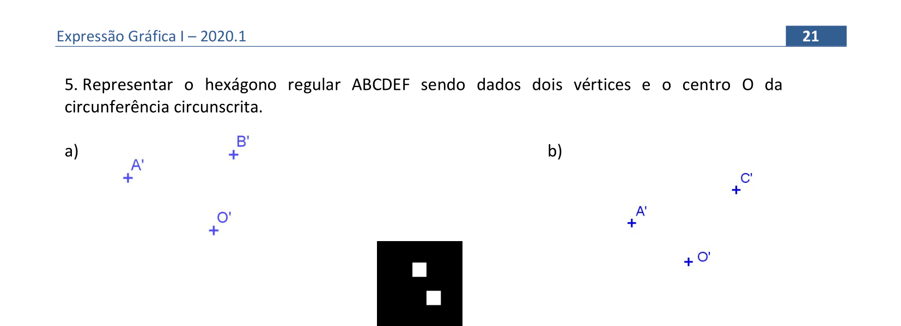
  

&#x1f4cf; &#x1f4d0; Resolução: itens a e b

  
 Vamos utilizar a régua, o compasso e os esquadros para resolver este exercício.

  <ul class="slider">
      <li>
           <input type="radio" id="slide136" name="slide" checked>
           <label for="slide136">1</label>
           
        <figcaption>Relembrando as propriedades do hexágono regular: os lados são iguais ao raio da circunferência circunscrita, e os raios são paralelos aos lados.</figcaption>
       </li>
       <li>
           <input type="radio" id="slide137" name="slide">
           <label for="slide137">2</label>
           
         <figcaption>Pela propriedade 3, os segmentos <b>A'O'</b> e <b>B'C'</b> terão projeções com mesma medida e serão paralelos. Logo, podemos construir a paralela a <b>A'O'</b> que passa por <b>B'</b>.</figcaption>
       </li>
       <li>
           <input type="radio" id="slide138" name="slide">
           <label for="slide138">3</label>
           
         <figcaption>Alinhando a hipotenusa de um esquadro e apoiando este esquadro com a régua ou outro esquadro, basta deslizar o esquadro que você alinhou até chegar em <b>B'</b>.</figcaption>
       </li>
       <li>
           <input type="radio" id="slide139" name="slide">
           <label for="slide139">4</label>
           
         <figcaption>Como <b>AO = BC</b> e <b>AO // BC</b>, pelas propriedades 2 e 3 temos que <b>A'O' = B'C'</b> e <b>A'O' // B'C'</b>. Podemos "pegar" a medida <b>A'O'</b> com o compasso...</figcaption>
       </li>
	   <li>
           <input type="radio" id="slide140" name="slide">
           <label for="slide140">5</label>
           
         <figcaption>... e marcá-la na paralela construída, a partir do ponto <b>B'</b>. Assim, encontramos a projeção do ponto <b>C'</b>.</figcaption>
       </li>
	   <li>
           <input type="radio" id="slide141" name="slide">
           <label for="slide141">6</label>
           
         <figcaption>Usando a propriedade 3, como <b>A</b>, <b>O</b> e <b>D</b> são colineares, temos que <b>A'O' = O'D'</b>. Podemos "pegar" essa medida com o compasso...</figcaption>
       </li>
	   <li>
           <input type="radio" id="slide142" name="slide">
           <label for="slide142">7</label>
           
         <figcaption>... e desenhar o arco com centro em <b>O'</b>. Assim, encontramos o vértice <b>D'</b>.</figcaption>
       </li>
	   <li>
           <input type="radio" id="slide143" name="slide">
           <label for="slide143">8</label>
           
         <figcaption>Podemos fazer a mesma construção com os segmentos <b>O'F' = O'C'</b> para encontrar <b>F'</b>.</figcaption>
       </li>
	   <li>
           <input type="radio" id="slide144" name="slide">
           <label for="slide144">9</label>
           
         <figcaption>E para fechar o hexágono, fazemos a mesma construção com os segmentos <b>B'O' = O'E'</b>. Use o link abaixo para visualizar o exercício em 3D.</figcaption>
       </li>
    </ul>
	
    <a href="vr/p_ex5a_hexagono.html" target="_blank" class="visu">Visualização em 3D</a>
	

	<h4>Solução do item b</h4>
	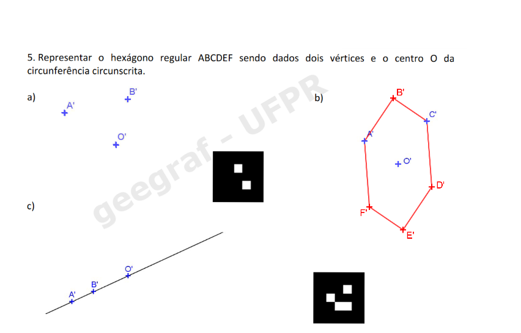
	<figcaption>Com as propriedades que usamos no item a, você consegue fazer a construção deste hexágono do item b.</figcaption>
  

  

&#x1f4cf; &#x1f4d0; Resolução: item c

  
 Vamos utilizar a régua e o compasso para resolver este exercício.

  <ul class="slider">
      <li>
           <input type="radio" id="slide145" name="slide" checked>
           <label for="slide145">1</label>
           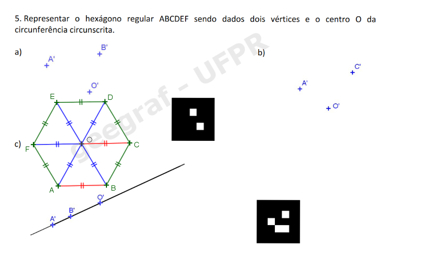
        <figcaption>Usando as propriedades do hexágono regular, podemos notar que <b>AB = OC</b> e <b>AB // OC</b>. Logo, as projeções desses serão iguais e paralelas.</figcaption>
       </li>
       <li>
           <input type="radio" id="slide146" name="slide">
           <label for="slide146">2</label>
           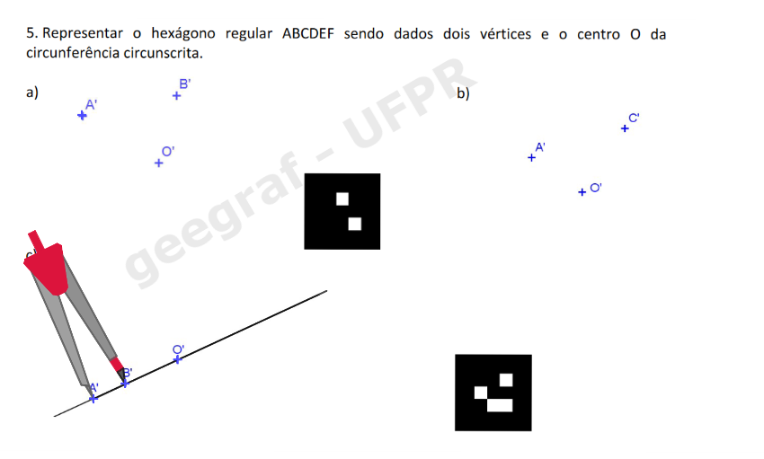
         <figcaption>Pela propriedade 5, como os pontos <b>A'</b>, <b>B'</b> e <b>O'</b> são colineares, o hexágono está em um plano paralelo à direção de projeções <b>d</b>. Logo, <b>C'</b> estará na mesma reta.</figcaption>
       </li>
       <li>
           <input type="radio" id="slide147" name="slide">
           <label for="slide147">3</label>
           
         <figcaption>Podemos "pegar" a medida <b>A'B'</b> com o compasso e transferir esta medida a partir de <b>O'</b>, encontrando o ponto <b>C'</b>.</figcaption>
       </li>
       <li>
           <input type="radio" id="slide148" name="slide">
           <label for="slide148">4</label>
           
         <figcaption>Como <b>BO = OE</b>, pela propriedade 3 temos que <b>B'O' = O'E'</b>. Podemos "pegar" a medida <b>B'O'</b> com o compasso...</figcaption>
       </li>
	   <li>
           <input type="radio" id="slide149" name="slide">
           <label for="slide149">5</label>
           
         <figcaption>... e marcá-la a partir do ponto <b>O'</b>, encontrando o vértice <b>E'</b>. Podemos usar a mesma propriedade para encontrar os outros vértices.</figcaption>
       </li>
	   <li>
           <input type="radio" id="slide150" name="slide">
           <label for="slide150">6</label>
           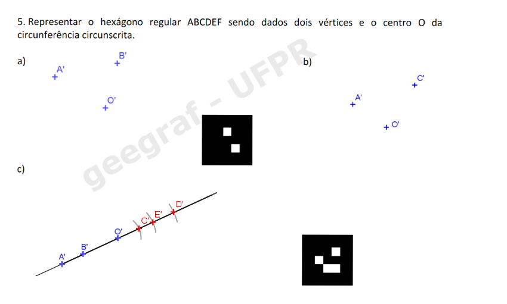
         <figcaption>Podemos marcar <b>A'O' = O'D'</b> para encontrar o vértice <b>D'</b>.</figcaption>
       </li>
	   <li>
           <input type="radio" id="slide151" name="slide">
           <label for="slide151">7</label>
           
         <figcaption>E para finalizar o hexágono, marcamos <b>O'C' = O'F'</b>. Visualize este hexágono em 3D com o link abaixo.</figcaption>
       </li>
    </ul>
	
    <a href="vr/p_ex5c_hexagono.html" target="_blank" class="visu">Visualização em 3D</a>
  

  
   <a href="#propriedades"> voltar ao topo</a>
  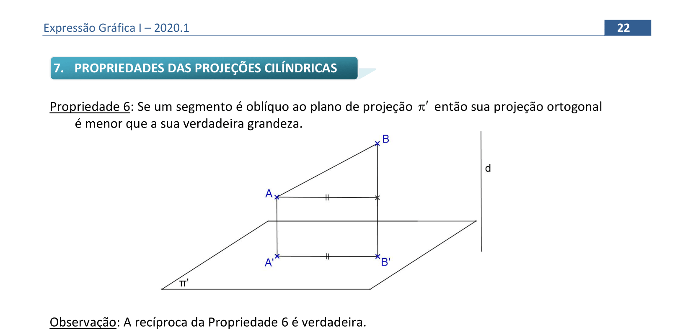
  <figcaption>Os segmentos oblíquos ao plano de projeções <b>&pi;'</b> são projetados com tamanho reduzido, ou seja, <b>AB > A'B'</b></figcaption>
  <a href="vr/p6.html" target="_blank" class="visu">Visualização da propriedade em 3D</a>
  
  <figcaption>Quando a reta <b>r // &pi;'</b> e as retas <b>r</b> e <b>s</b> são perpendiculares ou ortogonais, as retas <b>r'</b> e <b>s'</b> são perpendiculares.</figcaption>
  <a href="vr/p7.html" target="_blank" class="visu">Visualização da propriedade em 3D</a>
   <a href="#propriedades"> voltar ao topo</a>
  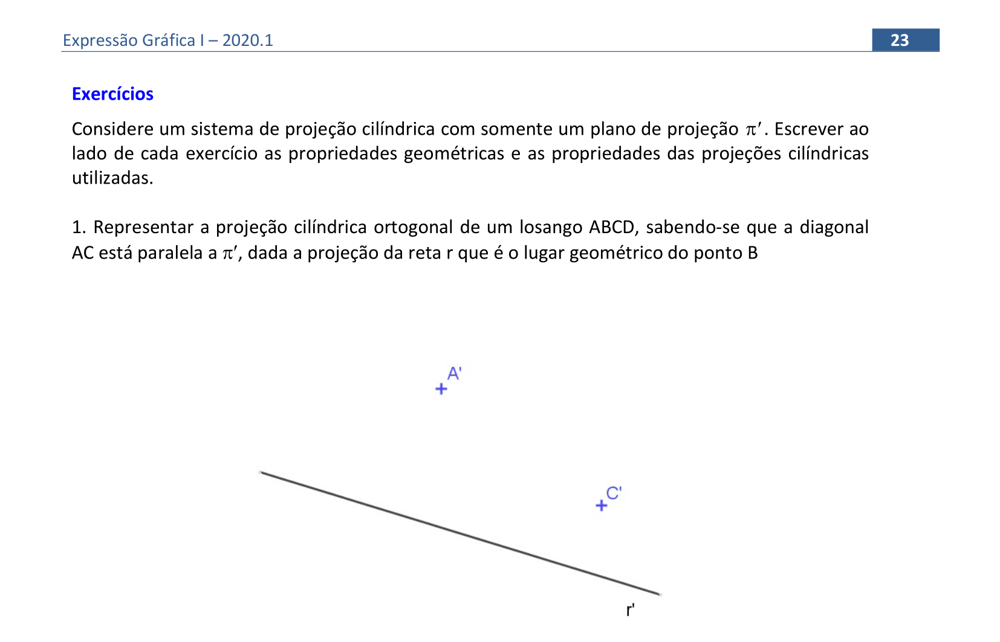
  

&#x1f4cf; &#x1f4d0; Resolução

  
 Vamos utilizar a régua e o compasso para resolver este exercício.

  <ul class="slider">
      <li>
           <input type="radio" id="slide152" name="slide" checked>
           <label for="slide152">1</label>
           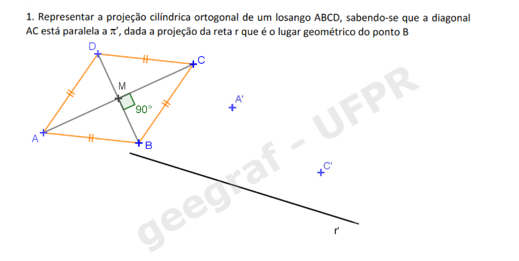
        <figcaption>Usando as propriedades do losango, temos que as medidas dos lados são iguais <b>AB = BC = CD = AD</b> e as diagonais <b>AC</b> e <b>BD</b> são perpendiculares. Podemos usar a propriedade 7 de projeções ortogonais.</figcaption>
       </li>
       <li>
           <input type="radio" id="slide153" name="slide">
           <label for="slide153">2</label>
           
         <figcaption>Como a reta <b>AC</b> é paralela a <b>&pi;'</b>, o ângulo de 90o está projetado em verdadeira grandeza (vg). Podemos construir a mediatriz da projeção da diagonal <b>A'C'</b>.</figcaption>
       </li>
       <li>
           <input type="radio" id="slide154" name="slide">
           <label for="slide154">3</label>
           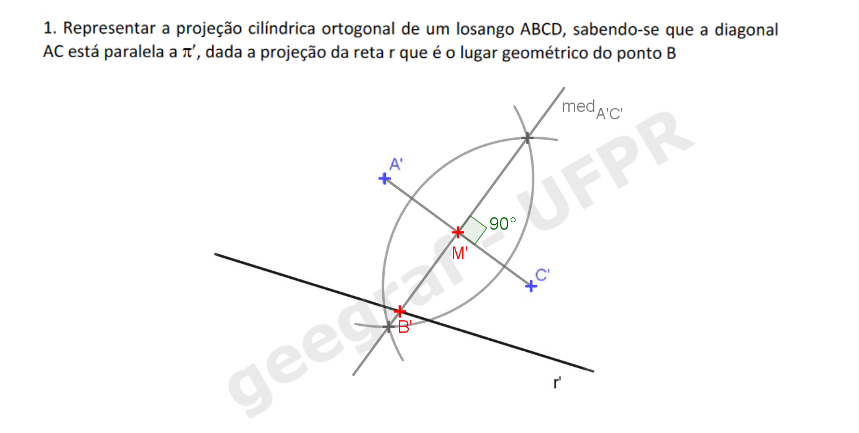
         <figcaption>A interseção da mediatriz de <b>A'C'</b> com a reta <b>r'</b> é o vértice <b>B'</b>.</figcaption>
       </li>
       <li>
           <input type="radio" id="slide155" name="slide">
           <label for="slide155">4</label>
           
         <figcaption>Como <b>BM = MD</b>, pela propriedade 3 temos que <b>B'M' = M'D'</b>. Podemos marcar com o compasso a medida <b>B'M'</b> a partir do ponto <b>M'</b>, encontrando o vértice <b>D'</b>.</figcaption>
       </li>
	   <li>
           <input type="radio" id="slide156" name="slide">
           <label for="slide156">5</label>
           
         <figcaption>Pronto, a projeção do losango está construída. Veja no link abaixo a representação em 3D deste exercício.</figcaption>
       </li>
    </ul>
	
    <a href="vr/p_ex1_losango.html" target="_blank" class="visu">Visualização em 3D</a>
  

  
  

&#x1f4cf; &#x1f4d0; Resolução

  
 Vamos utilizar a régua e o compasso para resolver este exercício.

  <ul class="slider">
      <li>
           <input type="radio" id="slide157" name="slide" checked>
           <label for="slide157">1</label>
           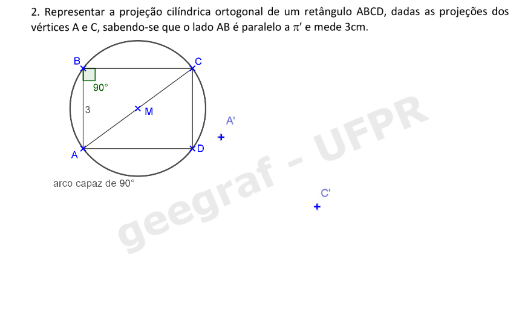
        <figcaption>Usando as propriedades do retângulo, temos que os vértices pertencem a uma circunferência com centro no encontro das diagonais <b>M</b>. Esta circunferência é chamada de arco capaz de 90o.</figcaption>
       </li>
       <li>
           <input type="radio" id="slide158" name="slide">
           <label for="slide158">2</label>
           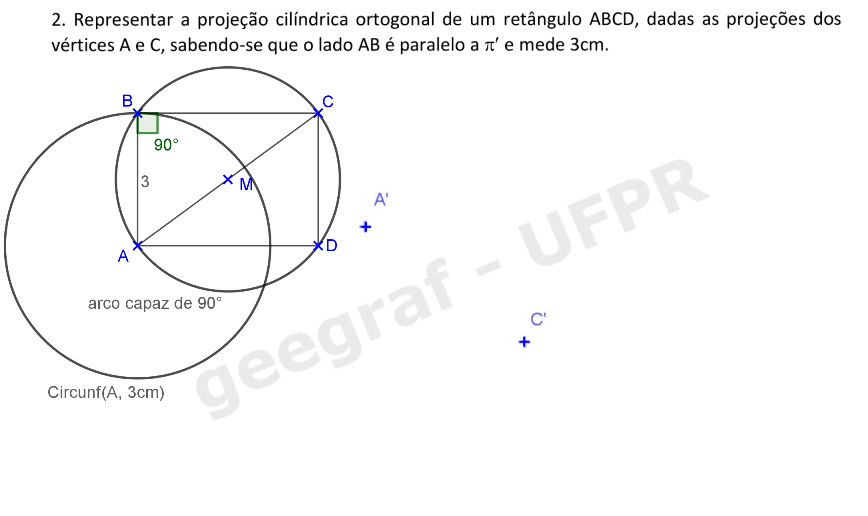
         <figcaption>Como o segmento <b>AB</b> é paralelo a <b>&pi;'</b>, sua projeção <b>A'B'</b> está em verdadeira grandeza (vg). Podemos construir a circunferência com centro em <b>A'</b> e raio 3cm.</figcaption>
       </li>
       <li>
           <input type="radio" id="slide159" name="slide">
           <label for="slide159">3</label>
           
         <figcaption>Vamos começar construindo a mediatriz de <b>A'C'</b> para desenhar o arco capaz de 90o.</figcaption>
       </li>
       <li>
           <input type="radio" id="slide160" name="slide">
           <label for="slide160">4</label>
           
         <figcaption>Com o centro em <b>M'</b>, podemos construir a circunferência de raio <b>M'A' = M'C'</b>.</figcaption>
       </li>
	   <li>
           <input type="radio" id="slide161" name="slide">
           <label for="slide161">5</label>
           
         <figcaption>Agora podemos desenhar a circunferência com centro em <b>A'</b> e raio 3cm. A interseção desta circunferência com o arco capaz de 90o é o vértice <b>B'</b>. Escolha uma das interseções para este vértice <b>B'</b></figcaption>
       </li>
	   <li>
           <input type="radio" id="slide162" name="slide">
           <label for="slide162">6</label>
           
         <figcaption>Como os lados <b>AB</b> e <b>CD</b> são paralelos, podemos desenhar a circunferência com centro em <b>C'</b> e raio 3cm para encontrar o vértice <b>D'</b>.</figcaption>
       </li>
	   <li>
           <input type="radio" id="slide163" name="slide">
           <label for="slide163">7</label>
           
         <figcaption>Pronto, a projeção do retângulo está construída. Veja no link abaixo a representação em 3D deste exercício.</figcaption>
       </li>
    </ul>
	
    <a href="vr/p_ex2_retangulo.html" target="_blank" class="visu">Visualização em 3D</a>
  

   <a href="#propriedades"> voltar ao topo</a>
  
  

&#x1f4cf; &#x1f4d0; Resolução

  
 Vamos utilizar o compasso e os esquadros para resolver este exercício.

  <ul class="slider">
      <li>
           <input type="radio" id="slide164" name="slide" checked>
           <label for="slide164">1</label>
           
        <figcaption>Um paralelepípedo tem todas as faces com paralelogramos. Supondo-se que o vértice <b>F</b> está mais próximo do observador, temos as arestas determinadas por <b>F</b> visíveis</figcaption>
       </li>
       <li>
           <input type="radio" id="slide165" name="slide">
           <label for="slide165">2</label>
           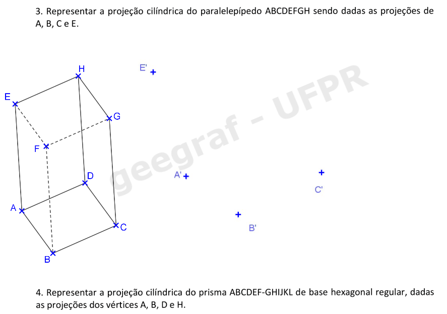
         <figcaption>Outra maneira de construir o paralelepípedo é considerando que o vértice <b>F</b> está mais distante do observador. Neste caso, suas arestas tornam-se invisíveis. Neste exercício você pode escolher uma das visibilidades apresentadas.</figcaption>
       </li>
       <li>
           <input type="radio" id="slide166" name="slide">
           <label for="slide166">3</label>
           
         <figcaption>Vamos começar construindo a reta paralela a <b>B'C'</b> que passa por <b>A'</b> para encontrar o vértice <b>D'</b> da base do paralelepípedo. Podemos usar o esquadro de 45o para alinhar com o segmento.</figcaption>
       </li>
       <li>
           <input type="radio" id="slide167" name="slide">
           <label for="slide167">4</label>
           
         <figcaption>Deslizando o esquadro com o outro esquadro apoiado, podemos desenhar a reta paralela a <b>B'C'</b> pelo vértice <b>A'</b>.</figcaption>
       </li>
	   <li>
           <input type="radio" id="slide168" name="slide">
           <label for="slide168">5</label>
           
         <figcaption>Fazendo a mesma construção, podemos desenhar a reta paralela ao segmento <b>A'B'</b> que passa por <b>C'</b>. O encontro destas paralelas é o vértice <b>D'</b>.</figcaption>
       </li>
	   <li>
           <input type="radio" id="slide169" name="slide">
           <label for="slide169">6</label>
           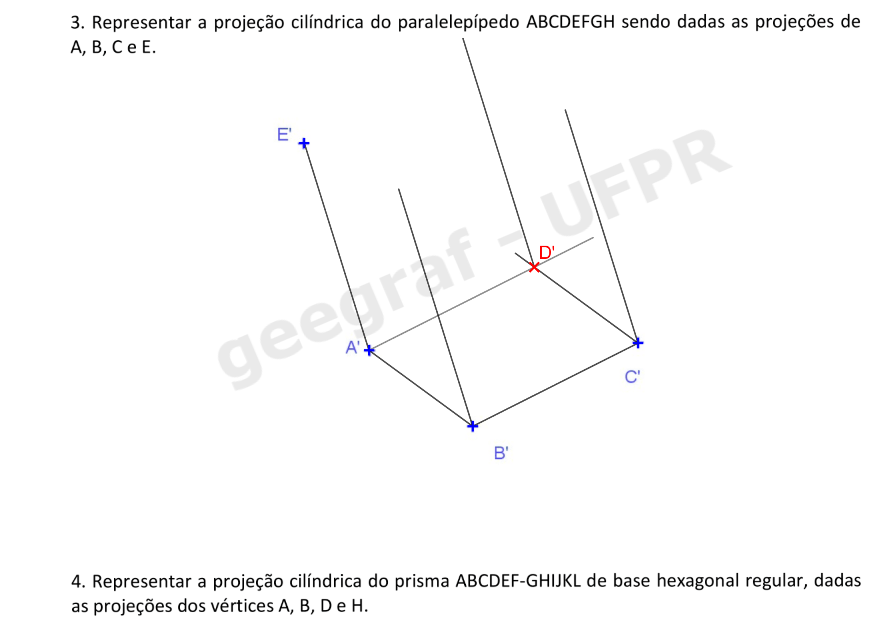
         <figcaption>Agora podemos desenhar as arestas laterais. Basta desenhar as retas paralelas à aresta lateral <b>A'E'</b> que passam pelos vértices <b>B'</b>, <b>C'</b> e <b>D'</b>.</figcaption>
       </li>
	   <li>
           <input type="radio" id="slide170" name="slide">
           <label for="slide170">7</label>
           
         <figcaption>Com o compasso, você pode "pegar" a medida <b>A'E'</b>...</figcaption>
       </li>
	   <li>
           <input type="radio" id="slide171" name="slide">
           <label for="slide171">8</label>
           
         <figcaption>... e marcar com a ponta seca em <b>B'</b> para encontrar o vértice <b>F'</b>.</figcaption>
       </li>
	   <li>
           <input type="radio" id="slide172" name="slide">
           <label for="slide172">9</label>
           
         <figcaption>Fazendo a mesma construção com os vértices <b>C'</b> e <b>D'</b>, você encontra os vértices <b>G'</b> e <b>H'</b>. Esta construção é possível por causa das propriedades 2 e 3 de projeções cilíndricas.</figcaption>
       </li>
	   <li>
           <input type="radio" id="slide173" name="slide">
           <label for="slide173">10</label>
           
         <figcaption>Agora você pode "passar a limpo" o desenho do paralelepípedo. Como ainda não estamos trabalhando com as coordenadas dos vértices, você pode escolher uma das visualizações mostradas nos passos 1 e 2.</figcaption>
       </li>
    </ul>
	
  

  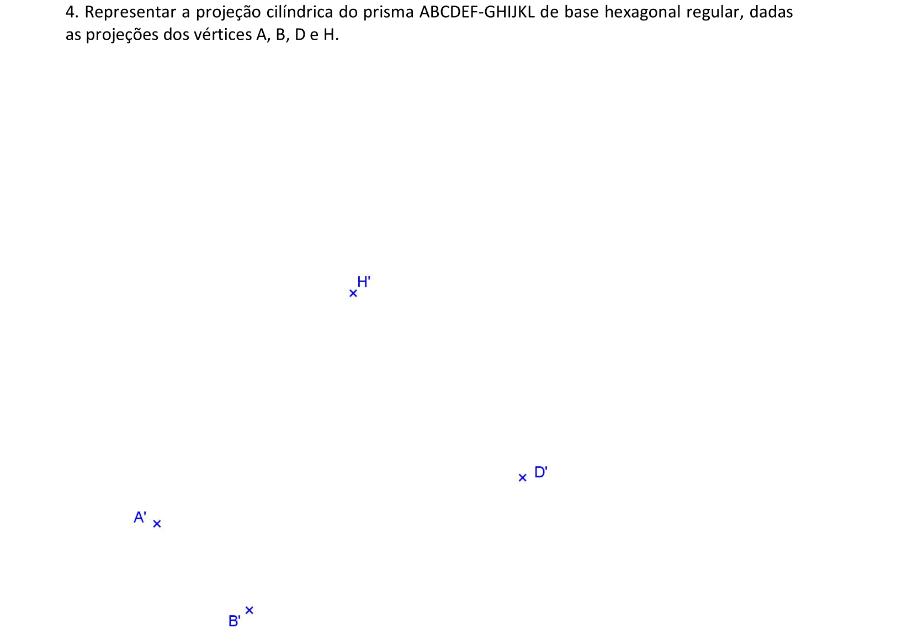
  

&#x1f4cf; &#x1f4d0; Solução

  
 Você pode utilizar o compasso e os esquadros para resolver este exercício. Lembre-se das propriedades de projeções cilíndricas 2 e 3.

	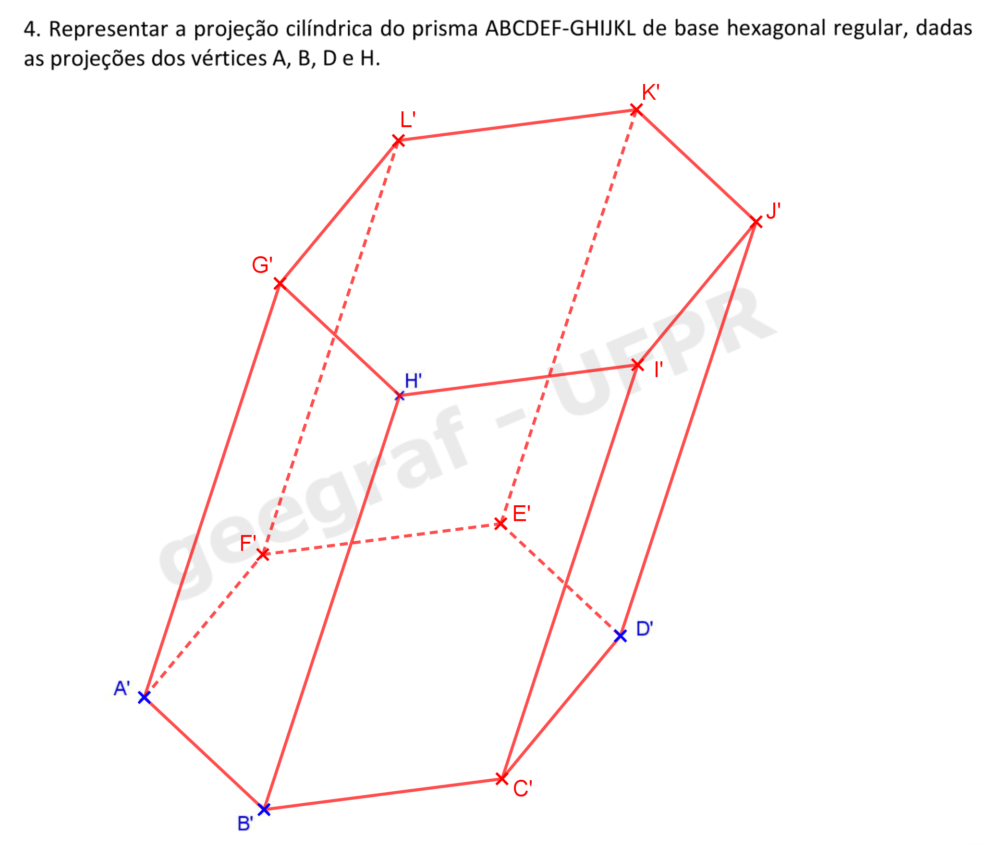
	<figcaption>Tente encontrar o centro da circunferência da base dos vertices <b>A'</b> e <b>B'</b>. Use as propriedades do hexágono regular.</figcaption>
  

   <a href="#propriedades"> voltar ao topo</a>
  
  

  
 Você pode utilizar o compasso e os esquadros para resolver este exercício. Lembre-se de aplicar as propriedades de projeções cilíndricas e cilíndricas ortogonais.

	
	<figcaption>Usando as propriedades de projeções cilíndricas ortogonais, verifique quais dos segmentos são projetados em verdadeira grandeza (vg) em <b>&pi;'</b>: <b>AB</b>, <b>AE</b>, <b>HJ</b> e <b>JG</b>.</figcaption>
  

 <a href="#propriedades"> voltar ao topo</a>

  
Pontos, retas e segmentos em épura

	

Representação de pontos em épura, pág. 26

		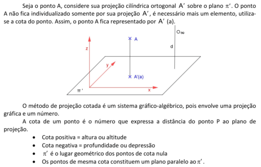
		<figcaption>Para representar um ponto em épura, basta marcar as coordenadas x(abscissa), y(ordenada) e indicar o valor da cota <b>a</b> do ponto. Use o link abaixo para visualizar em 3D.</figcaption>
		<a href="vr/rep_ponto.html" target="_blank" class="visu">Visualização em 3D</a>
	

    

	

Representação de pontos em épura, pág. 27

		
		<figcaption>Visualização em 3D do exercício da página 27.</figcaption>
		<a href="vr/exerc_epura.html" target="_blank" class="visu">Visualização em 3D</a>
	

    

    

Verdadeira grandeza de um segmento, pág. 28

		
		<figcaption>Rebatimento usado para encontrar a verdadeira grandeza (vg) de um segmento AB. Neste caso, o segmento é rebatido usando a projeção <b>A'B'</b> como eixo para rebater o segmento em <b>&pi;'</b>. Neste caso, marcamos as cotas dos pontos a partir de suas projeções.</figcaption>
		<a href="vr/vg_segmento.html" target="_blank" class="visu">Visualização em 3D</a>
	

	

	

Verdadeira grandeza de um segmento, pág. 30

		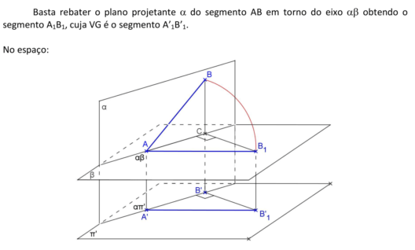
		<figcaption>Rebatimento usado para encontrar a verdadeira grandeza (vg) de um segmento AB. Neste caso, o segmento é rebatido usando o segmento <b>AC</b> como eixo para rebater o segmento em um plano horizontal<b>&beta;</b> que passa por <b>A</b>. Neste caso, marcamos a diferença de cotas entre os pontos <b>A</b> e <b>B</b> a partir da projeção <b>B'</b></figcaption>
		<a href="vr/vg_segmento2.html" target="_blank" class="visu">Visualização em 3D</a>
	

	

	

Paralelismo entre retas quaisquer, pág. 44

		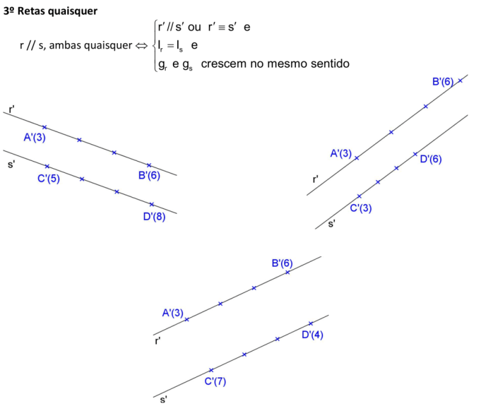
		<figcaption>Duas retas quaisquer <b>r</b> e <b>s</b> são paralelas quando suas projeções <b>r'</b> e <b>s'</b> são paralelas, e as graduações destas retas crescem no mesmo sentido. Use o link abaixo para visualizar esta propriedade em 3D.</figcaption>
		<a href="vr/44_paralelas.html" target="_blank" class="visu">Visualização em 3D do 1o exemplo</a>
		 <a href="vr/44_paralelas2.html" target="_blank" class="visu">Visualização em 3D do 2o exemplo</a>
		 <a href="vr/44_paralelas3.html" target="_blank" class="visu">Visualização em 3D do 3o exemplo</a>
	

	

	

Condições de incidência, pág. 47 (5o caso)

	  
 Vamos verificar se as retas são paralelas ou concorrentes, considerando a reta <b>s</b> qualquer e a reta <b>r</b> vertical. Como pertencem ao mesmo plano projetante, elas são necessariamente concorrentes, basta encontrar o ponto <b>P</b> de concorrência. Usando o método do rebatimento, siga os seguintes passos:

	  <ul class="slider">
		  <li>
			   <input type="radio" id="slide308" name="slide" checked>
			   <label for="slide308">1</label>
			   
			<figcaption>Marcar a cota do ponto <b>A</b></figcaption>
		   </li>
		   <li>
			   <input type="radio" id="slide309" name="slide">
			   <label for="slide309">2</label>
			   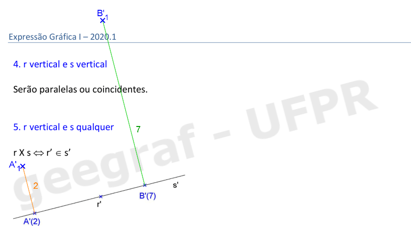
			 <figcaption>Marcar a cota do ponto <b>B</b></figcaption>
		   </li>
		   <li>
			   <input type="radio" id="slide310" name="slide">
			   <label for="slide310">3</label>
			   
			 <figcaption>Representar a reta s rebatida, unindo <b>A'1</b> e <b>B'1</b></figcaption>
		   </li>
		   <li>
			   <input type="radio" id="slide311" name="slide">
			   <label for="slide311">4</label>
			   
			 <figcaption>Rebater a reta <b>r</b>.</figcaption>
		   </li>
		   <li>
			   <input type="radio" id="slide312" name="slide">
			   <label for="slide312">5</label>
			   
			 <figcaption>Verificar que a cota do ponto <b>P</b>, de intersecção entre as retas tem cota <b>5</b>. Use o link abaixo para visualizar este exemplo em 3D.</figcaption>
		   </li>
		</ul>
		
		<a href="vr/47_incidencia5.html" target="_blank" class="visu">Visualização em 3D do 5o caso de incidência</a>
	

	

	

Condições de incidência, pág. 47 (6o caso)

	  
 Vamos verificar se as retas são paralelas ou concorrentes considerando as retas <b>r</b> e <b>s</b> quaisquer. Devemos verificar o ponto de interseção tem a mesma cota nas duas retas, para isso utilizamos o método do rebatimento.

	  <h4>Planos projetantes distintos e não paralelos</h4>
	  <ul class="slider">
		  <li>
			   <input type="radio" id="slide300" name="slide" checked>
			   <label for="slide300">1</label>
			   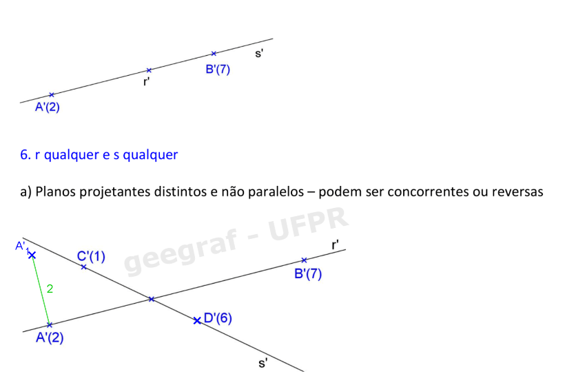
			<figcaption>Marcar a cota do ponto <b>A'(2)</b>.</figcaption>
		   </li>
		   <li>
			   <input type="radio" id="slide301" name="slide">
			   <label for="slide301">2</label>
			   
			 <figcaption>Marcar a cota do ponto <b>B'(7)</b></figcaption>
		   </li>
		   <li>
			   <input type="radio" id="slide302" name="slide">
			   <label for="slide302">3</label>
			   
			 <figcaption>Representar a reta rebatida unindo <b>A'1</b> e <b>B'1</b></figcaption>
		   </li>
		   <li>
			   <input type="radio" id="slide303" name="slide">
			   <label for="slide303">4</label>
			   
			 <figcaption>Verificar qual é a cota do ponto <b>P</b> na reta <b>r</b> rebatida. A cota do ponto <b>P</b> na reta <b>r</b> é <b>4</b>.</figcaption>
		   </li>
		   <li>
			   <input type="radio" id="slide304" name="slide">
			   <label for="slide304">5</label>
			   
			 <figcaption>Rebater a reta <b>s</b>, marcando a cota do ponto <b>C'(1)</b></figcaption>
		   </li>
		   <li>
			   <input type="radio" id="slide305" name="slide">
			   <label for="slide305">6</label>
			   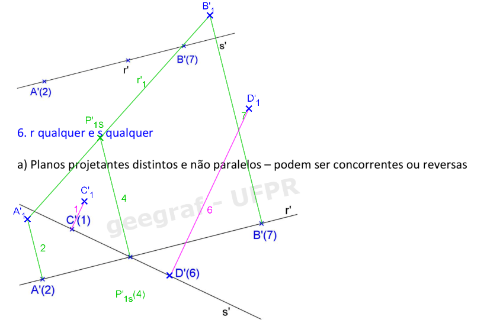
			 <figcaption>Marcar a cota do ponto <b>D'(6)</b></figcaption>
		   </li>
		   <li>
			   <input type="radio" id="slide306" name="slide">
			   <label for="slide306">7</label>
			   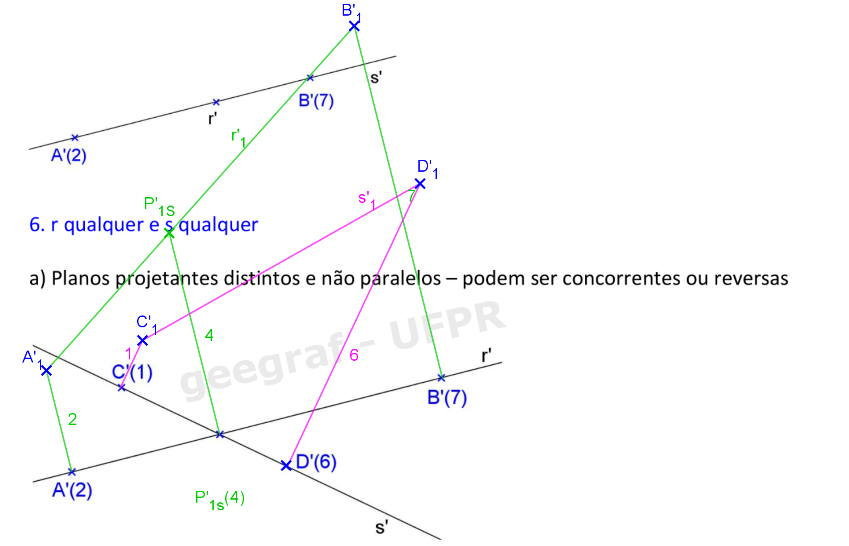
			 <figcaption>Representar a reta <b>s</b> rebatida</figcaption>
		   </li>
		   <li>
			   <input type="radio" id="slide3071" name="slide">
			   <label for="slide3071">8</label>
			   
			 <figcaption>Verificar que a cota do ponto <b>P</b> na reta <b>s</b> também é <b>4</b>. Portanto as retas <b>r</b> e <b>s</b> são concorrentes no ponto <b>P</b> de cota <b>4</b></figcaption>
		   </li>
		   <li>
			   <input type="radio" id="slide307" name="slide">
			   <label for="slide307">9</label>
			   
			 <figcaption>Verificar que a cota do ponto <b>P</b> na reta <b>s</b> também é <b>4</b>. Portanto as retas <b>r</b> e <b>s</b> são concorrentes. Use o link abaixo para visualizar este exemplo em 3D.</figcaption>
		   </li>
		</ul>
		
		<a href="vr/47_incidencia6a.html" target="_blank" class="visu">Visualização em 3D do 6o caso de incidência</a>
		

		<h4>Segundo exemplo:</h4>
		
Agora você pode praticar, resolva o exercício, seguindo o mesmo modelo do exercício anterior. Verificar se as retas são paralelas ou concorrentes.
 
		
		<figcaption>Neste caso as retas são reversas, pois o ponto <b>P</b> possui cotas diferentes nas retas <b>r</b> e <b>s</b>. Use o link abaixo para visualizar este exemplo em 3D.</figcaption>
		<a href="vr/47_incidencia6b.html" target="_blank" class="visu">Visualização em 3D do 6o caso de incidência</a>
		

		<h4>Mesmo plano projetante:</h4>
		
Como as retas são concorrentes, basta verificar se o ângulo entre elas é 90o. Se for, elas são perpendiculares. Faremos isso através do método do rebatimento.

		<ul class="slider">
		  <li>
			   <input type="radio" id="slide313" name="slide" checked>
			   <label for="slide313">1</label>
			   
			<figcaption>Rebater os pontos <b>A</b> e <b>B</b>.</figcaption>
		   </li>
		   <li>
			   <input type="radio" id="slide314" name="slide">
			   <label for="slide314">2</label>
			   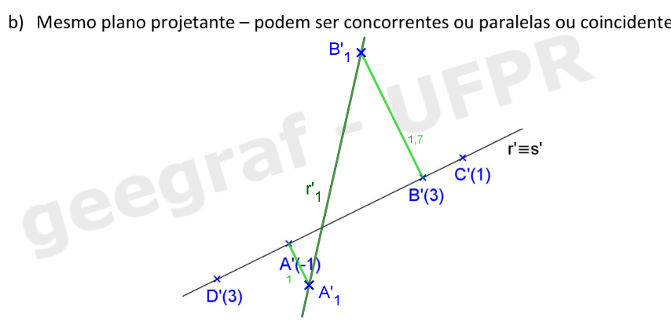
			 <figcaption>Representar a reta rebatida <b>r'1</b> que passa pelos pontos <b>A'1</b> e <b>B'1</b></figcaption>
		   </li>
		   <li>
			   <input type="radio" id="slide315" name="slide">
			   <label for="slide315">3</label>
			   
			 <figcaption>Rebater os pontos <b>C</b> e <b>D</b>.</figcaption>
		   </li>
		   <li>
			   <input type="radio" id="slide316" name="slide">
			   <label for="slide316">4</label>
			   
			 <figcaption> Representar a reta <b>s'1</b> que passa pelos pontos <b>C'1</b> e <b>D'1</b></figcaption>
		   </li>
		   <li>
			   <input type="radio" id="slide317" name="slide">
			   <label for="slide317">5</label>
			   
			 <figcaption>Representar o ponto de concorrência das retas, <b>P</b></figcaption>
		   </li>
		   <li>
			   <input type="radio" id="slide318" name="slide">
			   <label for="slide318">6</label>
			   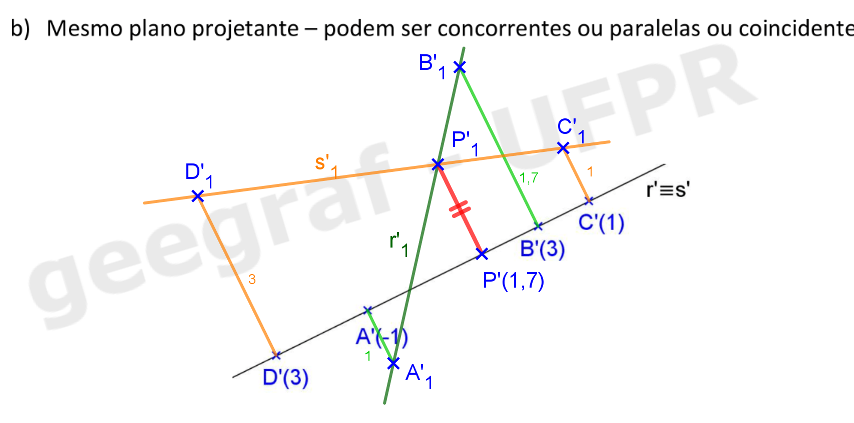
			 <figcaption>Verificar a cota do ponto <b>P(1,7)</b>. Como as retas pertencem ao mesmo plano projetante, são concorrentes no Ponto <b>P</b> de cota 1,7. Use o link abaixo para visualizar este exemplo em 3D.</figcaption>
		   </li>
		</ul>
		
		<a href="vr/47_incidencia6c.html" target="_blank" class="visu">Visualização em 3D do 6o caso de incidência</a>
	

	

	

Retas perpendiculares ou ortogonais, pág. 49 (reta horizontal e reta qualquer)

	  
Devemos verificar se as retas são concorrentes ou ortogonais, para isso basta verificar se o ponto se o ponto onde as retas se cruzam na projeção, possui cota <b>2</b> na reta <b>s</b>.

	  <ul class="slider">
		  <li>
			   <input type="radio" id="slide319" name="slide" checked>
			   <label for="slide319">1</label>
			   
			<figcaption>Rebater o ponto <b>A</b></figcaption>
		   </li>
		   <li>
			   <input type="radio" id="slide320" name="slide">
			   <label for="slide320">2</label>
			   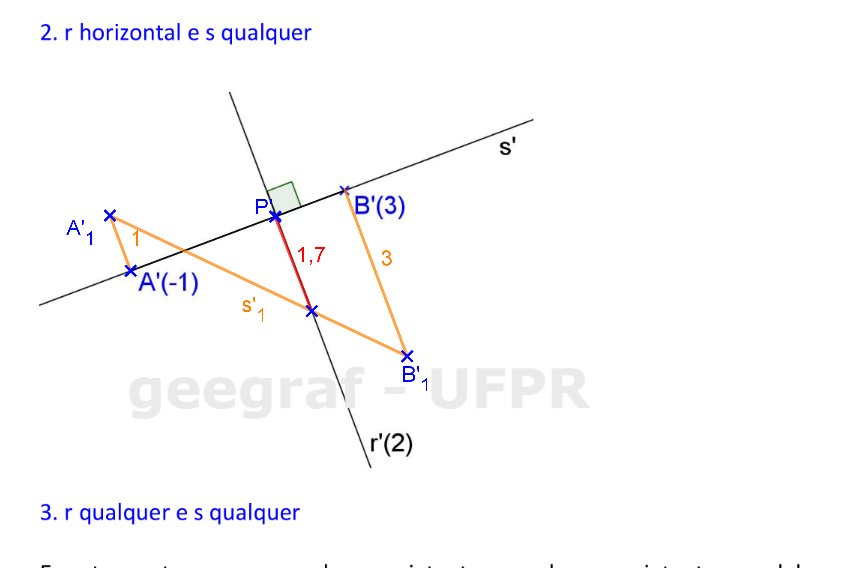
			 <figcaption>Rebater o ponto <b>B</b></figcaption>
		   </li>
		   <li>
			   <input type="radio" id="slide321" name="slide">
			   <label for="slide321">3</label>
			   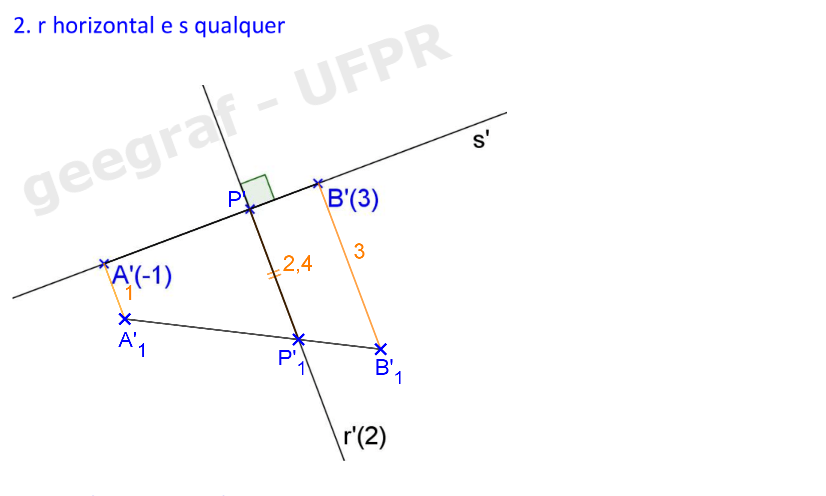
			 <figcaption>Verificar a cota do ponto de intersecção das projeções, medindo o segmento. Verificamos que a cota do ponto <b>P</b> é <b>2,4</b>, portanto as retas são ortogonais.</figcaption>
		   </li>
		</ul>
		
	

	

	

Retas perpendiculares ou ortogonais, pág. 49 (retas quaisquer)

	  
Como as retas são concorrentes, basta verificar se o ângulo entre elas é <b>90o</b>, se for, elas são perpendiculares. Faremos isso através do método do rebatimento.

	  <ul class="slider">
		  <li>
			   <input type="radio" id="slide322" name="slide" checked>
			   <label for="slide322">1</label>
			   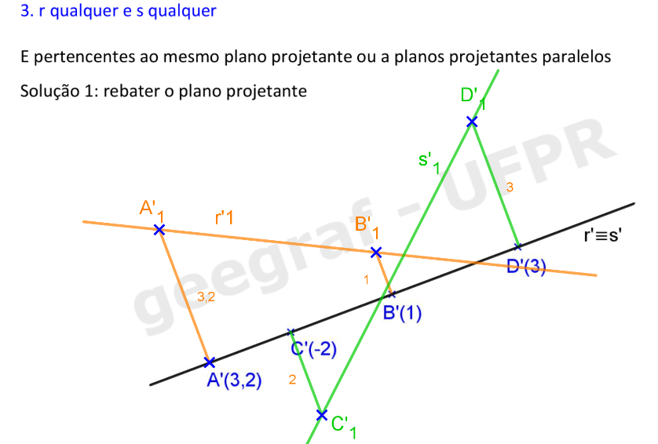
			<figcaption>Rebater os pontos: <b>A</b>, <b>B</b>, <b>C</b> e <b>D</b> e representar as retas <b>r</b> e <b>s</b>, rebatidas</figcaption>
		   </li>
		   <li>
			   <input type="radio" id="slide323" name="slide">
			   <label for="slide323">2</label>
			   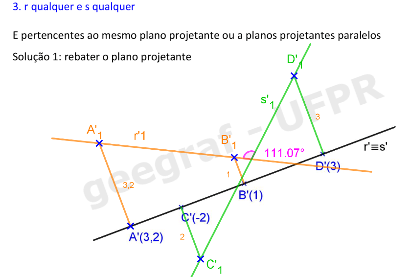
			 <figcaption>Verificar o ângulo entre as retas rebatidas: <b>111o</b></figcaption>
		   </li>
		</ul>
		
	

	

   <a href="#pontos"> voltar ao topo</a>

  
Sólidos em Projeções Cotadas

	

Pirâmide de base hexagonal, pág. 53

		
		<figcaption>Visualização em 3D do Exercício 2.</figcaption>
		<a href="vr/piramide1.html" target="_blank" class="visu">Visualização em 3D</a>
	

	

	

Pirâmide de base quadrada, pág. 56

		
		<figcaption>Visualização em 3D do Exercício 1.</figcaption>
		<a href="vr/piramide2.html" target="_blank" class="visu">Visualização em 3D</a>
	

	

	

Prisma de base hexagonal, pág. 56

		
		<figcaption>Visualização em 3D do Exercício 2.</figcaption>
		<a href="vr/prisma1.html" target="_blank" class="visu">Visualização em 3D</a>
	

	

	 <a href="#solidos"> voltar ao topo</a>

  
Reta de declive e Rebatimento de um plano qualquer

	

Reta de declive, pág. 63

		
		<figcaption>Visualização em 3D da reta de declive de um plano.</figcaption>
		<a href="vr/reta_declive.html" target="_blank" class="visu">Visualização em 3D</a>
	

	

  	

Exercício 1, pág. 63

	   
	  <ul class="slider">
		  <li>
			   <input type="radio" id="slide400" name="slide" checked>
			   <label for="slide400">1</label>
			   
			<figcaption>Representar uma reta do plano, por exemplo a reta <b>a(A,B)</b>. Obs: para garantir que o resultado esteja dentro da folha de trabalho recomenda-se escolher a reta definida pelos ponto de maior e menor cota.</figcaption>
		   </li>
		   <li>
			   <input type="radio" id="slide401" name="slide">
			   <label for="slide401">2</label>
			   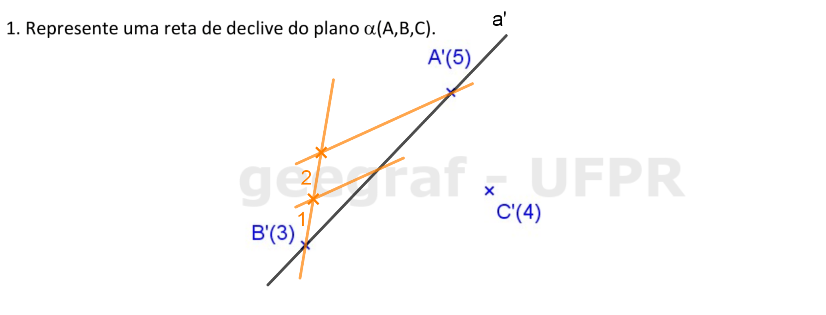
			 <figcaption>Graduar a reta <b>a(A,B)</b> utilizando, por exemplo, o Teorema de Tales.</figcaption>
		   </li>
		   <li>
			   <input type="radio" id="slide402" name="slide">
			   <label for="slide402">3</label>
			   
			 <figcaption>Definir o ponto de cota <b>4</b> da reta <b>a(A,B): D(4)</b>.</figcaption>
		   </li>
		   <li>
			   <input type="radio" id="slide403" name="slide">
			   <label for="slide403">4</label>
			   
			 <figcaption>Encontrar a reta horizontal de cota <b>4</b> do plano <b>&alpha;</b> unindo os pontos <b>C</b> e <b>D</b>.</figcaption>
		   </li>
		   <li>
			   <input type="radio" id="slide404" name="slide">
			   <label for="slide404">5</label>
			   
			 <figcaption>Representar as horizontais de cota <b>3</b> e <b>5</b> do plano <b>&alpha;</b>. Obs: as horizontais de um plano são paralelas entre si.</figcaption>
		   </li>
		   <li>
			   <input type="radio" id="slide405" name="slide">
			   <label for="slide405">6</label>
			   
			 <figcaption>Traçar uma reta perpendicular às horizontais do plano. Esta reta é a reta de maior declive. Obs. Não esqueça de marcar no mínimo 2 pontos desta reta para defini-la.</figcaption>
		   </li>
		</ul>
		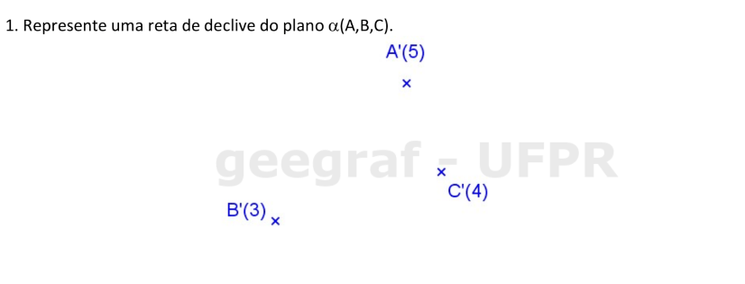
	

	

	

Exercício 2, pág. 63

	  
Num plano existem infinitas retas, se o plano for qualquer estas retas podem ser horizontais ou quaisquer.

	  <ul class="slider">
		  <li>
			   <input type="radio" id="slide406" name="slide" checked>
			   <label for="slide406">1</label>
			   
			<figcaption>Sabemos que as retas horizontais de um plano são perpendiculares as suas retas de maior declive, portanto para encontrar a horizontal de cota 2(<b>h2</b>) basta encontrar uma reta perpendicular à reta <b>d&alpha;</b> pelo ponto <b>A(2)</b>.</figcaption>
		   </li>
		   <li>
			   <input type="radio" id="slide407" name="slide">
			   <label for="slide407">2</label>
			   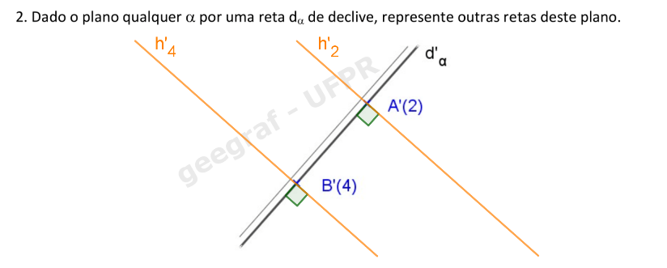
			 <figcaption>Se conduzirmos pelo ponto <b>B(4)</b> uma reta perpendicular à reta <b>d&alpha;</b> teremos a horizontal de cota 4(<b>h4</b>) do plano <b>&alpha;</b>. </figcaption>
		   </li>
		   <li>
			   <input type="radio" id="slide408" name="slide">
			   <label for="slide408">3</label>
			   
			 <figcaption>Podemos definir um ponto <b>C(2)</b> do plano. Ele deve pertencer à reta <b>h2</b>.</figcaption>
		   </li>
		   <li>
			   <input type="radio" id="slide409" name="slide">
			   <label for="slide409">4</label>
			   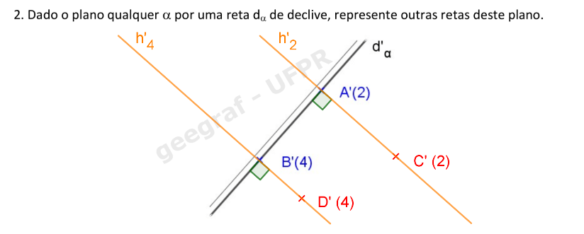
			 <figcaption>Podemos definir um ponto <b>D(4)</b> do plano. Ele deve pertencer à reta <b>h4</b>.</figcaption>
		   </li>
		   <li>
			   <input type="radio" id="slide410" name="slide">
			   <label for="slide410">5</label>
			   
			 <figcaption>Unindo os pontos <b>C(2)</b> e <b>D(4)</b> temos uma reta qualquer no plano, <b>r(C,D)</b>.</figcaption>
		   </li>
		</ul>
		
	

	

	

Exercício 1, pág. 64

	  
O ângulo que um plano forma com o plano de projeção é igual à inclinação de uma de suas retas de maior declive.

	  <ul class="slider">
		  <li>
			   <input type="radio" id="slide411" name="slide" checked>
			   <label for="slide411">1</label>
			   
			<figcaption>Encontrar a projeção auxiliar do ponto <b>A</b>.</figcaption>
		   </li>
		   <li>
			   <input type="radio" id="slide412" name="slide">
			   <label for="slide412">2</label>
			   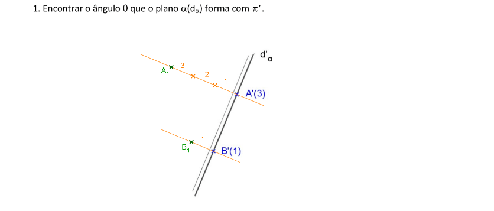
			 <figcaption>Encontrar a projeção auxiliar do ponto <b>B</b>. </figcaption>
		   </li>
		   <li>
			   <input type="radio" id="slide413" name="slide">
			   <label for="slide413">3</label>
			   
			 <figcaption>Unindo <b>A1</b> e <b>B1</b> temos a reta <b>d'&alpha;1</b> que corresponde a projeção auxiliar da reta <b>d&alpha;</b></figcaption>
		   </li>
		   <li>
			   <input type="radio" id="slide414" name="slide">
			   <label for="slide414">4</label>
			   
			 <figcaption>O ângulo formado pela projeção da reta de maior declive <b>d'&alpha;</b> com sua projeção auxiliar <b>d'&alpha;1</b> é o ângulo que o plano <b>&alpha;</b> forma com o plano de projeção <b>&pi;'</b>.</figcaption>
		   </li>
		</ul>
		
	

	

	

Exercício 2, pág. 64

	  
Representar uma reta do plano, por exemplo a reta definida pelos pontos <b>B</b> e <b>C</b>.

	  <ul class="slider">
		  <li>
			   <input type="radio" id="slide415" name="slide" checked>
			   <label for="slide415">1</label>
			   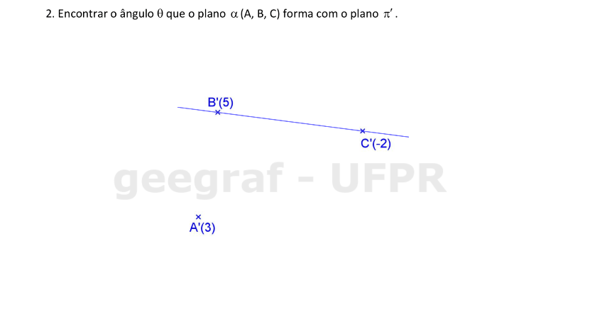
			<figcaption>Para garantir que o resultado esteja dentro da folha de trabalho recomenda-se escolher a reta definida pelos pontos de maior e menor cota.</figcaption>
		   </li>
		   <li>
			   <input type="radio" id="slide416" name="slide">
			   <label for="slide416">2</label>
			   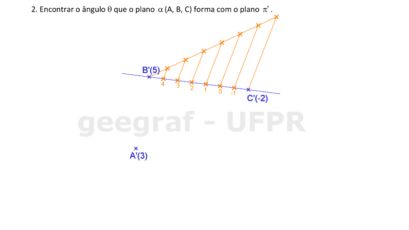
			 <figcaption>Graduar a reta definida pelos pontos <b>B</b> e <b>C</b> utilizando, por exemplo, o Teorema de Tales.</figcaption>
		   </li>
		   <li>
			   <input type="radio" id="slide417" name="slide">
			   <label for="slide417">3</label>
			   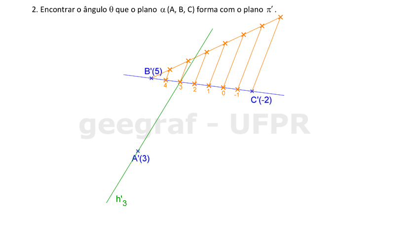
			 <figcaption>Unindo o ponto de cota 3 desta reta com o ponto <b>A</b>, também de cota 3, temos a horizontal de cota 3 do plano <b>&alpha;</b>.</figcaption>
		   </li>
		   <li>
			   <input type="radio" id="slide418" name="slide">
			   <label for="slide418">4</label>
			   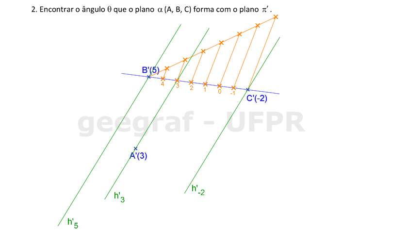
			 <figcaption>Representar as horizontais de cota 5 e -2 do plano <b>&alpha;</b>. Obs. As horizontais de um plano são paralelas entre si.</figcaption>
		   </li>
		   <li>
			   <input type="radio" id="slide419" name="slide">
			   <label for="slide419">5</label>
			   
			 <figcaption>Traçar uma reta de maior declive do plano <b>(d'&alpha;)</b> e identificar no mínimo dois pontos desta reta. Os pontos <b>D</b>, <b>E</b> e <b>F</b> são pontos desta reta. Obs: As retas de maior declive de um plano são perpendiculares às horizontais do plano.</figcaption>
		   </li>
		   <li>
			   <input type="radio" id="slide420" name="slide">
			   <label for="slide420">6</label>
			   
			 <figcaption>Encontrar a projeção auxiliar da reta de maior declive.</figcaption>
		   </li>
		   <li>
			   <input type="radio" id="slide421" name="slide">
			   <label for="slide421">7</label>
			   
			 <figcaption>O ângulo  que o plano <b>&alpha;(A, B, C)</b> forma com o plano <b>&pi;'</b> é o ângulo formado pela projeção da reta de maior declive com sua projeção auxiliar.</figcaption>
		   </li>
		</ul>
		
	

	

	

Rebatimento de um plano qualquer, pág. 66

		
		<figcaption>Visualização em 3D do rebatimento de um plano qualquer <b>&alpha;</b> sobre <b>&pi;</b>.</figcaption>
		<a href="vr/rebatimento.html" target="_blank" class="visu">Visualização em 3D</a>
	

	

	 <a href="#rebatimento"> voltar ao topo</a>

  
Interseções de planos

<h3>Exemplo da pág. 74</h3>
  
  <figcaption>Visualização em RA e RV da interseção de um plano horizontal e um plano vertical.</figcaption>
  
<h3>Exemplo da pág. 74</h3>

  <figcaption>Visualização em RA e RV da interseção entre um plano qualquer e um plano horizontal.</figcaption>
  
<h3>Exemplo da pág. 75</h3>

  <figcaption>Visualização em RA e RV da interseção de um plano qualquer e um plano vertical.</figcaption>
  
<h3>Exemplo da pág. 75</h3>

  <figcaption>Visualização em RA e RV da interseção entre dois planos quaisquer.</figcaption>
  
 <a href="#intersecoes"> voltar ao topo</a>

  
Representações de telhados

 Para ver os telhados em Realidade Aumentada, visite o site:
 
<a href="https://paulohscwb.github.io/cotadas/telhados.html"> https://paulohscwb.github.io/cotadas/telhados.html</a>

<h3>Terminologia, pág. 79</h3>

  <figcaption>Visualização em RA e RV de um telhado com a terminologia utilizada.</figcaption>
  

<h3>Exercício 3.3, pág. 83</h3>

  <figcaption>Visualização em RA e RV do exercício 3.3: telhado com inclinações iguais.</figcaption>
  

<h3>Exercício 3.4, pág. 84</h3>

  <figcaption>Visualização em RA e RV do exercício 3.4: telhado com inclinações iguais.</figcaption>
  

<h3>Exercício 3.5, pág. 85</h3>

  <figcaption>Visualização em RA e RV do exercício 3.5: telhado com inclinações iguais.</figcaption> 
  

<h3>Exercício 3.6, pág. 86</h3>

  <figcaption>Visualização em RA e RV do exercício 3.6: telhado com inclinações iguais.</figcaption>
  

<h3>Exercício 3.7, pág. 87</h3>

  <figcaption>Visualização em RA e RV do exercício 3.7: telhado com inclinações iguais.</figcaption>
  

<h3>Exercício 3.8, pág. 88</h3>

  <figcaption>Visualização em RA e RV do exercício 3.8: telhado com inclinações iguais.</figcaption>
  

<h3>Exercício 3.9, pág. 89</h3>

  <figcaption>Visualização em RA e RV do exercício 3.9: telhado com inclinações iguais.</figcaption>
  

<h3>Exercício 4.3, pág. 92</h3>

  <figcaption>Visualização em RA e RV do exercício 4.3: telhado com inclinações diferentes.</figcaption>
  

<h3>Exercício 4.4, pág. 93</h3>

  <figcaption>Visualização em RA e RV do exercício 4.4: telhado com inclinações diferentes.</figcaption>
  

<h3>Exercício 4.5, pág. 94</h3>

  <figcaption>Visualização em RA e RV do exercício 4.5: telhado com inclinações diferentes.</figcaption>
  

<h3>Exercício 4.6, pág. 95</h3>

  <figcaption>Visualização em RA e RV do exercício 4.6: telhado com inclinações e níveis diferentes.</figcaption>
  
 <a href="#telhados"> voltar ao topo</a>

  
Superfícies Topográficas

 Para ver as superfícies topográficas em Realidade Aumentada, visite o site:
 
<a href="https://paulohscwb.github.io/cotadas/superficies.html"> https://paulohscwb.github.io/cotadas/superficies.html</a>

<h3>Curvas de nível, pág. 97</h3>

  <figcaption>Visualização em RA e RV da superfície topográfica com suas respectivas curvas de nível.</figcaption>
  

<h3>Exercício 1, pág. 99</h3>
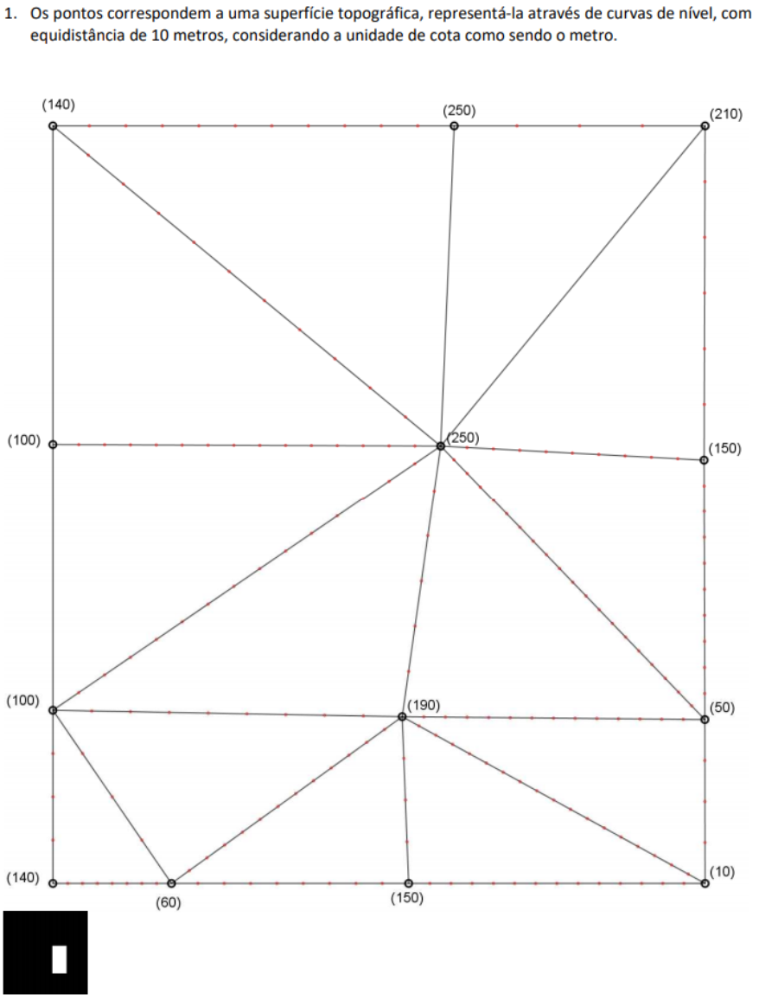
  <figcaption>Visualização em RA e RV do exercício 1 com suas curvas de nível.</figcaption>
  

<h3>Exercício 2, pág. 103</h3>

  <figcaption>Visualização em RA e RV do exercício 2: perfil topográfico de um terreno.</figcaption>
  

<h3>Exercício 3, pág. 104</h3>

  <figcaption>Visualização em RA e RV do exercício 3: perfil topográfico de um terreno.</figcaption>
  

<h3>Exercício da pág. 106</h3>

  <figcaption>Visualização em RA e RV do exercício da página 106: seção plana de um terreno.</figcaption>
  

<h3>Exercício da pág. 111</h3>
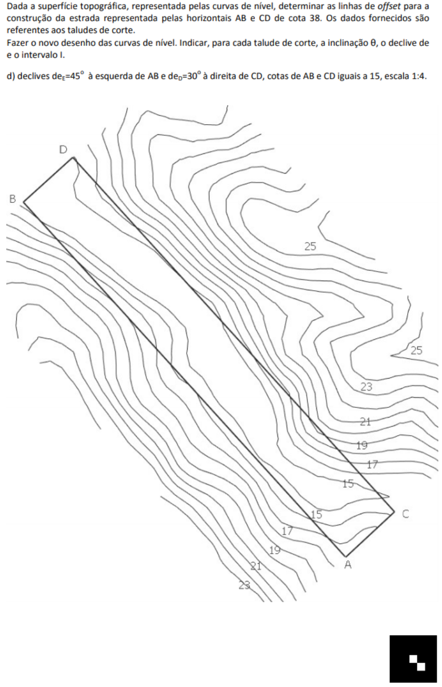
  <figcaption>Visualização em RA e RV do exercício da página 111: cortes de um terreno para construção de uma estrada.</figcaption>
  

<h3>Exercício 2, pág. 114</h3>

 
  <figcaption>Visualização em RA e RV do exercício 2: seção mista de um terreno (corte e aterro).</figcaption>
  <a href="#superficies"> voltar ao topo</a>

 <b>desenvolvido por:</b> Paulo Henrique Siqueira - Universidade Federal do Paraná 
 <b>contato:</b> paulohscwb@gmail.com 
  Este site contém algumas partes da <a href="http://www.exatas.ufpr.br/portal/degraf_paulo/wp-content/uploads/sites/4/2014/09/Cotadas_2020.pdf" target="_blank">apostila de Projeções Cotadas</a> usada em sala de aula para visualizar os objetos com Realidade Virtual (RV) e Realidade Aumentada (RA). As propriedades de projeções, os sólidos e as maquetes podem ser vistos em RA com os marcadores indicados, e através dos links criados nos marcadores, os objetos podem ser vistos em RV. 
 Para ver os objetos em Realidade Aumentada, visite o site:
 
<a href="https://paulohscwb.github.io/cotadas/ra.html"> https://paulohscwb.github.io/cotadas/ra.html</a>

 em qualquer navegador com um dispositivo de webcam (smartphone, tablet ou notebook).
 O acesso aos sites de Realidade Virtual é feito clicando no círculo azul que aparece em cima dos marcadores.
  

  <b>Referências</b>
 O ambiente Realidade Aumentada foi criado com os scripts de <b>Jerome Etienne</b>: <a href="https://github.com/jeromeetienne/AR.js"> AR.js - Augmented Reality for the Web</a>.
 Os scripts de órbita desenvolvidos por <b>Kevin Ngo</b> foram usados nas páginas de RV: <a href="https://github.com/supermedium/superframe/tree/master/components/orbit-controls/"> Orbit controls for A-Frame</a>.
 As faces de poliedros foram criadas com a função desenvolvida por <b>Andreas Plesch</b>: <a href="https://github.com/andreasplesch/aframe-faceset-component"> Geometry from vertices and faces</a>.
