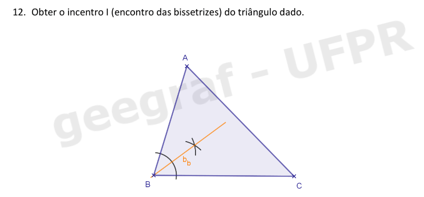
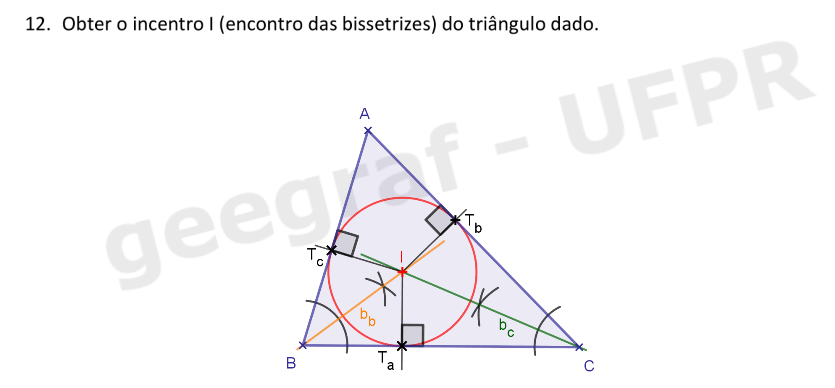
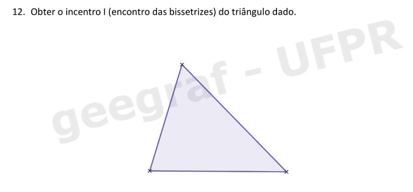
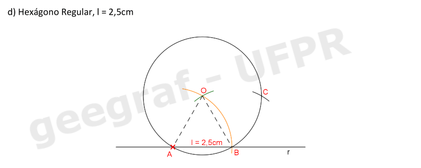

<link rel="stylesheet" href="../../scripts/style.css">

<h2 id="inicio">Respostas do Módulo 2. Sistemas de projeções / Representação de pontos e segmentos</h2> 
  

Atividade 1: exercício 12 da pág. 5

  
  

&#x1f4cf; &#x1f4d0; Resolução

  
Para obter o Incentro <b>I</b> do triângulo precisamos construir as bissetrizes internas do mesmo. Veja como resolver o exercício.

  <ul class="slider">
      <li>
           <input type="radio" id="045" name="sl">
           <label for="045"></label>
           
           <figcaption>Vamos nomear os vértices do triângulo como <b>A</b>, <b>B</b> e <b>C</b>. Construa a bissetriz <b>bb</b> do ângulo interno <b>B</b>.</figcaption>
       </li>
       <li>
           <input type="radio" id="046" name="sl">
           <label for="046"></label>
           
           <figcaption>Construa a bissetriz <b>bc</b> do ângulo interno <b>bbC</b>.</figcaption>
       </li>
	   <li>
           <input type="radio" id="047" name="sl">
           <label for="047"></label>
           
           <figcaption>A interseção duas bissetrizes nos dá o Incentro <b>I</b> do triângulo <b>ABC</b>. Esse ponto <b>I</b> é equidistante dos três lados do triângulo e, portanto, ele é o centro de circunferência inscrita ao triângulo. Vamos obter essa circunferência!</figcaption>
       </li>
       <li>
           <input type="radio" id="048" name="sl">
           <label for="048"></label>
           
           <figcaption>Construa por <b>I</b> retas perpendiculares aos lados do triângulo, obtendo os pontos <b>Ta</b>, <b>Tb</b> e <b>Tc</b>. </figcaption>
       </li>
       <li>
           <input type="radio" id="049" name="sl">
           <label for="049"></label>
           
           <figcaption>Construa a circunferência de centro no Incentro <b>I</b> e raio de <b>I</b> até <b>Ta</b>. Essa circunferência é tangente aos lados do triângulo <b>ABC</b>. </figcaption>
       </li>
    </ul>
    
  

  

Atividade 2: exercício 15 d) da pág. 9

  
  

&#x1f4cf; &#x1f4d0; Resolução

  
Vamos construir o hexágono regular de lado <b>l</b> dado! Lembra da construção do hexágono regular inscrito numa circunferência? Retorne à página 7 e reveja a construção! Nesse exercício usamos o raio da circunferência para marcar o lado do polígono! Vamos utilizar esse conceito agora!

  <ul class="slider">
      <li>
           <input type="radio" id="0007" name="sl">
           <label for="0007"></label>
           
           <figcaption>Construa uma reta suporte <b>r</b>. Construa um triângulo equilátero <b>ABO</b>, de lado <b>l=2,5cm</b>, com o lado <b>AB</b> sobre a reta <b>r</b>.</figcaption>
       </li>
       <li>
           <input type="radio" id="0008" name="sl">
           <label for="0008"></label>
           
           <figcaption>Desenhe a circunferência de centro <b>O</b> e raio <b>l=2,5cm</b>. Essa circunferência é circunscrita ao hexágono regular que queremos construir. </figcaption>
       </li>
	   <li>
           <input type="radio" id="0009" name="sl">
           <label for="0009"></label>
           
           <figcaption>Com a medida <b>l=2,5cm</b> no compasso, construa o arco de circunferência de centro <b>B</b> obtendo o ponto <b>C</b> sobre a circunferência.</figcaption>
       </li>
	   <li>
           <input type="radio" id="0010" name="sl">
           <label for="0010"></label>
           
           <figcaption>Com o mesmo raio <b>l=2,5cm</b>, construa o arco de circunferência de centro <b>C</b> obtendo o ponto <b>D</b> sobre a circunferência.</figcaption>
       </li>
	   <li>
           <input type="radio" id="0011" name="sl">
           <label for="0011"></label>
           
           <figcaption>Repita o processo, obtendo os pontos <b>E</b> e <b>F</b>.</figcaption>
       </li>
	   <li>
           <input type="radio" id="0012" name="sl">
           <label for="0012"></label>
           
           <figcaption>Pronto! O polígono <b>ABCDEF</b> é o hexágono regular de lado <b>l=2,5cm</b>. Note que os triângulos <b>OAB</b>, <b>OBC</b>, <b>OCD</b>, <b>ODE</b>, <b>OEF</b> e <b>OFA</b> são todos equiláteros e, portanto, a soma dos ângulos centrais <b>AOB</b>, <b>BOC</b>, <b>COD</b>, <b>DOE</b>, <b>EOF</b> e <b>FOA</b> é <b>360°</b>.</figcaption>
       </li>
    </ul>
    
  

  

Atividade 3: exercício 18 da pág. 10

  
  

&#x1f4cf; &#x1f4d0; Resolução

  
Lembre-se que para que uma reta seja tangente à uma circunferência devemos ter que o ângulo formado entre o raio e a reta no ponto de tangência mede <b>90°</b>! Vamos à construção.

  <ul class="slider">
      <li>
           <input type="radio" id="0022" name="sl">
           <label for="0022"></label>
           
           <figcaption>Construa a reta <b>OT</b>.</figcaption>
       </li>
       <li>
           <input type="radio" id="0024" name="sl">
           <label for="0024"></label>
           
           <figcaption>Usando os esquadros ou o compasso construa a reta <b>t</b> passando pelo ponto <b>T</b> e perpendicular à reta <b>s</b>. Pronto! A reta <b>t</b> é tangente à circunferência dada pois o ângulo formado entre ela e o raio no ponto <b>T</b> é <b>90°</b>.</figcaption>
       </li>
    </ul>
    
  

