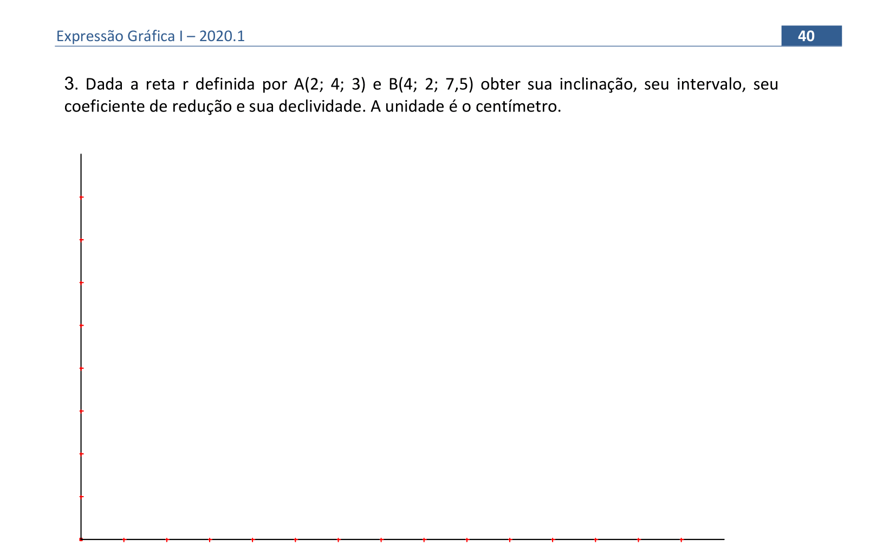

<link rel="stylesheet" href="../../scripts/style.css">

<h2 id="inicio">Respostas do Módulo 3. Representação de retas</h2> 
  

Atividade 1: exercício 3 da pág. 40

  
  

&#x1f4cf; &#x1f4d0; Resolução

	<ul class="slider">
		   <li>
			   <input type="radio" id="565" name="sl">
			   <label for="565"></label>
			   
			<figcaption>Iniciamos marcando a projeção dos pontos <b>A</b> e <b>B</b>.</figcaption>
		   </li>
		   <li>
			   <input type="radio" id="566" name="sl">
			   <label for="566"></label>
			   
			<figcaption>Traçamos duas perpendiculares por <b>A</b> e <b>B</b>, marcando 3 unidades a partir de <b>A</b> e 7,5 unidades a partir de <b>B</b>. Com isso temos os pontos <b>A’1</b> e <b>B’1</b>.</figcaption>
		   </li>
		   <li>
			   <input type="radio" id="567" name="sl">
			   <label for="567"></label>
			   
			 <figcaption>Traçando-se uma perpendicular por <b>A’1</b>, encontramos a inclinação da reta (ângulo <b>&theta;</b>).</figcaption>
		   </li>
		   <li>
			   <input type="radio" id="568" name="sl">
			   <label for="568"></label>
			   
			 <figcaption>A partir de <b>B’1</b>, marcamos uma unidade, indicando <b>dV=1</b>, com isso construímos o triângulo conforme a figura e encontramos o intervalo <b>Ir</b>, conforme o indicado.</figcaption>
		   </li>
		   <li>
			   <input type="radio" id="569" name="sl">
			   <label for="569"></label>
			   
			 <figcaption>De acordo com a teoria, temos a declividade, a inclinação e o coeficiente de redução.</figcaption>
		   </li>
		</ul>
		
	

	
    

Atividade 2: exercício 2d da pág. 43

	
	

&#x1f4cf; &#x1f4d0; Solução

		
Como os pontos possuem cotas inteiras, pode-se encontrar o ponto médio de <b>GH</b>, e, com isso obter o ponto <b>I</b> de cota 3. O ponto médio de <b>I</b> e <b>H</b>, resulta no ponto <b>J</b> de cota 2,5. A distância <b>HJ</b> é usada para encontrar o ponto <b>P</b> de cota 1,5.

		
	

	
    

Atividade 3: exercício 1b da pág. 50

	
	

&#x1f4cf; &#x1f4d0; Solução

		
A resolução da letra b é similar à letra a. Lembre-se que entre as projeções dos pontos <b>A</b> e <b>B</b>, temos 2 intervalos, dessa forma, devemos marcar 2 unidades de cota no ponto <b>B</b> e obteremos 2 intervalos da reta <b>s</b> e como as cotas de retas perpendiculares crescem no sentido oposto, a cota do ponto <b>Q</b> obtido é a cota do ponto <b>P</b> menos duas unidades.

		
	

	
    

Atividade 4: exercício 2c) da pág. 51

	
	

&#x1f4cf; &#x1f4d0; Solução

		
Como os planos projetantes das retas são paralelos, então suas projeções são paralelas, ou seja, <b>r'</b> é paralela a <b>s'</b>. Observe que a diferença de cotas entre os pontos <b>A</b> e <b>B</b>, é de 4 unidades de cota, assim, ao rebater o ponto <b>B</b>, marcamos 4 unidades de cota (3cm) e o segmento entre <b>A'</b> e <b>B'</b> representa 4 intervalos da reta <b>r</b>, que chamamos de <b>4Ir</b>, obtendo o ponto <b>B'1</b>.

		
		<figcaption>Ao traçar a perpendicular à reta rebatida, <b>r'1</b>, pelo ponto <b>B'1</b>, obtemos 4 intervalos da reta <b>s</b>, que chamamos de <b>4Is</b>. Quando transportamos esse intervalo para a reta <b>s</b>, devemos lembrar que em retas ortogonais, as cotas crescem em sentidos opostos.</figcaption>
	

