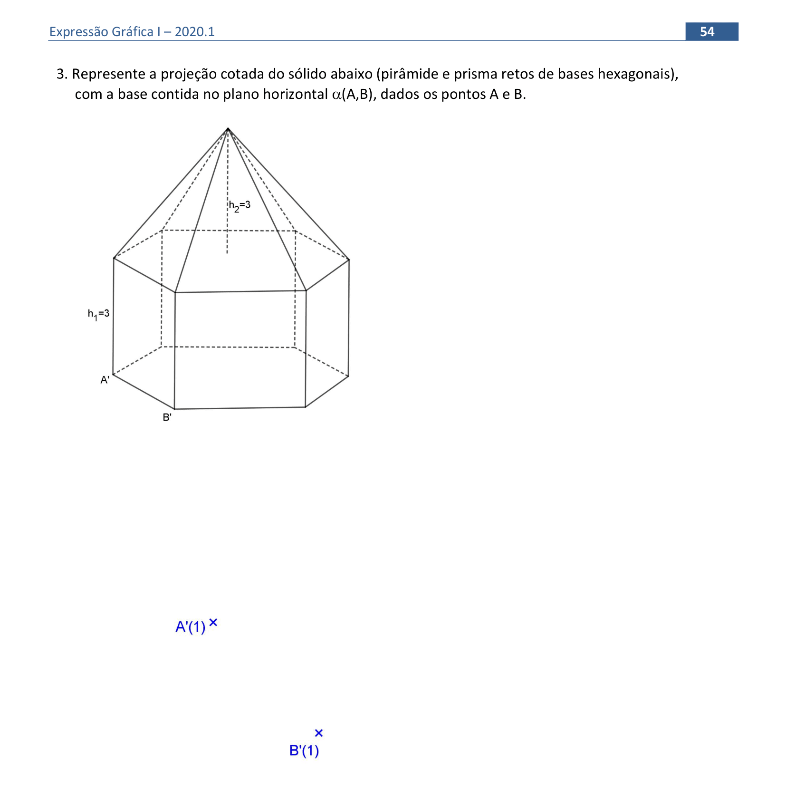
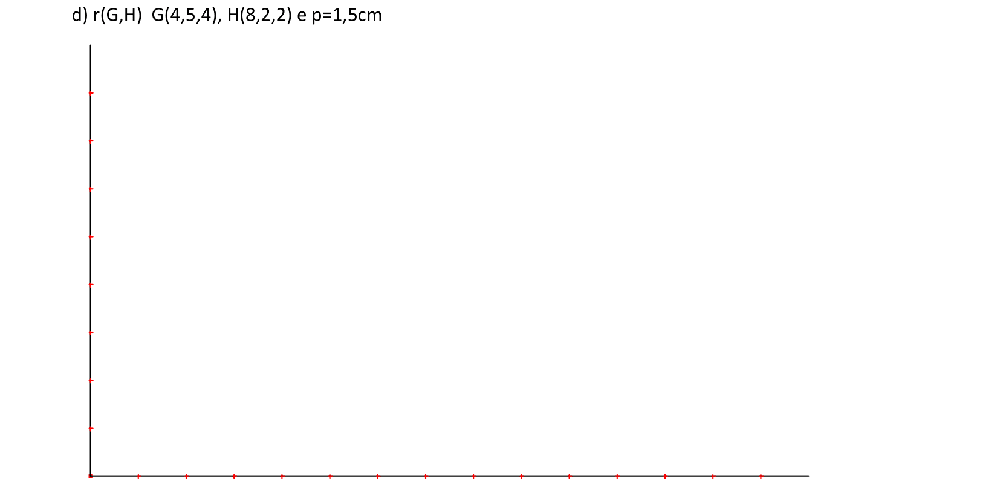
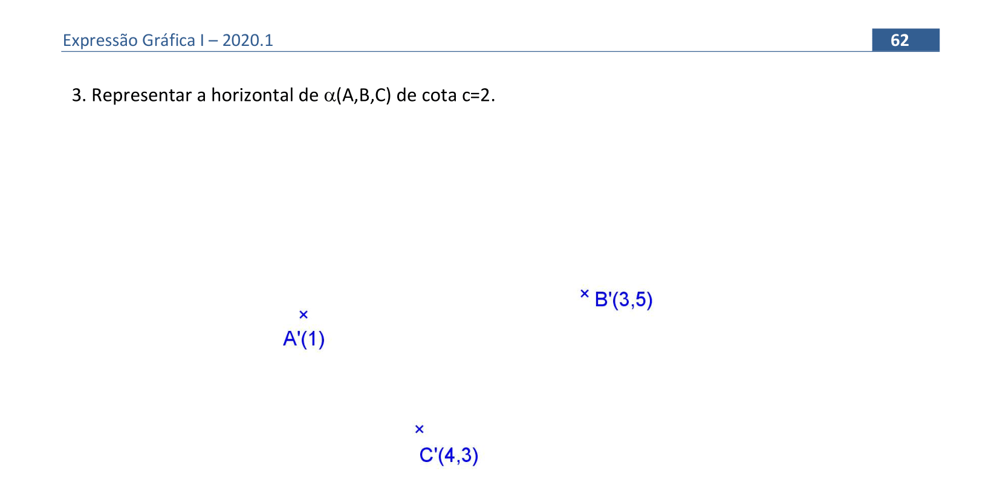
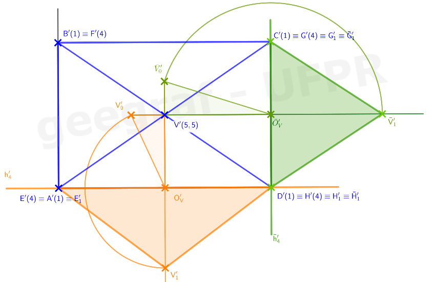

<link rel="stylesheet" href="../../scripts/style.css">

<h2 id="inicio">Respostas do Módulo 4. Representação de planos</h2> 
  

Atividade 1: exercício 3 da pág. 54

  
  

&#x1f4cf; &#x1f4d0; Resolução

		
A pirâmide possui base hexagonal e como está contida no plano horizontal, todos os pontos possuem a mesma cota e o hexágono está em Verdadeira Grandeza (VG).

		<ul class="slider">
		  <li>
			   <input type="radio" id="340" name="sl">
			   <label for="340"></label>
			   
			<figcaption>Desenhar o hexágono em VG, obtendo os pontos <b>C'</b>, <b>D'</b>, <b>E'</b> e <b>F'</b>. Observe que é possível representar dois hexágonos, uma para a direita do segmento <b>A'B'</b> e outro para a esquerda. Vamos escolher a posição para direita, pois tem mais espaço para desenhar. As cotas dos pontos <b>C</b>, <b>D</b>, <b>E</b> e <b>F</b> são iguais à cota do plano, ou seja, <b>1</b>.</figcaption>
		   </li>
		   <li>
			   <input type="radio" id="341" name="sl">
			   <label for="341"></label>
			   
			 <figcaption>Representar a altura do prisma, observe que a face superior coincide com a inferior, a projeção da segunda face que também é um hexágono regular coincide com a primeira, as arestas: <b>AG</b>, <b>BH</b>, <b>CI</b>, <b>DJ</b>, <b>EK</b> e <b>FL</b> são retas verticais e, portanto sua projeção é um ponto. Os pontos <b>GHIJKL</b> pertencem ao plano horizontal de cota <b>4</b>, portanto sua cota é <b>4</b>.</figcaption>
		   </li>
		   <li>
			   <input type="radio" id="342" name="sl">
			   <label for="342"></label>
			   
			 <figcaption>Agora representamos a pirâmide apoiada sobre a face <b>GHIJKL</b>, para isso, basta unir esses vértices com o centro do hexágono, obtendo o vértice <b>V</b> de cota <b>7</b>.</figcaption>
		   </li>
		</ul>
		
	

	
  

Atividade 2: plano vertical

  
  

&#x1f4cf; &#x1f4d0; Solução

		
Como os pontos possuem cotas inteiras, pode-se encontrar o ponto médio de <b>GH</b>, e, com isso obter o ponto <b>I</b> de cota 3. O ponto médio de <b>I</b> e <b>H</b>, resulta no ponto <b>J</b> de cota 2,5. A distância <b>HJ</b> é usada para encontrar o ponto <b>P</b> de cota 1,5.

		
	

	
	

Atividade 3: exercício 2d da pág. 43

  
  

&#x1f4cf; &#x1f4d0; Solução

		
Basta encontrar dois pontos do plano que possuam cota 2, graduar duas das retas do plano para encontrar esses pontos.
 
		
		<figcaption></figcaption>
	

	
		
  

Atividade 3: exercício 5 da pág. 72

  
  

&#x1f4cf; &#x1f4d0; Solução

		
		<figcaption></figcaption>
	

