<link rel="stylesheet" href="../../scripts/style.css">

<h2 id="inicio">Respostas do Módulo 5. Interseções / Representações de telhados</h2> 
  

Atividade 5.1: Exercício c) da pág. 77

  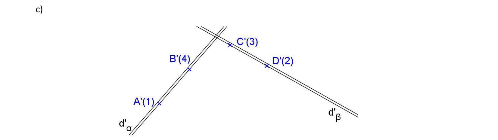
  

&#x1f4cf; &#x1f4d0; Solução

		

		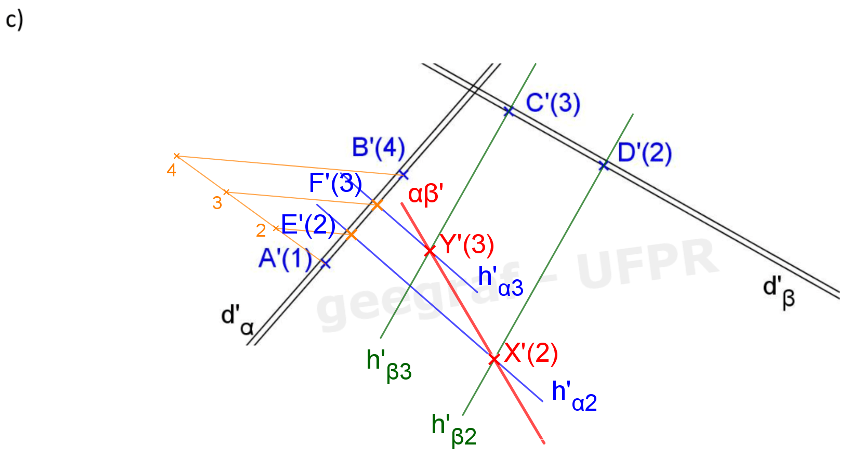
		<figcaption></figcaption>
	

  

Atividade 5.2: exercício 3.8 da pág. 88

  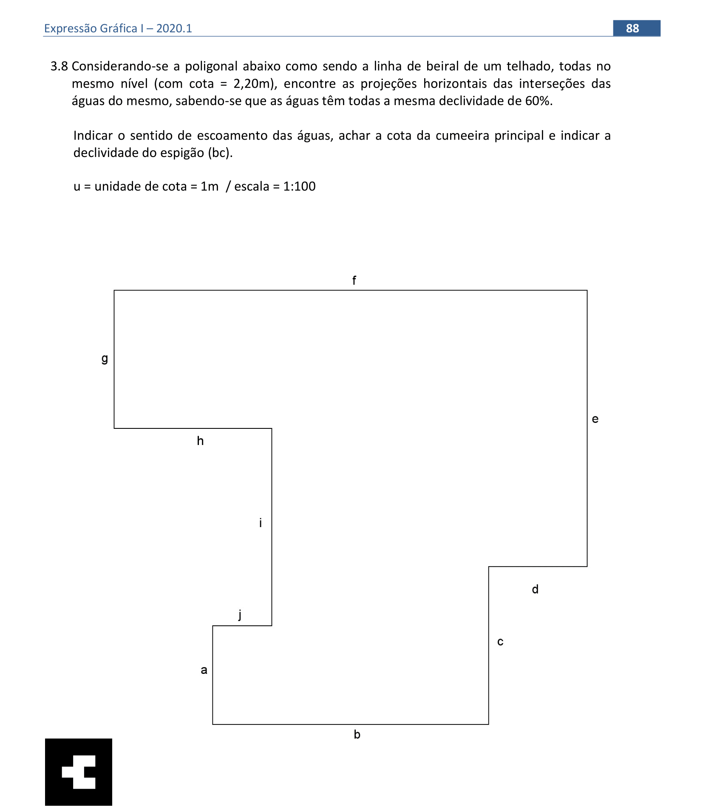
  

  

&#x1f4cf; &#x1f4d0; Resolução

	  
Vamos determinar as interseções das águas da cobertura dada. Como todas as águas possuem a mesma inclinação utilizaremos o processo das bissetrizes.

	  <ul class="slider">
		   <li>
		   <input type="radio" id="665n" name="sl">
			   <label for="665n"></label>
			   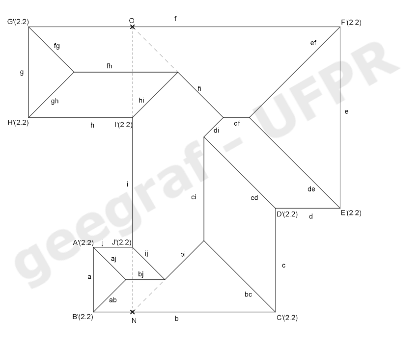
			 <figcaption>Nomeie os vértices da poligonal de <b>A</b> a <b>J</b> e trace as bissetrizes dos seus ângulos internos, obtendo as projeções das interseções <b>(ab)</b>, <b>(bc)</b>, ..., <b>(aj)</b>. Obtenha as demais projeções das interseções das águas desse telhado.</figcaption>
		   </li>
		   <li>
			   <input type="radio" id="666n" name="sl">
			   <label for="666n"></label>
			   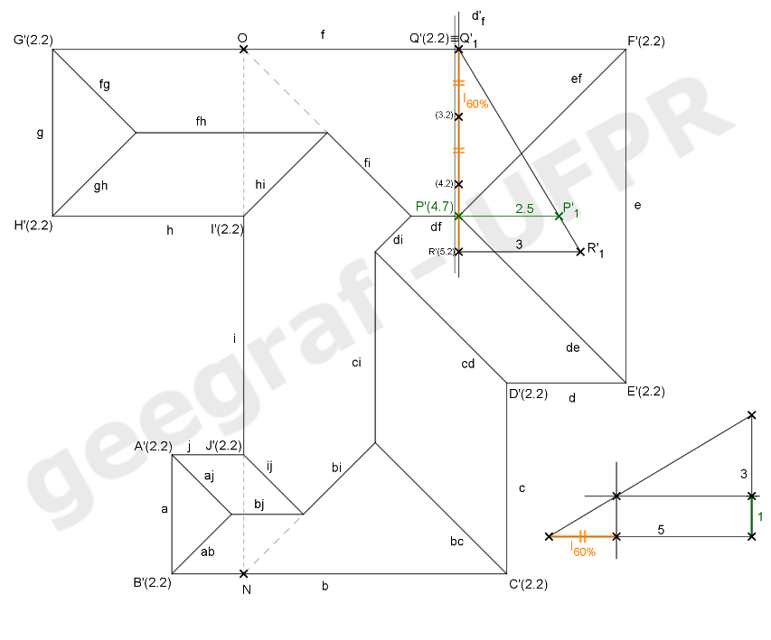
			 <figcaption>Este telhado possui quatro cumeeiras <b>(fh)</b>, <b>(df)</b>, <b>(ci)</b> e <b>(bj)</b>, dez espigões e três rincões <b>(hi)</b>, <b>(cd)</b> e <b>(ij)</b>. A cumeeira principal será <b>(df)</b>. Obtenha o <b>I60%</b> na escala 1:100 e gradue a reta de declive <b>d’f</b> que passa pelo ponto <b>P≡(def)</b>. A cota de <b>P</b> será de 4,7m que nos dá a cota da cumeeira principal.</figcaption>
		   </li>
		   <li>
			   <input type="radio" id="667n" name="sl">
			   <label for="667n"></label>
			   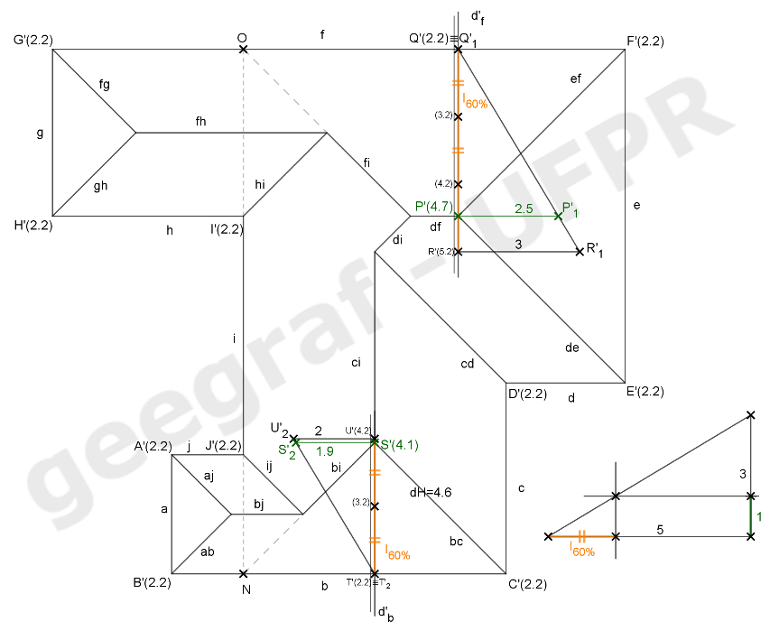
			 <figcaption>Construa a reta de declive de <b>b</b> pelo ponto <b>S</b>. Gradue a mesma obtendo os pontos <b>T</b> e <b>U</b>. Obtenha a cota do ponto <b>S</b> rebatendo o segmento <b>UT</b>. A declividade do rincão <b>(bc)</b> é: <b>de(bc)=de(CS) = dV / dH</b>. Temos <b>dV = |cota(S) – cota(C)| = 4,1 – 2,2 = 1,9m e dH = C’S’ = 4,6m</b>. Portanto, <b>de(bc) = de(CS) = tg(&theta;bc) = dV/dH = 1,9 / 4,6 = 0,413 = 41,3%</b>.</figcaption>
		   </li>	  
		   <li>
			   <input type="radio" id="668n" name="sl">
			   <label for="668n"></label>
			   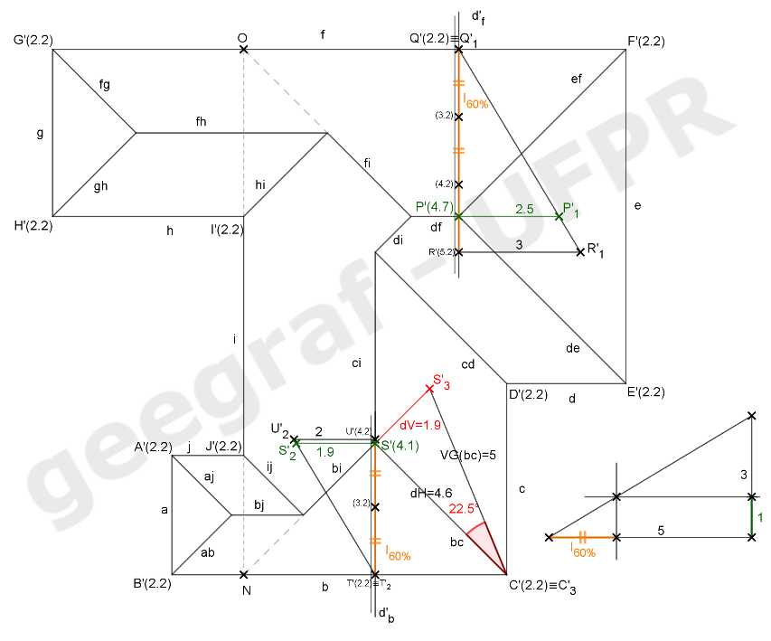
			 <figcaption>Rebatendo os pontos <b>C</b> e <b>S</b> temos a VG de <b>(bc)</b> que é de 5m e também o ângulo <b>&theta;(bc) = 22,5°</b>.</figcaption>
		   </li>
		   <li>
			   <input type="radio" id="669n" name="sl">
			   <label for="669n"></label>
			   
			 <figcaption>Rebatendo a água <b>h</b> obtemos sua VG. Sua área será <b>S(F) = 4,7 x 2,4 =11,28m&sup2;</b>.</figcaption>
		   </li>
		   <li>
			   <input type="radio" id="670n" name="sl">
			   <label for="670n"></label>
			   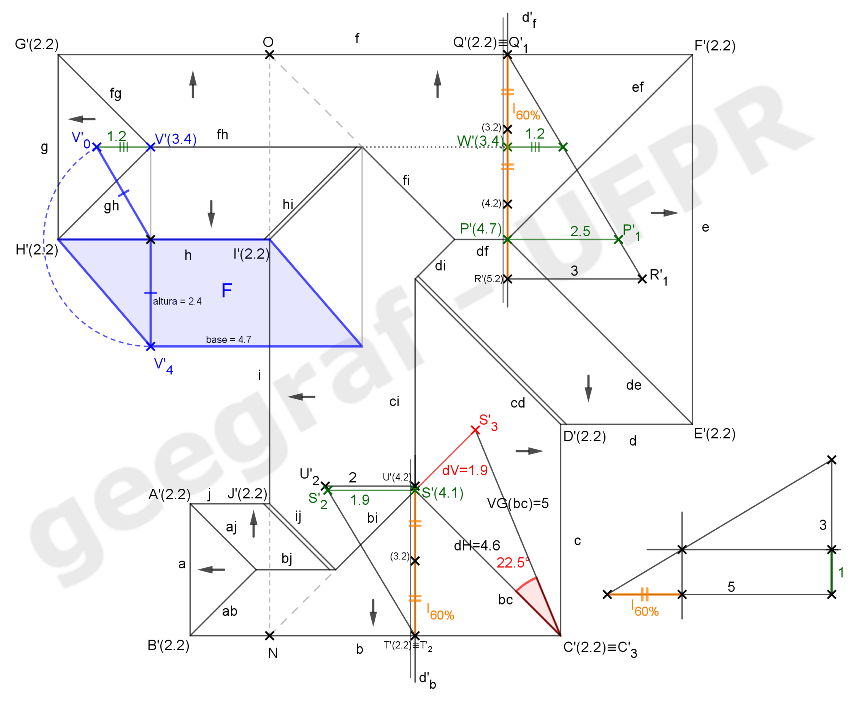
			 <figcaption>Represente as calhas nos rincões <b>(hi)</b>, <b>(cd)</b> e <b>(ij)</b>, e indique o sentido de escoamento das águas.</figcaption>
		   </li>
		</ul>
		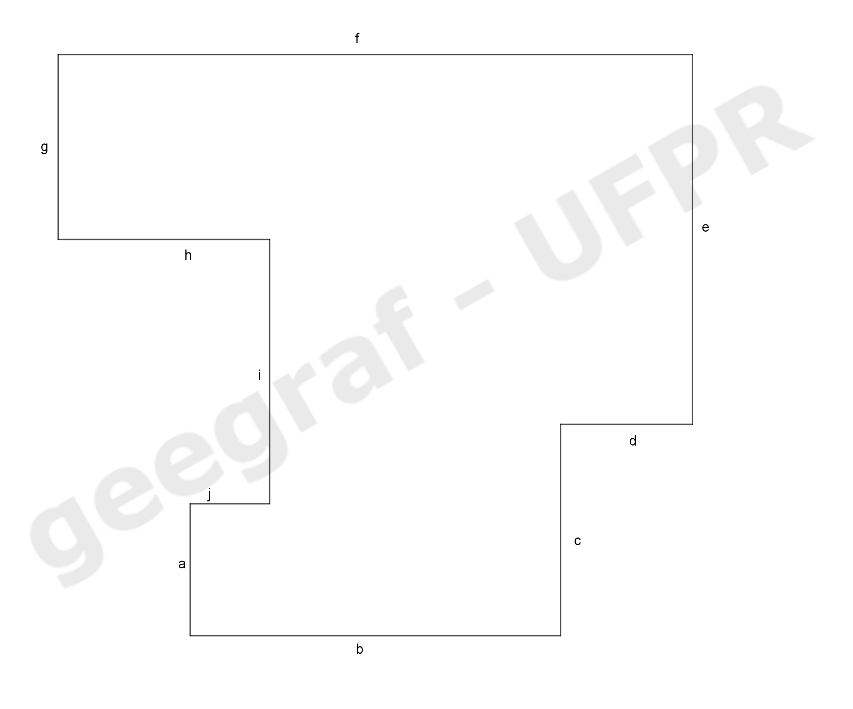
	

	
  

Atividade 5.3: telhado com inclinações diferentes

  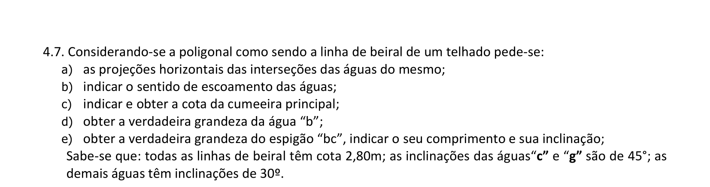
  

&#x1f4cf; &#x1f4d0; Solução

		
Usando as construções que fizemos nos exercícios anteriores, podemos encontrar as medidas indicadas neste exemplo.

		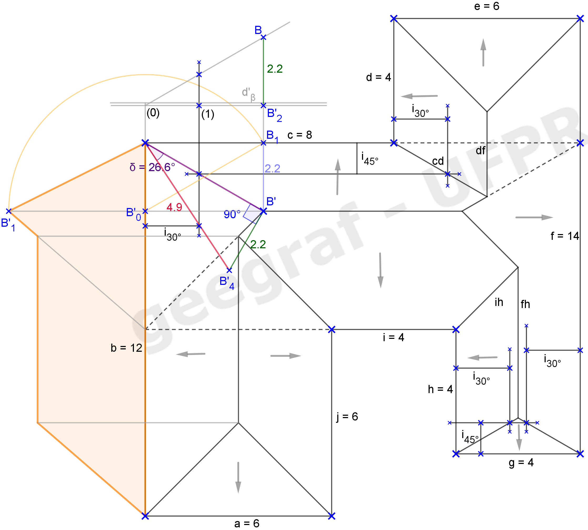
		<figcaption>Lembre-se de que devemos construir os intervalos de 45&deg; nos lados indicados.</figcaption>
	

