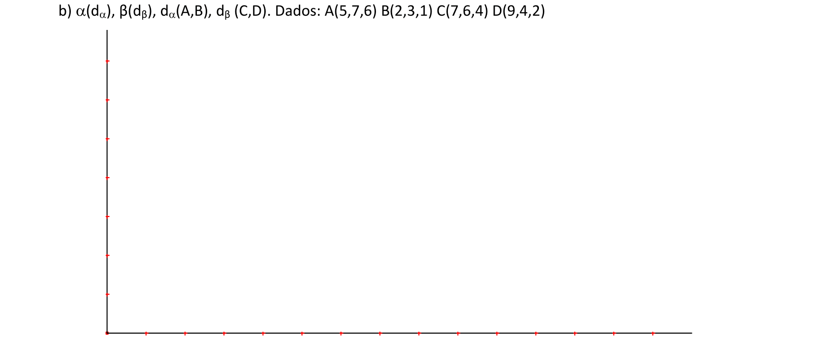
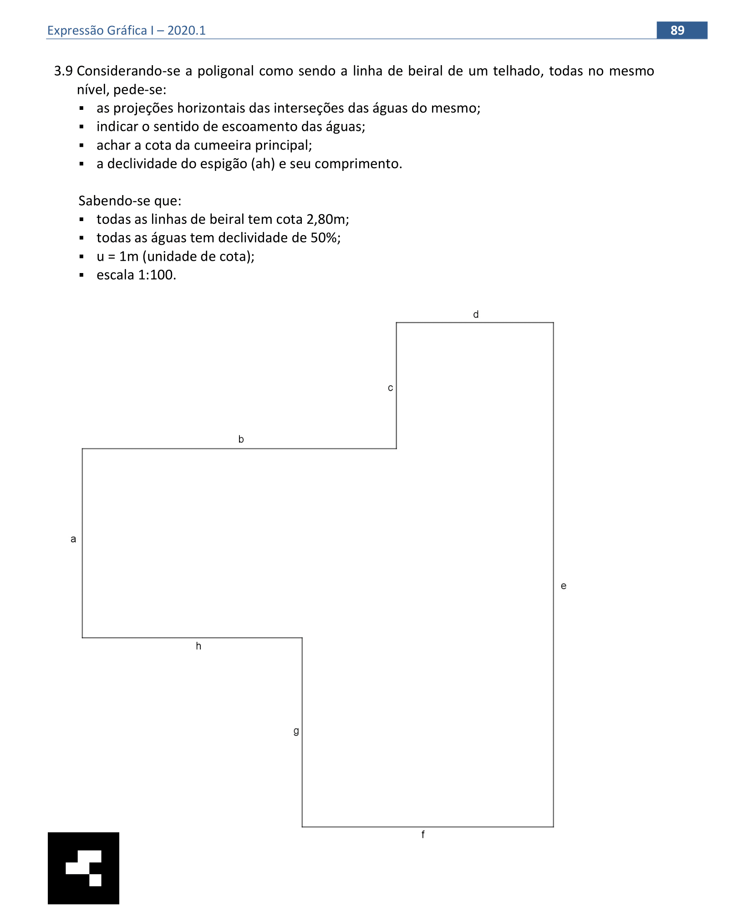

<link rel="stylesheet" href="../../scripts/style.css">

<h2 id="inicio">Respostas do Módulo 5. Interseções / Representações de telhados</h2> 
  

Atividade 5.1: Exercício b) da pág. 77

  
  

&#x1f4cf; &#x1f4d0; Solução

		

		
		<figcaption></figcaption>
	

  

Atividade 5.2: exercício 3.9 da pág. 89

  
  

  

&#x1f4cf; &#x1f4d0; Resolução

	  
Vamos determinar as interseções das águas da cobertura dada. Como todas as águas possuem a mesma inclinação utilizaremos o processo das bissetrizes.

	  <ul class="slider">
		   <li>
		   <input type="radio" id="665n" name="sl">
			   <label for="665n"></label>
			   
			 <figcaption>Nomeie os vértices da poligonal de <b>A</b> a <b>H</b> e trace as bissetrizes dos seus ângulos internos, obtendo as projeções das interseções desse telhado.</figcaption>
		   </li>
		   <li>
			   <input type="radio" id="666n" name="sl">
			   <label for="666n"></label>
			   
			 <figcaption>Este telhado possui três cumeeiras <b>(bh)</b>, <b>(eg)</b> e <b>(ce)</b>, oito espigões e dois rincões <b>(gh)</b> e <b>(bc)</b>. A cumeeira principal será <b>(eg)</b>. Obtenha o <b>I50%</b> na escala 1:100 e gradue a reta de declive <b>d’e</b> que passa pelo ponto <b>P≡(efg)</b>. A cota de <b>P</b> será de 4,6m que nos dá a cota da cumeeira principal.</figcaption>
		   </li>
		   <li>
			   <input type="radio" id="667n" name="sl">
			   <label for="667n"></label>
			   
			 <figcaption>Construa a reta de declive de <b>h</b> pelo ponto <b>S≡(abh)</b>. Gradue a mesma obtendo os pontos <b>T</b> e <b>U</b>. Obtenha a cota do ponto <b>S</b> rebatendo o segmento <b>UT</b>. A declividade do espigão <b>(ah)</b> é: <b>de(ah)=de(AS) = dV / dH</b>. Temos <b>dV = |cota(S) – cota(A)| = 4,1 – 2,8 = 1,3m</b> e <b>dH = A’S’ = 3,7m</b>. Portanto, <b>de(ah) = de(AS) = tg(&theta;ah) = dV/dH = 1,3 / 3,7 = 0,351 = 35,1%</b>. </figcaption>
		   </li>	  
		   <li>
			   <input type="radio" id="668n" name="sl">
			   <label for="668n"></label>
			   
			 <figcaption>Rebatendo os pontos <b>A</b> e <b>S</b> temos a VG de <b>(ah)</b> que é de 4m e também o ângulo <b>&theta;(ah) = 19,5°</b>.</figcaption>
		   </li>
		   <li>
			   <input type="radio" id="669n" name="sl">
			   <label for="669n"></label>
			   
			 <figcaption>Rebatendo a água e obtemos sua VG. Dividindo a figura em um trapézio e um paralelogramotemos que <b>S(F1) = (3,5 + 10,5) x 3,9 / 2 = 27,3m&sup2;</b> e <b>S(F2) = 3,5 x 2,5 = 8,75m&sup2;</b>, fornecendo a área total de <b>36,05m&sup2;</b>.</figcaption>
		   </li>
		   <li>
			   <input type="radio" id="670n" name="sl">
			   <label for="670n"></label>
			   
			 <figcaption>Represente as calhas nos rincões <b>(gh)</b> e <b>(bc)</b>, e indique o sentido de escoamento das águas.</figcaption>
		   </li>
		</ul>
		
	

  

  

	
  

Atividade 5.3: telhado com inclinações diferentes

  
  
  

&#x1f4cf; &#x1f4d0; Solução

		
Usando as construções que fizemos nos exercícios anteriores, podemos encontrar as medidas indicadas neste exemplo.

		
		<figcaption>Lembre-se de que devemos construir os intervalos de 45&deg; nos lados indicados.</figcaption>
	

