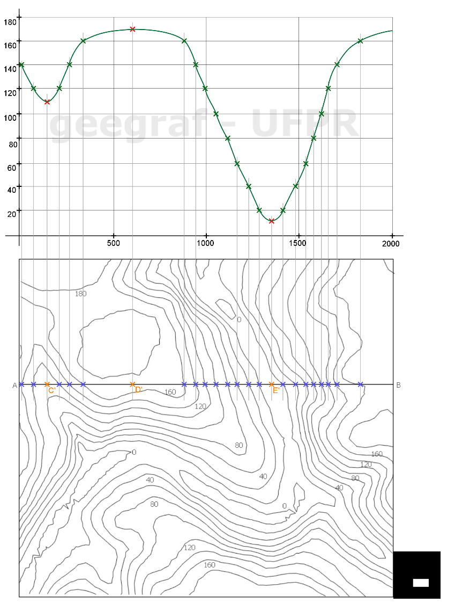
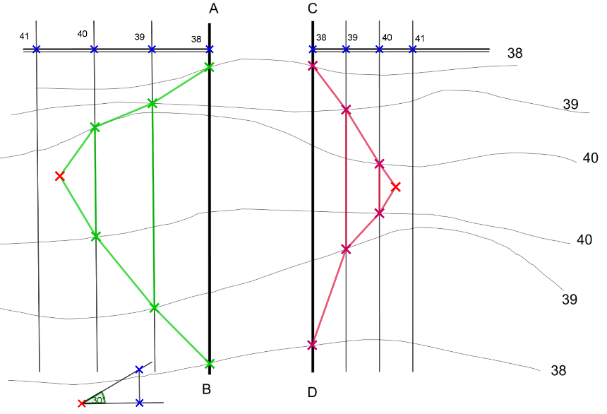

<link rel="stylesheet" href="../../scripts/style.css">

<h2 id="inicio">Respostas do Módulo 6. Superfícies Topográficas</h2> 
  

Atividade 6.1: exercício 2 da pág. 103

  
  

&#x1f4cf; &#x1f4d0; Solução

	  
Para obtermos o perfil topográfico devemos encontrar os pontos comuns da superfície natural do terreno com o plano de corte vertical. Siga o procedimento como no exercício anterior.

	  
	  <figcaption></figcaption>
	  

	

	
  

Atividade 6.2: exercício da pág. 109

  
  

&#x1f4cf; &#x1f4d0; Solução

	  
Repetir os passos do exercício anterior. Observe que a única diferença é o intervalo de 30&deg;.

	  
	  <figcaption></figcaption>
	  

