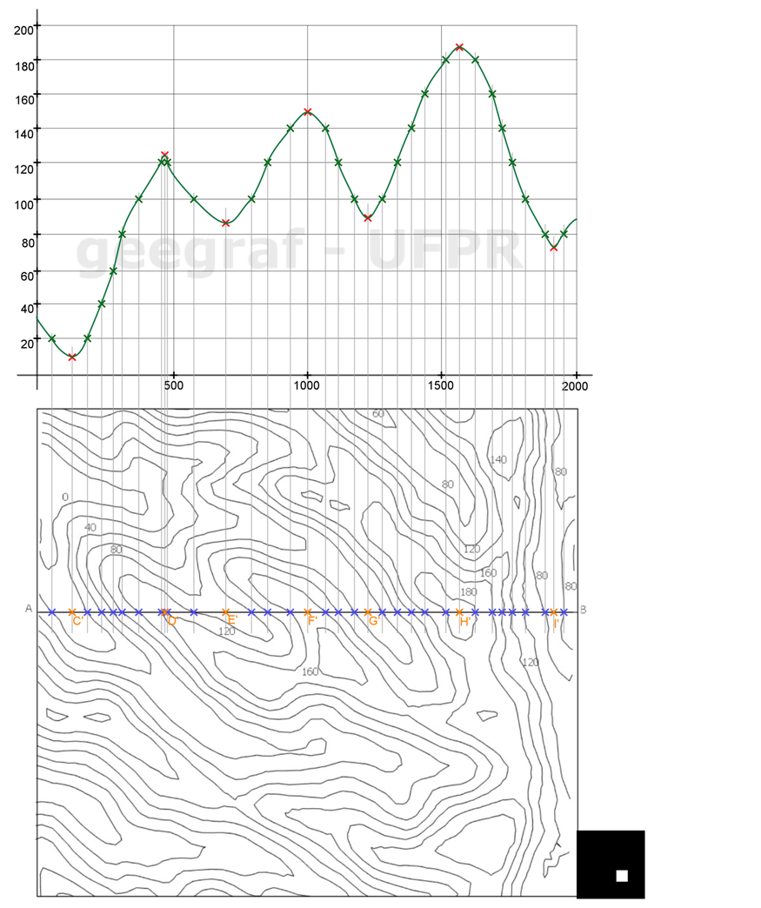
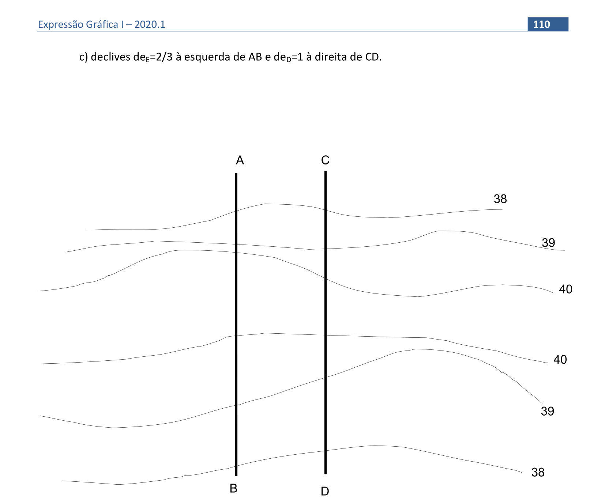

<link rel="stylesheet" href="../../scripts/style.css">

<h2 id="inicio">Respostas do Módulo 6. Superfícies Topográficas</h2> 
  

Atividade 1: exercício 3 da pág. 104

  
  

&#x1f4cf; &#x1f4d0; Solução

	  
Para obtermos o perfil topográfico devemos encontrar os pontos comuns da superfície natural do terreno com o plano de corte vertical. Siga o procedimento como no exercício anterior.

	  
	  <figcaption></figcaption>
	  

	
  

Atividade 2: exercício da pág. 110

  
  

&#x1f4cf; &#x1f4d0; Solução

	  
Repetir os passos do exercício anterior. A diferença nesse exercício é que ao invés de inclinação é dada a declividade. Lembre-se que o intervalo é o inverso da declividade, assim se a declividade é 2/3, o intervalo é 3/2, ou seja o intervalo é 1.5.

	  
	  <figcaption></figcaption>
	  

