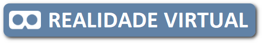
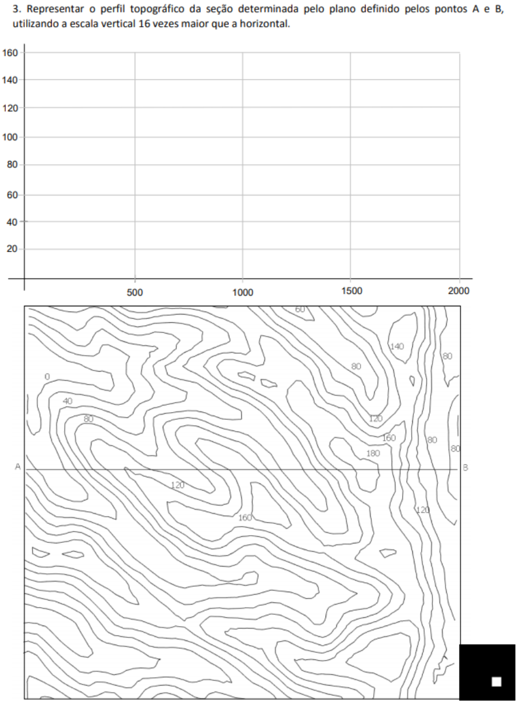

<h2 id="inicio">Superfícies Topográficas</h2> 
 <b>desenvolvido por:</b> Paulo Henrique Siqueira - Universidade Federal do Paraná 
 <b>contato:</b> paulohscwb@gmail.com 
  Este site contém algumas partes da <a href="..vr/Cotadas_2020.pdf" target="_blank">apostila de Projeções Cotadas</a> usada em sala de aula para visualizar os objetos com Realidade Virtual (RV) e Realidade Aumentada (RA). As maquetes podem ser vistas em RA com os marcadores indicados, e através dos links criados nos marcadores, os objetos podem ser vistos em RV. 
 Para ver as superfícies topográficas em Realidade Aumentada, visite o site:
 
<a href="https://paulohscwb.github.io/cotadas/superficies.html"> https://paulohscwb.github.io/cotadas/superficies.html</a>

 em qualquer navegador com um dispositivo de webcam (smartphone, tablet ou notebook).
 O acesso aos sites de Realidade Virtual é feito clicando no círculo azul que aparece em cima dos marcadores.
  

<table><tr><td><h3>Curvas de nível, pág. 119</h3>

 

<h3>Exercício 1, pág. 121</h3>

 

<h3>Exercício 2, pág. 125</h3>

 

<h3>Exercício 3, pág. 126</h3>

 

<h3>Exercício da pág. 127</h3>

 

<h3>Exercício da pág. 133</h3>

 

<h3>Exercício 2, pág. 136</h3>

 

<h3>Exercício novo: estrada com curva</h3>

 
</td></tr></table>

<a href="#inicio"> voltar ao topo</a>
  <b>Referências</b>
 O ambiente Realidade Aumentada foi criado com os scripts de <b>Jerome Etienne</b>: <a href="https://github.com/jeromeetienne/AR.js"> AR.js - Augmented Reality for the Web</a>.
 Os scripts de órbita desenvolvidos por <b>Kevin Ngo</b> foram usados nas páginas de RV: <a href="https://github.com/supermedium/superframe/tree/master/components/orbit-controls/"> Orbit controls for A-Frame</a>.
